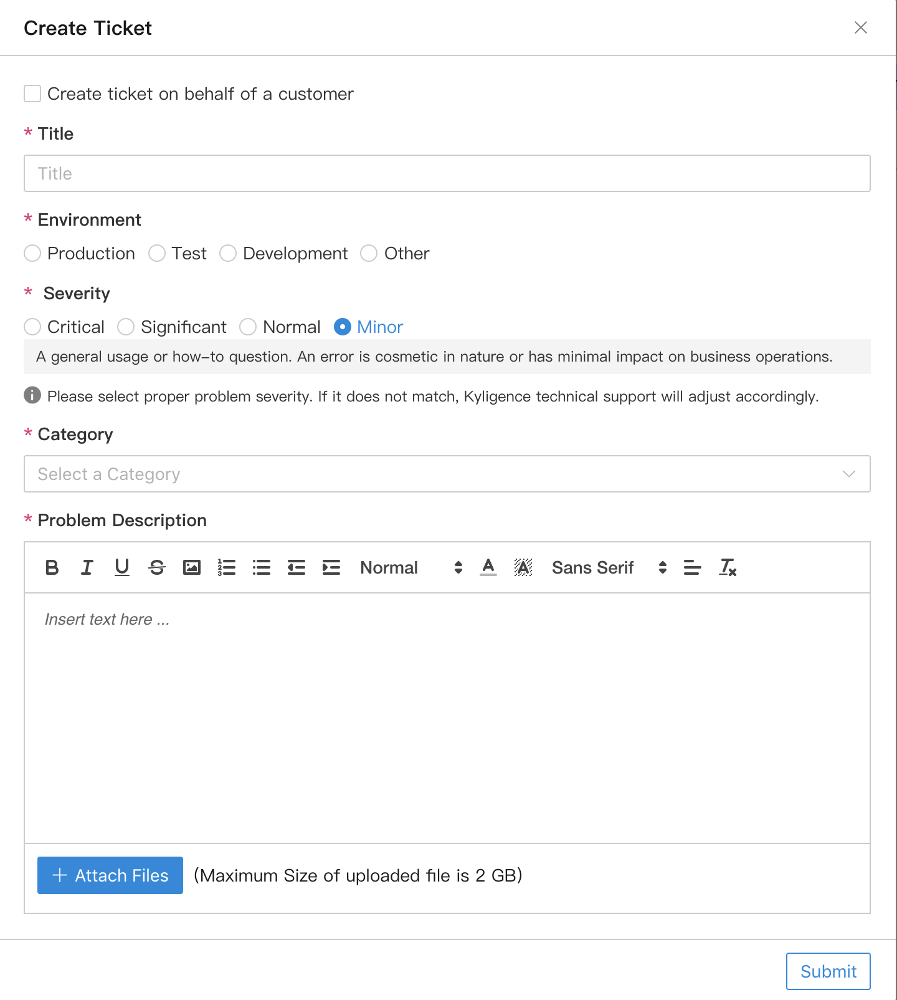

## Get Support

Kyligence provides original support for Kyligence Enterprise. Enterprise users can search for effective solution in knowledge base articles or submit a ticket to get technical support in [Kyligence Support Portal](https://support.kyligence.io). 

* [Knowledge Base](#knowledge_base)
* [Create a Ticket](#create_ticket)
* [View Tickets](#view_tickets)
* [Close a Ticket](#close_ticket)
* [User Manual and Release Notes](#manual_release_notes)

### Knowledge Base  {#knowledge_base}

1. Click the label of *Knowledge Base*.
   
2. You can type in the keywords and search for the corresponding result.

### Create a ticket  {#create_ticket}

1. Click *My Tickets* -->  *Create Ticket*.
2. Fill in the *Title*, Environment, Severity, Category, Problem Description in the prompted window, and attach picture or diagnosis package which can help Kyligence Technical Support better known your situation. 
   
  > *Caution*：
  > 1. Please choose the correct issue severity, and Kyligence technical support will adjuct it according to the actual situation.
  > 2. Please refer to [System and Job Diagnosis](diag.en.md) about how to generate diagnosis package.
  > 3. Maximum size of uploaded file is 2 GB.
3. Submit the ticket with proper input to get help from Kyligence Support.

### View tickets  {#view_tickets}

- In the *My Tickets* page, the latest five tickets will show up, and you can click on the ticket number to view the ticket details.
- There are four status for tickets as *Processing*, *Waiting for your reply*, *To be confirmed* and *Closed*.

### Close a ticket {#close_ticket}
Ticket can be closed at your end when the problem has been solved. Please click the *Close ticket* button in the detailed page of a ticket.

At the same time, you will be invited to fill in a Satisfaction Survey.

### User Manual and Release Notes {#manual_release_notes}

- *User Manual*
  On the right side of the knowledge base page, you can browse the latest user manual for the corresponding Kyligence Enterprise version by clicking on the link.
  
- *Release Notes*
  In the middle bottom of the home page, you can see the release notes section, click the link  to see the latest release notes of Kyligence products.
