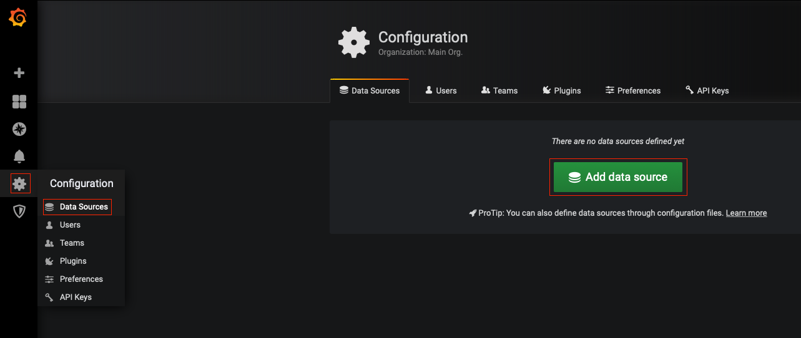
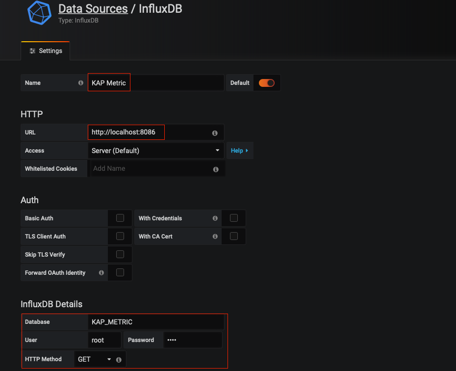
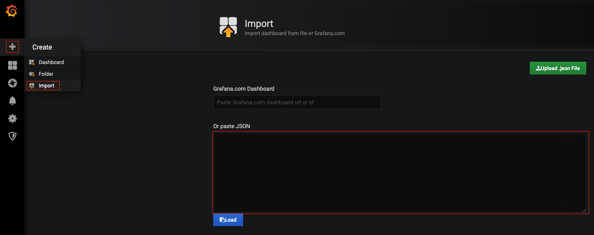
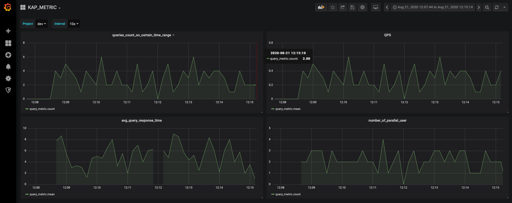

## Metrics Monitoring
By default, the system collects metric data for every query request, including submitter, host, project, engine type, duration, and the amount of scanned data. The monitoring data is stored in the specified [InfluxDB](https://www.influxdata.com/time-series-platform/) and displayed through [Grafana](https://grafana.com/grafana/). It can help administrators to understand the health of the system in order to take necessary actions.

> **Note**: Since metrics monitoring depends on InfluxDB and Grafana, please make sure that InfluxDB and Grafana are both correctly configured and started.

### InfluxDB
After InfluxDB starts, you need to modify the configuration file to enable InfluxDB in KE, open `$KYLIN_HOME/conf/kylin.properties` and add the following properties:

```
kap.metric.diagnosis.influxDB-address=ip:port
kap.metric.diagnosis.graph-writer-type=INFLUX
kap.metric.diagnosis.influxDB-database=KAP_METRIC
kap.metric.diagnosis.influxDB-query-measurement=query_metric
kap.metric.diagnosis.influxDB-username=username
kap.metric.diagnosis.influxDB-password=password
```

The password can be encrypted with AES. KE contains an encryption tool, you can use it via:

`bin/kylin.sh io.kyligence.kap.tool.general.CryptTool AES password`

### Grafana
After the startup is successful, you may access Grafana through web browser with default port: 3000, username: admin, password: admin 

There are two steps to finish the initialization of Grafana:
1. Add data sources.
2. Import default dashboard.

#### dd data sources
Select "Data Sources" in the setting of Grafana, then click "Add data sources", select InfluxDB.



In the database configuration interface, set data source name, URL, database name, user, password and http method (the password cannot be encrypted here), then click "Save & Test".



#### Import default dashboard
Select "Import" in the menu of Grafana, copy <a onclick="window.open('files/grafana_kap_metric.json', '_blank');">the default configuration</a> to the text box, click "Load" , then select the data source you set before.
> **Note**: To use the default dashboard configuration, KE's property `kap.metric.diagnosis.influxDB-query-measurement` must be set to the dafult value `query_metric`.



### Metrics Explanation

The default configuration contains four metrics, the meaning of these metrics are based on a specific time interval, which can be selected from various values.

| Name       | Meaning    | Project related    |
| :------------- | :---------- | :----------- |
| queries_count_on_certain_time_range | total queries | Y |
| QPS | queries per second | Y |
| avg_query_response_time | average response time for queries | Y |
| number_of_parallel_user | number of parallel user | Y |


