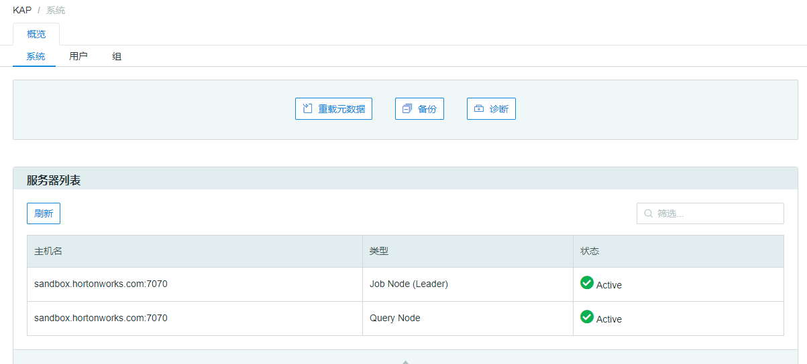

## Server Status ##

Since Kyligence Enterprise V2.5.5, users can check the Kyligence Enterprise cluster server status in the system page, which is shown in the following figure:

### Server Type ###

* Job Node (Leader): The node which is selected as the active job engine.

* Job Node (Follower): If the Leader node fails, the follower nodes will track the Cube build progress and process later build requests.

* Query Node: The node which is assigned as query engine.

  More information could be seen in [Service Discovery and Job Engine HA](../install/adv_install_ha.en.md) and [Cluster (Load Balance) Deployment](../install/adv_install_lb.en.md)

### Server Status ###

* Active: The current node is running.
* Available: The current Follower node(s) could be selected as the new active Leader node.

If the nodes are disconnected, they will not be shown in the server list.