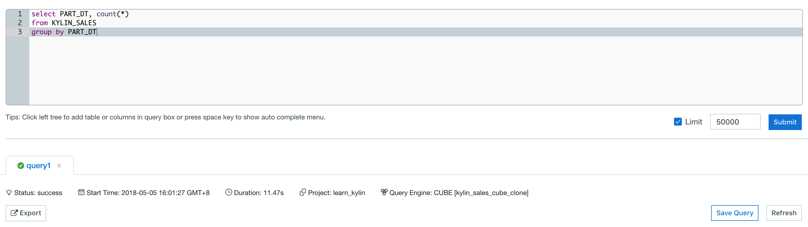

## Execute SQL Statements in Web UI

Open  Kyligence Enterprise Web UI, click **Insight** on the navigation header, all query-able tables will be listed on the left side of page. The tables will be shown only after the related cube is ready. Enter SQL in textbox on the right side of page, query result will be shown at the below textbox.

* **F** - Fact table 
* **L** - Lookup table

### Execute SQL Queries

Enter a select query and click **Submit**, you will see query results. Note the **Limit** field at the bottom right of the page. If there's no limit clause in your SQL statement, the system will apply a default limit value, which is 500. You can uncheck the checkbox in front of the limit field, if you want to disable the limit utterly.

After query results returned successfully, you can find the name of the answering cube in the **Query Engine** item below **Status**. 

> Note:
> 1. Only **SELECT** queries are supported.
> 2. When query pushdown is enabled, queries that cannot be served by cube will be routed to the pushdown engine for execution. In this case, it will take longer to return.

### Save Query

User could click **Save SQL** button at bottom right corner to save queries, the queries are associated with the current user.

### Query History
All query histories are shown in **Query History** tab. Click **Query History** tab, you can resubmit your SQL query. If the browser cookies are cleared, all histories will be lost. 

### Query Result

Kyligence Enterprise displays query result in table by default, the result data could be sorted in ascending or descending order. You can also show/hide the column and export results into CSV file.

### Other ways to execute SQL queries

- [Integration with BI tools](../integration/README.md)

- [REST API](../rest/README.md)