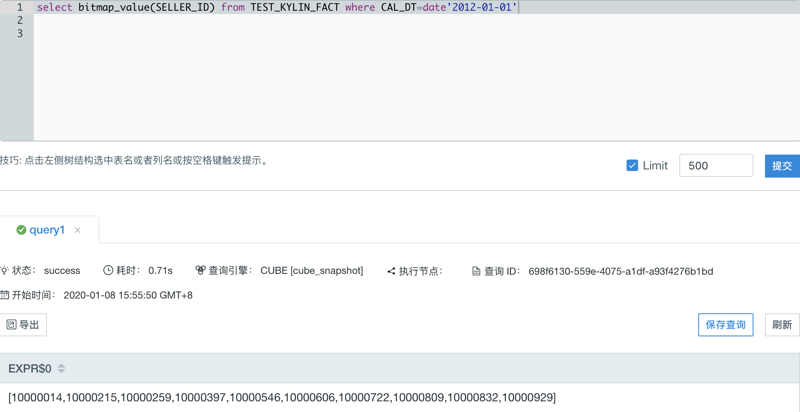
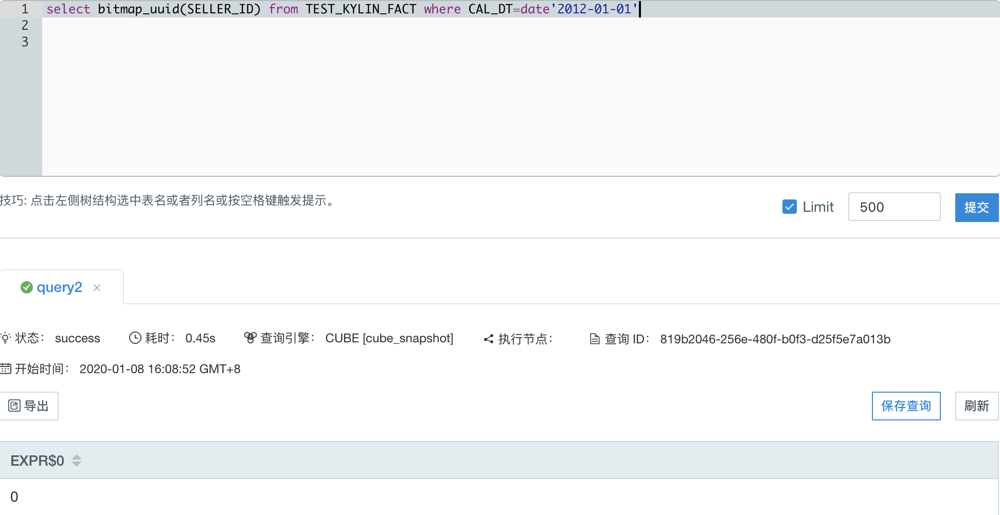
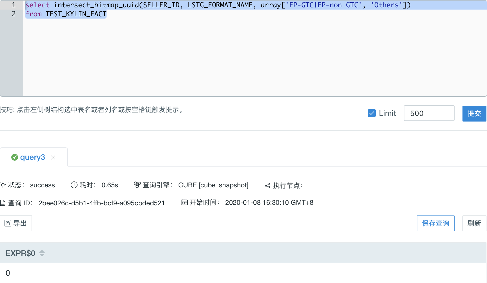
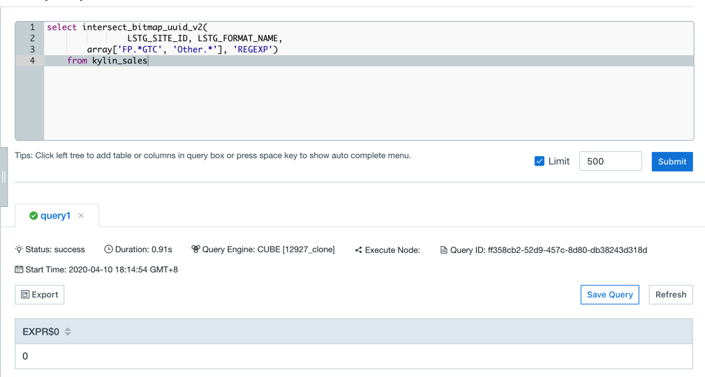
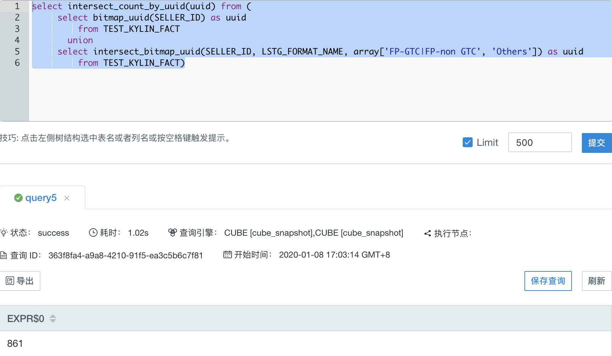
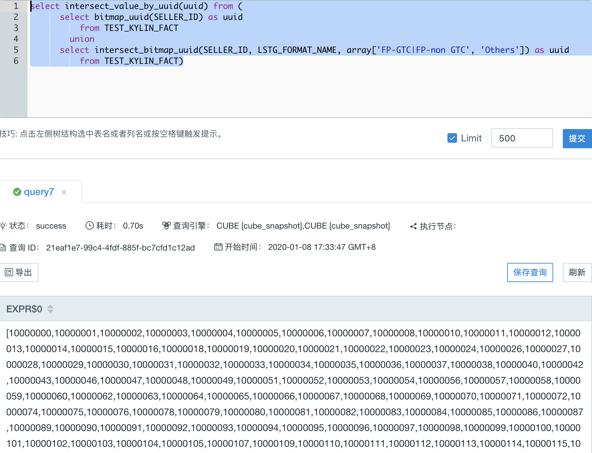
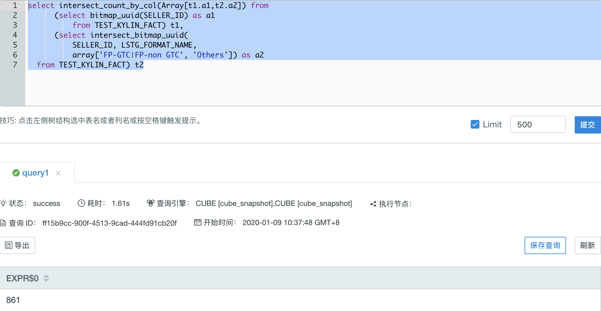
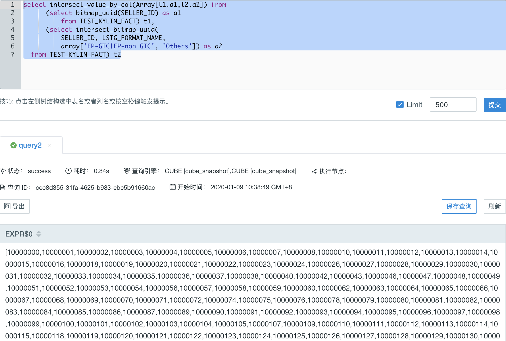

## Bitmap Function

Users can use bitmap functions to operate de-duplication based on bitmap. Then find the intersection of the result bitmaps. 

Kyligence Enterprise supports following bitmap functions,


### BITMAP_VALUE

- Description

  - Return an array of unique value in one row.

- Syntax

  - `bitmap_value(column_to_count)`
  
- Parameters

  - `column_to_count`, the column to be calculated and applied on distinct value, required to be added as **Precise count distinct** measure. **And only columns of type tinyint, smallint, or integer are supported**.

- Query Example 1

  Fact table `KYLIN_SALES_TEST` simulates the online transaction data. `SELLER_ID` is an `integer` column, set to be a **precise count distinct** measure. 
  
  ```select bitmap_value(SELLER_ID) from TEST_KYLIN_FACT where CAL_DT=date'2012-01-01'```
  
- Response Example 1

  
  
  It returns a collection of seller ids for New Year's day online transactions, displayed as an array.
  	

### BITMAP_UUID

- Description

  - Return a uuid which points to a hidden bitmap, as an input to other bitmap functions.

- Syntax

  - `bitmap_uuid(column_to_count)`
  
- Parameters

  - `column_to_count` ,  the column to be calculated and applied on distinct value, required to be added as **Precise count distinct** measure.
  
- Query Example 1

  ```select bitmap_uuid(SELLER_ID) from TEST_KYLIN_FACT where CAL_DT=date'2012-01-01'```
  
- Response Example 1

  

  Return a uuid: 0, which points to a hidden bitmap. The bitmap result is the de-duplicated seller id set of online transactions on New Year's day. The uuid can be used as an input to other bitmap functions.

### INTERSECT_BITMAP_UUID

- Description

  - Return a uuid, pointing to a hidden bitmap, which is the result of finding intersection based on filter column, and then de-duplicating based on count column. 

- Syntax

  - `intersect_bitmap_uuid(column_to_count,  column_to_filter, filter_value_list)`
  
- Parameters

  - `column_to_count` ,  the column to be calculated and applied on distinct value required to be added as **Precise count distinct** measure.
  - `column_to_filter`, the varied dimension. 
  - `filter_value_list`,  the value of the varied dimensions listed in `array[]`, When `column_to_filter` is of type varchar, A single element in an array can map multiple values. By default, the '|' is split. You can set `kylin.query.intersect.separator` in `kylin.properties` to configure the separator, Can take value '|' or ',', default is '|'(Currently this parameter does not support the use of subquery results as parameters).

> **Note:** When the data type of a varied dimension is not varchar or integer, the values in 'filter_value_list' need to be explicitly cast, for example:
> `select intersect_bitmap_uuid(column_to_count, column_to_filter, array[cast(3.53 as double), cast(5.79 as double)]) from ...`
> OR `select intersect_bitmap_uuid(column_to_count, column_to_filter, array[TIMESTAMP'2012-01-02 11:23:45', TIMESTAMP'2012-01-01 11:23:45']) from ...`

- Query Example 1

  LSTG_FORMAT_NAME is a column of VARCHAR(4096) varied dimension.
  
  ```
  select intersect_bitmap_uuid(
          SELLER_ID, LSTG_FORMAT_NAME,
          array['FP-GTC|FP-non GTC', 'Others'])
      from TEST_KYLIN_FACT
  ```
  
- Response Example 1

  
  
  Return a uuid: 0, which points to a hidden bitmap. The bitmap result is the de-duplicated seller id set who have transactions in either type 'FP-GTC' and 'Others', or type 'FP-non GTC' or 'Others' on New Year's day. The uuid can be used as an input to other bitmap functions.

### INTERSECT_BITMAP_UUID_V2

- Description
  - Return a uuid, pointing to a hidden bitmap, which is the result of finding intersection based on filter column, and then de-duplicating based on count column. Support Regexp in condition.
- Syntax
  - `intersect_bitmap_uuid_v2(column_to_count,  column_to_filter, filter_value_list, filter_type)`
- Parameters
  - `column_to_count` ,  the column to be calculated and applied on distinct value required to be added as **Precise count distinct** measure.
  - `column_to_filter`, the varied dimension. 
  - `filter_value_list`,  the value of the varied dimensions listed in `array[]`,
  - `filter_type`, the data type is String, which identifies the filter mode. There are currently two optional values "RAWSTRING" and "REGEXP". When the parameter value is "RAWSTRING", the filtering mode is precise filtering. When `column_to_filter` is a Varchar type, A single element in the array can be mapped with multiple values. By default, it is separated by '|'. You can use `kylin.query.intersect.separator` to configure the separator. And only support configuration in the `kylin.properties` file.  (currently this parameter does not support using the results of subqueries as parameters). When the parameter value is "REGEXP", the filtering mode is regular matching, and only the value of the regular expression in column_to_filter that can match the filter_value_list will be filtered.

> **Note:**  When the filter_type is "RAWSTRING" and the data type of a varied dimension is not varchar or integer, the values in 'filter_value_list' need to be explicitly cast, for example:
> `select intersect_bitmap_uuid_v2(column_to_count, column_to_filter, array[cast(3.53 as double), cast(5.79 as double)], 'RAWSTRING') from TEST_TABLE`
> 或 `select intersect_bitmap_uuid_v2(column_to_count, column_to_filter, array[TIMESTAMP'2012-01-02 11:23:45', TIMESTAMP'2012-01-01 11:23:45'], 'RAWSTRING') from TEST_TABLE;`

- Query Example 1

  LSTG_FORMAT_NAME is a column of VARCHAR(4096) varied dimension.

  ```
  select intersect_bitmap_uuid_v2(
  				LSTG_SITE_ID, LSTG_FORMAT_NAME,
          array['FP.*GTC', 'Other.*'], 'REGEXP')
      from kylin_sales
  ```

- Response Example 1

  

  Return a uuid: 0, which points to a hidden bitmap. The regular expression can match 'FP-GTC', 'FP-non GTC' and 'Others', The bitmap result is the de-duplicated seller id set who have transactions in either type 'FP-GTC' and 'Others', or type 'FP-non GTC' or 'Others' on New Year's day. The uuid can be used as an input to other bitmap functions.

### INTERSECT_COUNT_BY_UUID

- Description

  - Find the intersection of the bitmaps, which is pointed by input uuid. Then return the distinct count.

- Syntax

  - `intersect_count_by_uuid(uuid)`
  
- Parameters

  - `uuid`, the input uuid column returned by subclause. Each uuid points to a bitmap hidden from users. Function `bitmap_uuid` and `intersect_bitmap_uuid` and `intersect_bitmap_uuid_v2`  can return uuid.
  
- Query Example 1

  ```
  select intersect_count_by_uuid(uuid) from (
      select bitmap_uuid(SELLER_ID) as uuid
          from TEST_KYLIN_FACT
        union
      select intersect_bitmap_uuid(
              SELLER_ID, LSTG_FORMAT_NAME,
              array['FP-GTC|FP-non GTC', 'Others']) as uuid
          from TEST_KYLIN_FACT)
  ```
  
- Response Example 1

  
  
  Function `bitmap_uuid` and `intersect_bitmap_uuid` return two uuid in one column. `intersect_count_by_uuid` then find the intersection of two bitmaps pointed by the uuid and return distinct count.

### INTERSECT_VALUE_BY_UUID

- Description

  - Find the intersection of the bitmaps, which is pointed by input uuid. Then return the distinct values in an array.

- Syntax

  - `intersect_value_by_uuid(uuid)`
  
- Parameters

  - `uuid`, the input uuid column returned by subclause. Each uuid points to a bitmap hidden from users. Function `bitmap_uuid` and `intersect_bitmap_uuid` and `intersect_bitmap_uuid_v2` can return uuid.

> **Note:**  And the column data type of inner function like bitmap_uuid, intersect_bitmap_uuid, intersect_bitmap_uuid_v2 only support tinyint, smallint, and integer.
- Query Example 1

  ```
    select intersect_value_by_uuid(uuid) from (
        select bitmap_uuid(SELLER_ID) as uuid
            from TEST_KYLIN_FACT
          union
        select intersect_bitmap_uuid(
                SELLER_ID, LSTG_FORMAT_NAME,
                array['FP-GTC|FP-non GTC', 'Others']) as uuid
            from TEST_KYLIN_FACT)
  ```
  
- Response Example 1

  
  
  Function `bitmap_uuid` and `intersect_bitmap_uuid` return two uuid in one column. `intersect_value_by_uuid` then find the intersection of two bitmaps pointed by the uuid and return an array of the distinct values.

### INTERSECT_COUNT_BY_COL

- Description

  - Find the intersection of the bitmaps, which is pointed by input uuid. Then return the distinct count.

- Syntax

  - `intersect_count_by_col(Array[t1.uuid,t2.uuid ...])`
  
- Parameters

  - `t1.uuid, t2.uuid ...`, the list of input uuid. Each uuid points to a bitmap hidden from users. Function `bitmap_uuid` and `intersect_bitmap_uuid`  and `intersect_bitmap_uuid_v2` can return uuid.
  
- Query Example 1

  ```
  select intersect_count_by_col(Array[t1.a1,t2.a2]) from
      (select bitmap_uuid(SELLER_ID) as a1
          from TEST_KYLIN_FACT) t1,
      (select intersect_bitmap_uuid(
          SELLER_ID, LSTG_FORMAT_NAME,
          array['FP-GTC|FP-non GTC', 'Others']) as a2
  from TEST_KYLIN_FACT) t2
  ```
  
- Response Example 1

  
  
  Function `bitmap_uuid` and `intersect_bitmap_uuid` return two uuid. `intersect_count_by_col` then find the intersection on two bitmaps, pointed by the uuid and return distinct count.

### INTERSECT_VALUE_BY_COL

- Description

  - Find the intersection of the bitmaps, pointed by input uuid. Then return the distinct values in an array.

- Syntax

  - `intersect_value_by_col(Array[t1.uuid,t2.uuid ...])`
  
- Parameters

  - `t1.uuid, t2.uuid ...`, the list of input uuid. Each uuid points to a bitmap hidden from users. Function `bitmap_uuid` and `intersect_bitmap_uuid` and `intersect_bitmap_uuid_v2` can return uuid.
  
> **Note:**  And the column data type of inner function like bitmap_uuid, intersect_bitmap_uuid, intersect_bitmap_uuid_v2 only support tinyint, smallint, and integer.
- Query Example 1

- Query Example 1

  ```
  select intersect_value_by_col(Array[t1.a1,t2.a2]) from
      (select bitmap_uuid(SELLER_ID) as a1
          from TEST_KYLIN_FACT) t1,
      (select intersect_bitmap_uuid(
          SELLER_ID, LSTG_FORMAT_NAME,
          array['FP-GTC|FP-non GTC', 'Others']) as a2
  from TEST_KYLIN_FACT) t2
  ```
  
- Response Example 1

  
  
  Function `bitmap_uuid` and `intersect_bitmap_uuid` return two uuid. `intersect_value_by_col` then find the intersection of two bitmaps, pointed by the uuid and return distinct values in an array.
