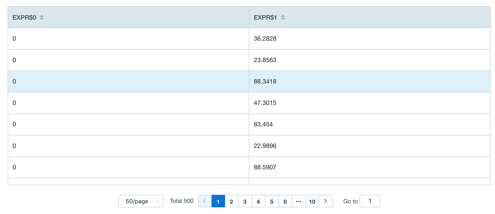

## Grouping Function

Users can use grouping function to aggregate data grouping by different keys in one SQL statement.


Kyligence Enterprise supports the following grouping function,

- [GROUPING(expression)](#GROUPING(expression))


### GROUPING(expression)

- Description
	- Returns a bit vector of the given grouping expressions
- Query Example 

```SQL
SELECT GROUPING(TRANS_ID)
	,SUM(PRICE)
FROM KYLIN_SALES
GROUP BY TRANS_ID
```

- 返回示例

