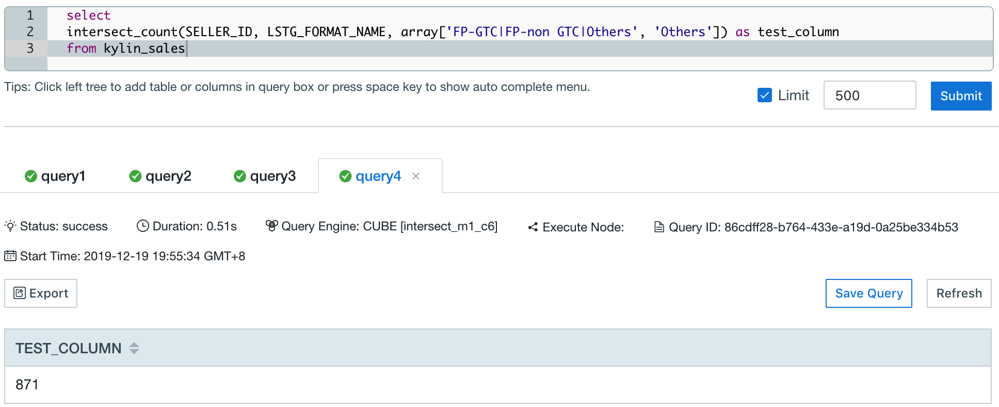
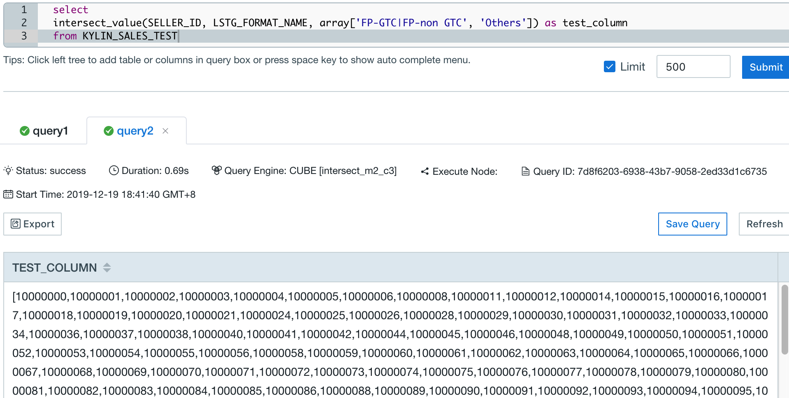

## Intersect Function

Users can use intersection function to calculate the value of the intersection of two data sets, with some same dimensions and one varied dimension, to analyze the retention or conversion rates.

Kyligence Enterprise supports the following intersection function,


### INTERSECT_COUNT

- Description

  - Returns the distinct count of the intersection of multiple result sets in different conditions

- Syntax

  - `intersect_count(column_to_count, column_to_filter, filter_value_list)`

- Parameters

  - `column_to_count`,  the column to be calculated and applied on distinct count, required to be added as **Precise count distinct** measure
  - `column_to_filter`, the varied dimension
  - `filter_value_list`, the value of the varied dimensions listed in `array[]`, When `column_to_filter` is of type varchar, A single element in an array can map multiple values. By default, the '|' is split. You can set `kylin.query.intersect.separator` in `kylin.properties` to configure the separator, Can take value '|' or ',', default is '|'(Currently this parameter does not support the use of subquery results as parameters).

> **Note: ** When the data type of a varied dimension is not varchar or integer, the values in 'filter_value_list' need to be explicitly cast, for example:
> `select intersect_count(column_to_count, column_to_filter, array[cast(3.53 as double), cast(5.79 as double)]) from TEST_TABLE`
> OR `select intersect_count(column_to_count, column_to_filter, array[TIMESTAMP'2012-01-02 11:23:45', TIMESTAMP'2012-01-01 11:23:45']) from TEST_TABLE;`

- Query Example 1

  Take the sample dataset provided by Kyligence Enterprise as an example, table `KYLIN_SALES` simulates the online transaction data, and the following query can return the percentile of sellers who are trading day by day during 2012.01.01 to 2012.01.03.

  ```SQL
  select LSTG_FORMAT_NAME,
  intersect_count(SELLER_ID, PART_DT, array[date'2012-01-01']) as first_day,
  intersect_count(SELLER_ID, PART_DT, array[date'2012-01-02']) as second_day,
  intersect_count(SELLER_ID, PART_DT, array[date'2012-01-03']) as third_day,
  intersect_count(SELLER_ID, PART_DT, array[date'2012-01-01',date'2012-01-02']) as retention_oneday, 
  intersect_count(SELLER_ID, PART_DT, array[date'2012-01-01',date'2012-01-02',date'2012-01-03']) as retention_twoday 
  from KYLIN_SALES
  where PART_DT in (date'2012-01-01',date'2012-01-02',date'2012-01-03')
  group by LSTG_FORMAT_NAME
  ```

- Response Example 1

  

  The result shows that there is no seller keeps trading constantly during this period.

- Query Example 2

  ```sql
    select 
    intersect_count(SELLER_ID, LSTG_FORMAT_NAME, array['FP-GTC|FP-non GTC|Others', 'Others']) as test_column
    from kylin_sales
  ```

- Response Example 2

   
 
### INTERSECT_VALUE	

- Description	

  - Returns the values of the intersection of multiple result sets in different conditions. If the returned result is large, it may cause the analysis page browser to crash.	

- Syntax	

  - `intersect_value(column_to_count, column_to_filter, filter_value_list)`	

- Parameters	

  - `column_to_count`,  the column to be calculated and applied on distinct value required to be added as **Precise count distinct** measure. **And only columns of type tinyint, smallint, or integer are supported**.	
  - `column_to_filter`, the varied dimension	
  - `filter_value_list`, the value of the varied dimensions listed in `array[]`, When `column_to_filter` is of type varchar, A single element in an array can map multiple values. By default, the '|' is split. You can set `kylin.query.intersect.separator` in `kylin.properties` to configure the separator, Can take value '|' or ',', default is '|'(Currently this parameter does not support the use of subquery results as parameters).	

> **Note: ** When the data type of a varied dimension is not varchar or integer, the values in 'filter_value_list' need to be explicitly cast, for example:
> `select intersect_value(column_to_count, column_to_filter, array[cast(3.53 as double), cast(5.79 as double)]) from TEST_TABLE`
> OR `select intersect_value(column_to_count, column_to_filter, array[TIMESTAMP'2012-01-02 11:23:45', TIMESTAMP'2012-01-01 11:23:45']) from TEST_TABLE;`


- Query Example 1	

  Fact table `KYLIN_SALES_TEST` simulates the online transaction data. And data type of `SELLER_ID` column is `integer`. The following query can return the percentile of sellers who are trading day by day during 2012.01.01 to 2012.01.03.	

  ```SQL	
  select LSTG_FORMAT_NAME,	
  intersect_value(SELLER_ID, PART_DT, array[date'2012-01-01']) as first_day,	
  intersect_value(SELLER_ID, PART_DT, array[date'2012-01-02']) as second_day,	
  intersect_value(SELLER_ID, PART_DT, array[date'2012-01-03']) as third_day,	
  intersect_value(SELLER_ID, PART_DT, array[date'2012-01-01',date'2012-01-02']) as retention_oneday, 	
  intersect_value(SELLER_ID, PART_DT, array[date'2012-01-01',date'2012-01-02',date'2012-01-03']) as retention_twoday 	
  from KYLIN_SALES	
  where PART_DT in (date'2012-01-01',date'2012-01-02',date'2012-01-03')	
  group by LSTG_FORMAT_NAME	
  ```	

- Response Example 1	

  	

  The result shows that set of keeping trading constantly's sellerId during this period.	

- Query Example 2	

  ```sql	
  select 	
  intersect_value(SELLER_ID, LSTG_FORMAT_NAME, array['FP-GTC|FP-non GTC|Others', 'Others']) as test_column	
  from kylin_sales	
  ```	

- Response Example  2	

  