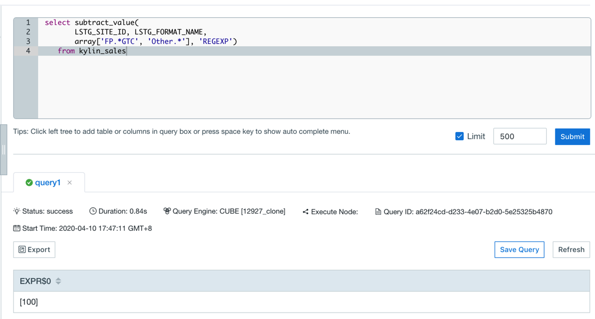

## Subtract Function

Users can use intersection function to calculate the value of the subtraction of two data sets, with some same dimensions and one varied dimension, to analyze the retention or conversion rates.

Kyligence Enterprise supports the following subtraction function,


### SUBTRACT_COUNT

- Description
  - Returns the distinct count of the subtraction of multiple result sets in different conditions. Support Regexp in condition.
- Syntax
  - `subtract_count(column_to_count, column_to_filter, filter_value_list, filter_type)`
- Parameters
  - `column_to_count`, the column to be calculated and applied on distinct count, required to be added as **Precise count distinct** measure
  - `column_to_filter`, the varied dimension
  - `filter_value_list`, the value of the varied dimensions listed in `array[]`,
  - `filter_type`, the data type is String, which identifies the filter mode. There are currently two optional values "RAWSTRING" and "REGEXP". When the parameter value is "RAWSTRING", the filtering mode is precise filtering. When `column_to_filter` is a Varchar type, A single element in the array can be mapped with multiple values. By default, it is separated by '|'. You can use `kylin.query.intersect.separator` to configure the separator. And only support configuration in the `kylin.properties` file.  (currently this parameter does not support using the results of subqueries as parameters). When the parameter value is "REGEXP", the filtering mode is regular matching, and only the value of the regular expression in column_to_filter that can match the filter_value_list will be filtered.

> **Note: ** When the filter_type is "RAWSTRING" and the data type of a varied dimension is not varchar or integer, the values in 'filter_value_list' need to be explicitly cast, for example:
> `select subtract_count(column_to_count, column_to_filter, array[cast(3.53 as double), cast(5.79 as double)], 'RAWSTRING') from TEST_TABLE`
> OR `select subtract_count(column_to_count, column_to_filter, array[TIMESTAMP'2012-01-02 11:23:45', TIMESTAMP'2012-01-01 11:23:45'], 'RAWSTRING') from TEST_TABLE;`

- Query Example 1

  ```sql
    select subtract_count(
      LSTG_SITE_ID, LSTG_FORMAT_NAME,
        array['FP.*GTC', 'Other.*'], 'REGEXP')
      from kylin_sales
  ```

- Response Example 1

   

### SUBTRACT_VALUE	

- Description	
  - Returns the values of the subtraction of multiple result sets in different conditions. If the returned result is large, it may cause the analysis page browser to crash. Support Regexp in condition.
- Syntax	
  - `subtract_value(column_to_count, column_to_filter, filter_value_list, filter_type)`
- Parameters	
  - `column_to_count`,  the column to be calculated and applied on distinct value required to be added as **Precise count distinct** measure. **And only columns of type tinyint, smallint, or integer are supported**.	
  - `column_to_filter`, the varied dimension	
  - `filter_value_list`, the value of the varied dimensions listed in `array[]`,
  - `filter_type`, the data type is String, which identifies the filter mode. There are currently two optional values "RAWSTRING" and "REGEXP". When the parameter value is "RAWSTRING", the filtering mode is precise filtering. When `column_to_filter` is a Varchar type, A single element in the array can be mapped with multiple values. By default, it is separated by '|'. You can use `kylin.query.intersect.separator` to configure the separator. And only support configuration in the `kylin.properties` file.  (currently this parameter does not support using the results of subqueries as parameters). When the parameter value is "REGEXP", the filtering mode is regular matching, and only the value of the regular expression in column_to_filter that can match the filter_value_list will be filtered.

> **Note: **  When the filter_type is "RAWSTRING" and the data type of a varied dimension is not varchar or integer, the values in 'filter_value_list' need to be explicitly cast, for example:
> `select subtract_value(column_to_count, column_to_filter, array[cast(3.53 as double), cast(5.79 as double)], 'RAWSTRING') from TEST_TABLE`
> OR `select subtract_value(column_to_count, column_to_filter, array[TIMESTAMP'2012-01-02 11:23:45', TIMESTAMP'2012-01-01 11:23:45'], 'RAWSTRING') from TEST_TABLE;`

- Query Example 1	

  ```sql	
   select subtract_value(
     		LSTG_SITE_ID, LSTG_FORMAT_NAME,
     		array['FP.*GTC', 'Other.*'], 'REGEXP') 
     	from kylin_sales
  ```

- Response Example  1 

  


### INTERSECT_SUBTRACT_COUNT

- Description
  - Firstly calculate the distinct count of the intersection of multiple result sets in different conditions as subResult, and then return the subtraction of the subResult. Support Regexp in condition.
- Syntax
  - `intersect_subtract_count(column_to_count, column_to_filter, filter_value_list, filter_type)`
- Parameters
  - `column_to_count`, the column to be calculated and applied on distinct count, required to be added as **Precise count distinct** measure
  - `column_to_filter`, the varied dimension
  - `filter_value_list`, the value of the varied dimensions listed in `array[]`, And the element data type is also array[]. eg. Array[Array[…], Array[…], …]
  - `filter_type`, the data type is String, which identifies the filter mode. There are currently two optional values "RAWSTRING" and "REGEXP". When the parameter value is "RAWSTRING", the filtering mode is precise filtering. When `column_to_filter` is a Varchar type, A single element in the inner array can be mapped with multiple values. By default, it is separated by '|'. You can use `kylin.query.intersect.separator` to configure the separator. And only support configuration in the `kylin.properties` file.  (currently this parameter does not support using the results of subqueries as parameters). When the parameter value is "REGEXP", the filtering mode is regular matching, and only the value of the regular expression in column_to_filter that can match the filter_value_list will be filtered.

> **Note: ** When the filter_type is "RAWSTRING" and the data type of a varied dimension is not varchar or integer, the values in 'filter_value_list' need to be explicitly cast, for example:
> `select intersect_subtract_count(column_to_count, column_to_filter, array[array[cast(3.53 as double), cast(5.79 as double)], array[array[cast(3.53 as double), cast(5.79 as double)]], 'RAWSTRING') from TEST_TABLE`
> OR `select intersect_subtract_count(column_to_count, column_to_filter, array[array[TIMESTAMP'2012-01-02 11:23:45', TIMESTAMP'2012-01-01 11:23:45'], array[TIMESTAMP'2012-01-02 11:23:45', TIMESTAMP'2012-01-01 11:23:45']], 'RAWSTRING') from TEST_TABLE;`

- Query Example 1

  ```sql
    select intersect_subtract_count(
    		LSTG_SITE_ID, LSTG_FORMAT_NAME,
    		array[array['FP.*GTC', 'Other.*'], array['ABIN', 'Auction1']], 'REGEXP') 
    	from kylin_sales
  ```

- Response Example 1

   

### INTERSECT_SUBTRACT_VALUE	

- Description	
  - Firstly calculate the distinct count of the intersection of multiple result sets in different conditions as subResult, and then return the subtraction of the subResult. Support Regexp in condition.
- Syntax	
  - `intersect_subtract_value(column_to_count, column_to_filter, filter_value_list, filter_type)`
- Parameters	
  - `column_to_count`,  the column to be calculated and applied on distinct value required to be added as **Precise count distinct** measure. **And only columns of type tinyint, smallint, or integer are supported**.	
  - `column_to_filter`, the varied dimension	
  - `filter_value_list`, the value of the varied dimensions listed in `array[]`, And the element data type is also array[]. eg. Array[Array[…], Array[…], …]
  - `filter_type`, the data type is String, which identifies the filter mode. There are currently two optional values "RAWSTRING" and "REGEXP". When the parameter value is "RAWSTRING", the filtering mode is precise filtering. When `column_to_filter` is a Varchar type, A single element in the array can be mapped with multiple values. By default, it is separated by '|'. You can use `kylin.query.intersect.separator` to configure the separator. And only support configuration in the `kylin.properties` file.  (currently this parameter does not support using the results of subqueries as parameters). When the parameter value is "REGEXP", the filtering mode is regular matching, and only the value of the regular expression in column_to_filter that can match the filter_value_list will be filtered.

> **Note: **  When the filter_type is "RAWSTRING" and the data type of a varied dimension is not varchar or integer, the values in 'filter_value_list' need to be explicitly cast, for example:
> `select intersect_subtract_value(column_to_count, column_to_filter, array[array[cast(3.53 as double), cast(5.79 as double)], array[array[cast(3.53 as double), cast(5.79 as double)]], 'RAWSTRING') from TEST_TABLE`
> OR `select intersect_subtract_value(column_to_count, column_to_filter, array[array[TIMESTAMP'2012-01-02 11:23:45', TIMESTAMP'2012-01-01 11:23:45'], array[TIMESTAMP'2012-01-02 11:23:45', TIMESTAMP'2012-01-01 11:23:45']], 'RAWSTRING') from TEST_TABLE;`

- Query Example 1	

  ```sql	
   select intersect_subtract_value(
     		LSTG_SITE_ID, LSTG_FORMAT_NAME,
     		array[array['FP.*GTC', 'Other.*'], array['ABIN', 'Auction1']], 'REGEXP') 
     	from kylin_sales
  ```

- Response Example  1 

  

