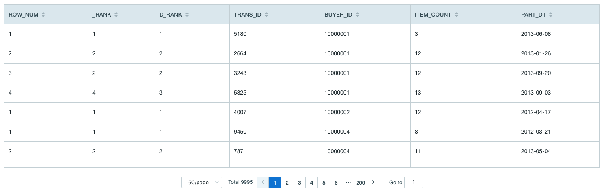
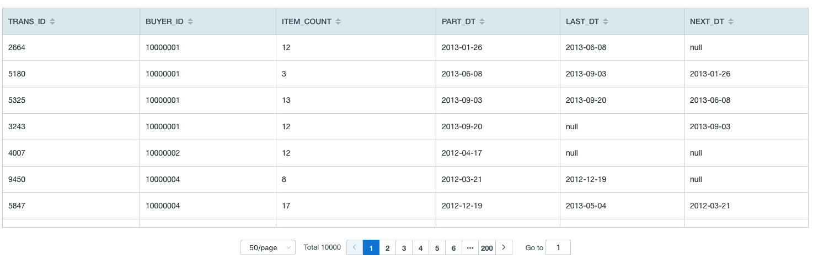

## Window Function

User can use window function to achieve queries that are more complicated, to simplify the query process and obtain better statistics results.

Kyligence Enterprise currently supports two kinds of window functions, namely, rank function and offset function.


- Rank Function

  - [ROW_NUMBER()](#ROW_NUMBER()-OVER-window)
  - [RANK()](#RANK()-OVER-window)
  - [DENSE_RANK()](#DENSE_RANK()-OVER-window)
  - [NTILE(value)](#NTILE(value)-OVER-window)

- Offset Function

  - [FIRST_VALUE(value)](#FIRST_VALUE(value)-OVER-window)
  - [LAST_VALUE(value)](#LAST_VALUE(value)-OVER-window)
  - [LEAD(value, offset, default)](#LEAD(value,-offset,-default)-OVER-window)
  - [LAG(value, offset, default)](#LAG(value,-offset,-default)-OVER-window)


And then we'll illustrate the usage of every single window function with table 'KYLIN_SALES' in the [sample dataset](../../model/sample_dataset.cn.md). The fields and corresponding descriptions of 'KYLIN_SALES' are as followings:
- PART_DT: Order Date
- TRANS_ID: order ID
- BUYER_ID: Buyer ID
- ITEM_COUNT: The number of purchased goods.


### ROW_NUMBER() OVER window

- Returns the number of the current row within its partition

### RANK() OVER window

- Returns the rank of the current row with gaps; same as ROW_NUMBER of its first peer

### DENSE_RANK() OVER window

- Returns the rank of the current row without gaps; this function counts peer groups


### Query Example for ROW_NUMBER()，RANK()，DENSE_RANK()

> **Note**:  In order to compare these three functions, we use them in one query sentence.

```SQL
SELECT *
FROM (
	SELECT ROW_NUMBER() OVER w AS ROW_NUM
		,RANK() OVER w AS _RANK
		,DENSE_RANK() OVER w AS D_RANK
		,TRANS_ID
		,BUYER_ID
		,ITEM_COUNT
		,PART_DT
	FROM KYLIN_SALES 
    WINDOW w AS (PARTITION BY BUYER_ID ORDER BY ITEM_COUNT)
	) T
WHERE ROW_NUM <= 5
```

Response Example:


> **Note**:
> For buyer with id 10000001', number of orders with 'ITEM_COUNT' as12 is 2.
>
> 1. When using row_number() function, orders with 'ITEM_COUNT' as 12  are ranked as  2 and 3, and the order with 'ITEM_COUNT' as 13 is ranked as 4.
> 2. When using rank() function, orders with 'ITEM_COUNT' as 12  are ranked as  2 and 2, and the order with 'ITEM_COUNT' as 13 is ranked as 4.
> 3. When using dense_rank() function, orders with 'ITEM_COUNT' as 12  are ranked as  2 and 2, and the order with 'ITEM_COUNT' as 13 is ranked as 3.


### NTILE(value) OVER window

- Description

  - Returns an integer ranging from 1 to value, dividing the partition as equally as possible
- Query Example

  > **Note**: Divide every buyer's orders into 3 groups according to the quanlity of purchased goods.


```SQL
SELECT NTILE(3) OVER w AS N_3
	,TRANS_ID
	,BUYER_ID
	,ITEM_COUNT
	,PART_DT
FROM KYLIN_SALES
WINDOW w AS (PARTITION BY BUYER_ID ORDER BY ITEM_COUNT)
```

- Response Example
  


### FIRST_VALUE(value) OVER window
- Returns value evaluated at the row that is the first row of the window frame


### LAST_VALUE(value) OVER window
-  Returns value evaluated at the row that is the last row of the window frame


### Query Sample for FIRST_VALUE() 和 LAST_VALUE()

> **Note**: Query the 'ITEM_COUNT' of the first and last order.

```SQL
SELECT TRANS_ID
	,BUYER_ID
	,ITEM_COUNT
	,PART_DT
	,FIRST_VALUE(ITEM_COUNT) OVER w AS F_1
	,LAST_VALUE(ITEM_COUNT) OVER w AS L_1
FROM KYLIN_SALES 
WINDOW w AS (PARTITION BY BUYER_ID ORDER BY PART_DT)
```

Response Example:


### LEAD(value, offset, default) OVER window
- Returns value evaluated at the row that is offset rows after the current row within the partition; if there is no such row, instead returns default. Both offset and default are evaluated with respect to the current row. If omitted, offset defaults to 1 and default to NULL

### LAG(value, offset, default) OVER window
- Returns value evaluated at the row that is offset rows before the current row within the partition; if there is no such row, instead returns default. Both offset and default are evaluated with respect to the current row. If omitted, offset defaults to 1 and default to NULL


### Query Example for LEAD() 和 LAG()
> **Note**: Query the time of last order and next order based on current order.

```SQL
SELECT TRANS_ID
	,BUYER_ID
	,ITEM_COUNT
	,PART_DT
	,LEAD(PART_DT, 1) OVER w LAST_DT
	,LAG(PART_DT, 1) OVER w NEXT_DT
FROM KYLIN_SALES 
WINDOW w AS (PARTITION BY BUYER_ID ORDER BY PART_DT)
```

Response Example:


