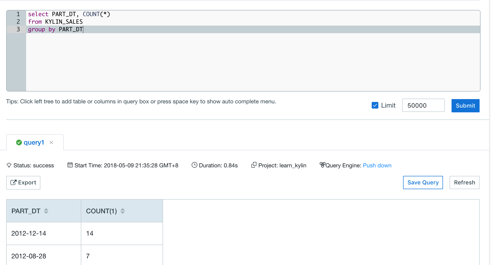

### Query Pushdown

KAP supports query pushdown from KAP 2.4. If there are queries which cannot be fulfilled through customized Cubes, you may simply leverage the query pushdown to redirect the query to Spark SQL, Hive and Impala, making a trade-off  between query latency and query flexibility to obtain a better experience. 

#### Enable Query Pushdown

The precondition for query pushdown is that there exists at least one table which has been loaded.

Query pushdown is turned off by default. To turn it on, do the following:

- Remove the Comment symbol in front of the configuration item `kylin.query.pushdown.runner-class-name=io.kyligence.kap.storage.parquet.adhoc.PushDownRunnerSparkImp` in the file `kylin.properties` to bring it into effect. 

- Restart KAP:

  ```
  $KYLIN_HOME/bin/kylin.sh stop
  $KYLIN_HOME/bin/kylin.sh start
  ```

With query pushdown turned on, queries that cannot get results from Cubes will be redirected to Spark SQL by default. You may also configure it manually, and choose Hive or Impala as the default engine to be redirected. Please refer to [Important Configurations](../config/basic_settings.en.md) for more configuration settings.

After you turn on the query pushdown, all source tables you have synchronized will be shown without building the corresponding Cubes. When you submit a query, you will find *Pushdown* in the *Query Engine* item below *Status*, if query pushdown works. 



