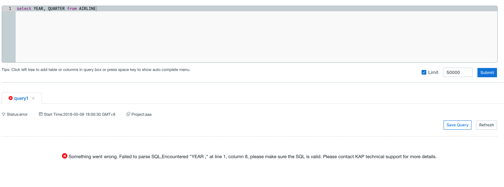
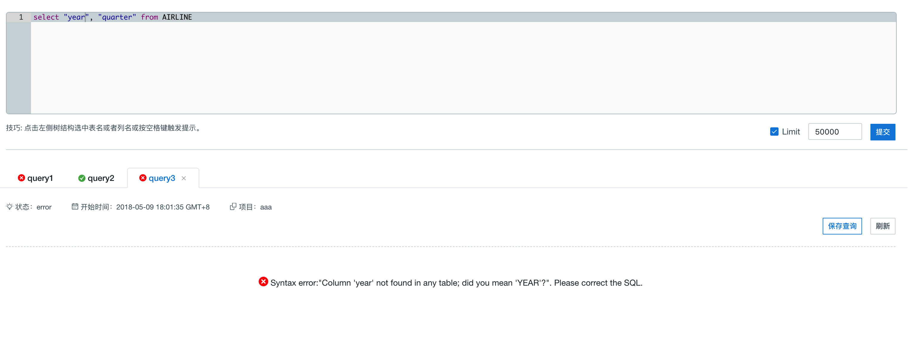
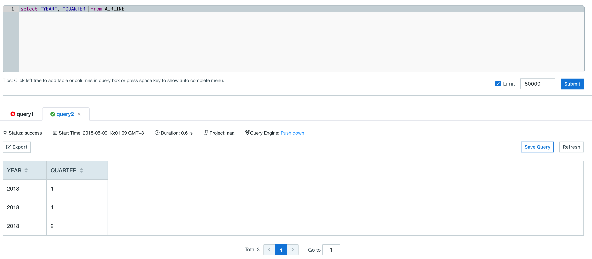
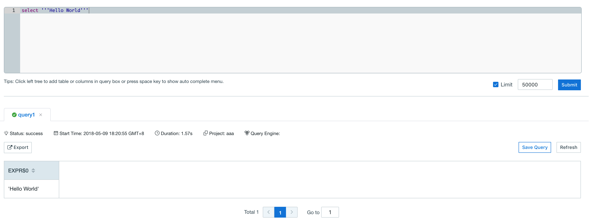
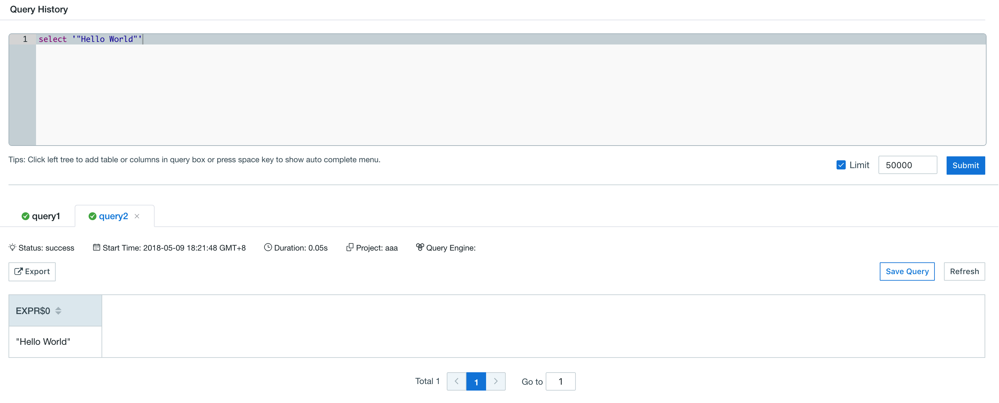

## SQL Specification

Kyligence Enterprise supports ANSI SQL 2003, and its basic SQL grammars are listed as follow.


### Supported Syntax

```sql
statement:
|  query 

query:
      values
  |  WITH withItem [ , withItem ]* query
  |   {
          select
      |  selectWithoutFrom
      |  query UNION [ ALL | DISTINCT ] query
      |  query INTERSECT [ ALL | DISTINCT ] query
      }
      [ ORDER BY orderItem [, orderItem ]* ]
      [ LIMIT { count | ALL } ]
      [ OFFSET start { ROW | ROWS } ]
      [ FETCH { FIRST | NEXT } [ count ] { ROW| ROWS } ]

withItem:
      name
      ['(' column [, column ]* ')' ]
      AS '(' query ')'

orderItem:
      expression [ ASC | DESC ]［ NULLS FIRST |NULLS LAST ］

select:
      SELECT [ ALL | DISTINCT]
          { * | projectItem [, projectItem ]* }
      FROM tableExpression
      [ WHERE booleanExpression ]
      [ GROUP BY { groupItem [, groupItem ]* }]
      [ HAVING booleanExpression ]
      [ WINDOW windowName AS windowSpec [,windowName AS windowSpec ]* ]

selectWithoutFrom:
      SELECT [ ALL | DISTINCT ]
          { * | projectItem [, projectItem ]* }

projectItem:
      expression [ [ AS ] columnAlias ]
  |  tableAlias . *

tableExpression:
      tableReference [, tableReference ]*
  |  tableExpression [ NATURAL ]［( LEFT | RIGHT | FULL ) [ OUTER ] ］ JOINtableExpression [ joinCondition ]

joinCondition:
      ON booleanExpression
  |  USING '(' column [, column ]* ')'

tableReference:
      tablePrimary
      [ matchRecognize ]
      [ [ AS ] alias [ '(' columnAlias [,columnAlias ]* ')' ] ]

tablePrimary:
      [ [ catalogName . ] schemaName . ]tableName
      '(' TABLE [ [ catalogName . ] schemaName. ] tableName ')'
  |   [LATERAL ] '(' query ')'
  |  UNNEST '(' expression ')' [ WITH ORDINALITY ]
  |   [LATERAL ] TABLE '(' [ SPECIFIC ] functionName '(' expression [, expression ]*')' ')'

values:
      VALUES expression [, expression ]*
 
groupItem:
      expression
  |   '('')'
  |   '('expression [, expression ]* ')'
  |  GROUPING SETS '(' groupItem [, groupItem ]* ')'

windowRef:
      windowName
  |  windowSpec

windowSpec:
      [windowName ]
      '(' 
      [ ORDER BYorderItem [, orderItem ]* ]
      [ PARTITION BY expression [, expression]* ]
      [
          RANGE numericOrIntervalExpression {PRECEDING | FOLLOWING }
      |  ROWS numericExpression { PRECEDING | FOLLOWING }
      ]
    ')'
```

> **Notice:** the versions of the realization may be different. Feel free to contact the technical support team if you have any questions.


### Keywords

The following is a list of SQL keywords. Reserved keywords are **bold**.

ABS,ALL,ALLOCATE,ALLOW,ALTER,AND,ANY,ARE,ARRAY,ARRAY_MAX_CARDINALITY,AS,ASENSITIVE,ASYMMETRIC,AT,ATOMIC,AUTHORIZATION,AVG,BEGIN,BEGIN_FRAME,BEGIN_PARTITION,BETWEEN,BIGINT,BINARY,BIT,BLOB,BOOLEAN,BOTH,BY,CALL,CALLED,CARDINALITY,CASCADED,CASE,CAST,CEIL,CEILING,CHAR,CHARACTER,CHARACTER_LENGTH,CHAR_LENGTH,CHECK,CLASSIFIER,CLOB,CLOSE,COALESCE,COLLATE,COLLECT,COLUMN,COMMIT,CONDITION,CONNECT,CONSTRAINT,CONTAINS,CONVERT,CORR,CORRESPONDING,COUNT,COVAR_POP,COVAR_SAMP,CREATE,CROSS,CUBE,CUME_DIST,CURRENT,CURRENT_CATALOG,CURRENT_DATE,CURRENT_DEFAULT_TRANSFORM_GROUP,CURRENT_PATH,CURRENT_ROLE,CURRENT_ROW,CURRENT_SCHEMA,CURRENT_TIME,CURRENT_TIMESTAMP,CURRENT_TRANSFORM_GROUP_FOR_TYPE,CURRENT_USER,CURSOR,CYCLE,DATE,DAY,DEALLOCATE,DEC,DECIMAL,DECLARE,DEFAULT,DEFINE,DELETE,DENSE_RANK,DEREF,DESCRIBE,DETERMINISTIC,DISALLOW,DISCONNECT,DISTINCT,DOUBLE,DROP,DYNAMIC,EACH,ELEMENT,ELSE,EMPTY,END,END-EXEC,END_FRAME,END_PARTITION,EQUALS,ESCAPE,EVERY,EXCEPT,EXEC,EXECUTE,EXISTS,EXP,EXPLAIN,EXTEND,EXTERNAL,EXTRACT,FALSE,FETCH,FILTER,FIRST_VALUE,FLOAT,FLOOR,FOR,FOREIGN,FRAME_ROW,FREE,FROM,FULL,FUNCTION,FUSION,GET,GLOBAL,GRANT,GROUP,GROUPING,GROUPS,HAVING,HOLD,HOUR,IDENTITY,IMPORT,IN,INDICATOR,INITIAL,INNER,INOUT,INSENSITIVE,INSERT, INT, INTEGER,INTERSECT,INTERSECTION,INTERVAL,INTO,IS,JOIN,JSON_ARRAY,JSON_ARRAYAGG,JSON_EXISTS,JSON_OBJECT,JSON_OBJECTAGG,JSON_QUERY,JSON_VALUE,LAG,LANGUAGE,LARGE,LAST_VALUE,LATERAL,LEAD,LEADING,LEFT,LIKE,LIKE_REGEX,LIMIT,LN,LOCAL,LOCALTIME,LOCALTIMESTAMP,LOWER,MATCH,MATCHES,MATCH_NUMBER,MATCH_RECOGNIZE,MAX,MEASURES,MEMBER,MERGE,METHOD,MIN,MINUS,MINUTE,MOD,MODIFIES,MODULE,MONTH,MULTISET,NATIONAL,NATURAL,NCHAR,NCLOB,NEW,NEXT,NO,NONE,NORMALIZE,NOT,NTH_VALUE,NTILE,NULL,NULLIF,NUMERIC,OCCURRENCES_REGEX,OCTET_LENGTH,OF,OFFSET,OLD,OMIT,ON,ONE,ONLY,OPEN,OR,ORDER,OUT,OUTER,OVER,OVERLAPS,OVERLAY,PARAMETER,PARTITION,PATTERN,PER,PERCENT,PERCENTILE_CONT,PERCENTILE_DISC,PERCENT_RANK,PERIOD,PERMUTE,PORTION,POSITION,POSITION_REGEX,POWER,PRECEDES,PRECISION,PREPARE,PREV,PRIMARY,PROCEDURE,RANGE,RANK,READS,REAL,RECURSIVE,REF,REFERENCES,REFERENCING,REGR_AVGX,REGR_AVGY,REGR_COUNT,REGR_INTERCEPT,REGR_R2,REGR_SLOPE,REGR_SXX,REGR_SXY,REGR_SYY,RELEASE,RESET,RESULT,RETURN,RETURNS,REVOKE,RIGHT,ROLLBACK,ROLLUP,ROW,ROWS,ROW_NUMBER,RUNNING,SAVEPOINT,SCOPE,SCROLL,SEARCH,SECOND,SEEK,SELECT,SENSITIVE,SESSION_USER,SET,SHOW,SIMILAR,SKIP,SMALLINT,SOME,SPECIFIC,SPECIFICTYPE,SQL,SQLEXCEPTION,SQLSTATE,SQLWARNING,SQRT,START,STATIC,STDDEV_POP,STDDEV_SAMP,STREAM,SUBMULTISET,SUBSET,SUBSTRING,SUBSTRING_REGEX,SUCCEEDS,SUM,SYMMETRIC,SYSTEM,SYSTEM_TIME,SYSTEM_USER,TABLE,TABLESAMPLE,THEN,TIME,TIMESTAMP,TIMEZONE_HOUR,TIMEZONE_MINUTE,TINYINT,TO,TRAILING,TRANSLATE,TRANSLATE_REGEX,TRANSLATION,TREAT,TRIGGER,TRIM,TRIM_ARRAY,TRUE,TRUNCATE,UESCAPE,UNION,UNIQUE,UNKNOWN,UNNEST,UPDATE,UPPER,UPSERT,USER,USING,VALUE,VALUES,VALUE_OF,VARBINARY,VARCHAR,VARYING,VAR_POP,VAR_SAMP,VERSIONING,WHEN,WHENEVER,WHERE,WIDTH_BUCKET,WINDOW,WITH,WITHIN,WITHOUT,YEAR


### Identifiers

Identifiers are the names of tables, columns and other metadata elements used in a SQL query.

Unquoted identifiers, such as `emp`, must start with a letter and can only contain letters, digits, and underscores. They are implicitly converted to upper case.

Quoted identifiers, such as `"Employee Name"`, start and end with double quotes. They may contain virtually any character, including spaces and other punctuation. If you wish to include a double quote in an identifier, use another double quote to escape it, like this: `"An employee called ""Fred""."`.

Matching identifiers to the name of the referenced object is case-sensitive. But remember that unquoted identifiers are implicitly converted to upper case before matching, and if the object it refers to was created using an unquoted identifier for its name, then its name will have been converted to upper case also.


### Escape Keywords 

If your column or table name are using keywords, you will need to use double quote to escape it.  

For example, table `AIRLINE` contains column `YEAR` and `QUARTER` that overlap with Kyligence Enterprise's keywords **YEAR** and **QUARTER**. As shown in the example below, if user query  `YEAR` and `QUARTER` directly, the query would return will error as Kyligence Enterprise query engine fails to differentiate these two columns from keywords. 



When you try to escape column with a double quote, matching identifier to the name of the referenced object become case-sensitive (as mentioned above), Kyligence Enterprise query engine will fail to query with double-quoted lower case letter as these columns are stored in capital letters in Kyligence Enterprise.  

If we change the double-quoted column name to all capitals, the query will return correctly.




### Escape Quote

If your query contains single quote in the value, you can use another single quote to escape single quote in the value. 



For double quotes in the value, escape is not needed. 




### Date Query

The following are syntax examples of date query:

```sql
select TRANS_ID,PART_DT,PRICE from KYLIN_SALES where PART_DT =date '2012-01-01'
```

or

```sql
select TRANS_ID,PART_DT,PRICE from KYLIN_SALES where PART_DT =cast ('2012-01-01' as date)
```

