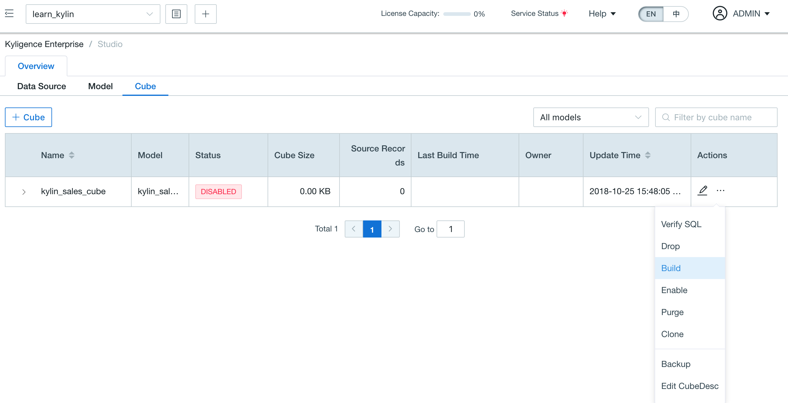

## Quick Start

In this guide, we will explain how to quickly install Kyligence Enterprise on a single node.

Before proceeding, please make sure the [Prerequisite](../installation/prerequisite.en.md) is met.

### Download and Install Kyligence Enterprise

1. Get Kyligence Enterprise software package. You can visit [Kyligence Enterprise Release Notes](../release/README.md) and choose a version according to your environment.

2. Decide the installation location and the Linux account to run Kyligence Enterprise. All the examples below are based on the following assumptions:

   - The installation location is `/usr/local/`.
   - Linux account to run Kyligence Enterprise is `root`. It is called the **Linux account** hereafter.

   > **Note**: Replace the above with your real installation location and Linux account in all the steps in this guide. For example, the default user for the CDH sandbox should be `cloudera` rather than `root`.

3. Copy Kyligence Enterprise software package to your server or VM, and unpack.

   ```shell
   cd /usr/local
   tar -zxvf Kyligence-Enterprise-{version}.tar.gz
   ```

4. Set environment variable `KYLIN_HOME` to be the folder path where Kyligence Enterprise is unpacked:

   ```shell
   export KYLIN_HOME=/usr/local/Kyligence-Enterprise-{version}
   ```

5. Create a working directory for Kyligence Enterprise on HDFS and grant the Linux account with the permission with r/w access. The default working directory is `/kylin`. Also ensure the Linux account has access to its home directory on HDFS.

   ```shell
   hdfs dfs -mkdir /kylin
   hdfs dfs -chown root /kylin
   hdfs dfs -mkdir /user/root
   hdfs dfs -chown root /user/root
   ```

   If necessary, you can modify the path of the Kyligence Enterprise working directory in `$KYLIN_HOME/conf/kylin.properties`.

   > **Note**: If you do not have permission to execute the above commands, you can `su` to HDFS account and try again.
   >
   > ```shell
   > su hdfs
   > # then retry the above hdfs dfs commands
   > ```

### Quick Configuration for Kyligence Enterprise

Under `$KYLIN_HOME/conf/`, there are two sets of configuration ready for use: `profile_prod` and `profile_min`. The former is the default configuration, which is recommended for production environment. The latter uses minimal resource, and is suitable for sandbox and other limited single node. Run the following command to switch to `profile_min` if your environment has only limited resource:

```shell
rm -f $KYLIN_HOME/conf/profile
ln -sfn $KYLIN_HOME/conf/profile_min $KYLIN_HOME/conf/profile
```

### Start Kyligence Enterprise

Run the following command to start Kyligence Enterprise:

```shell
${KYLIN_HOME}/bin/kylin.sh start
```

If you want to observe the detailed startup progress, run:

> ```shell
> tail -f $KYLIN_HOME/logs/kylin.log
> 
> ```

Once the startup is completed, you will see information prompt in the console. Run the below command to check the Kyligence Enterprise process at any time.

```shell
ps -ef | grep kylin
```

### Use Kyligence Enterprise

After Kyligence Enterprise is started, open web GUI at `http://{host}:7070/kylin`. Please replace `host` with your host name, IP address, or domain name. The default port is `7070`. The default username and password are `ADMIN` and `KYLIN` . After the first login, please reset the administrator password according to the password rule.

- At least 8 characters.
- Contains at least one number, one letter, and one special character (~!@#$%^&*(){}|:"<>?[];',./`).

Now, you can verify the installation by building a sample cube. Please continue to [Install Validation](install_validate.en.md).

### Stop Kyligence Enterprise

Run the following command to stop Kyligence Enterprise:

```shell
$KYLIN_HOME/bin/kylin.sh stop
```

You can run the following command to check if the Kyligence Enterprise process has stopped.

```shell
ps -ef | grep kylin
```

### Import Sample Dataset

Kyligence Enterprise support to use Hive as the default data source. You can import the Kyligence Enterprise built-in sample data into Hive using executable scripts. The script is `sample.sh`. Its default storage path is the bin directory under `KYLIN_HOME`. For more details, please refer to [Sample Dataset](../appendix/sample_dataset.en.md)

```shell
$KYLIN_HOME/bin/sample.sh
```

> Tips: After sample.sh is executed, it is required to choose **Reload Metadata** under the **System** page. Otherwise, there will be errors in data modeling. 

### Build Cube

After importing  the sample data, please access `learn_kylin` project and build `kylin_sales_cube`. 



### Verify SQL

After cube built successfully, you can query cube in **Insight** page.

> Note:
>
> 1. Only **SELECT** query is supported.
> 2. When query pushdown is enabled, queries that cannot be served by cube will be routed to the pushdown engine for execution. In this case, it will take longer to return.

After query results returned successfully, you can find the name of the answering cube in the **Query Engine** item.

```sql
select PART_DT,COUNT(*)
from KYLIN_SALES
group by PART_DT
```

### FAQ

**Q: How to change the default port?**

You can use the below commands to change the port, which will be set an offset to 7070.

```sh
$KYLIN_HOME/bin/kylin-port-replace-util.sh set PORT_OFFSET
```

**Q: How to use Beeline to connect Hive?**

Please refer to  [Use Beeline to Connect Hive](../installation/config/beeline.en.md).

**Q: If my cluster is based on JDK 7, how to run Kyligence Enterprise?**

Please follow the steps in [How to Run Kyligence Enterprise on Lower Version JDK](../appendix/run_on_jdk7.en.md).

**Q: Does Kyligence Enterprise support to integrate with Kerberos?**

Yes, if your cluster enables Kerberos security, the Spark embeds in Kyligence Enterprise needs proper configuration to access your cluster resource securely. For more information, please refer to [Kerberos integration](../security/kerberos.en.md).

