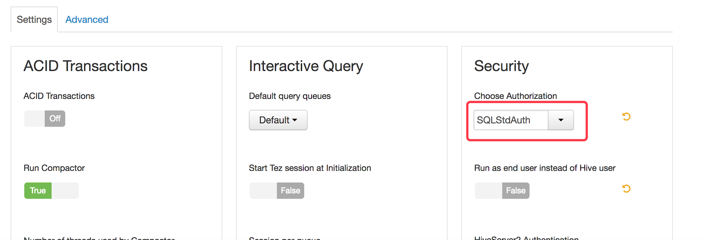

## Hive ACL Mapping

Kyligence supports Hive ACL mapping on Hortonworks HDP and HUAWEI FusionInsight platform, which means project admin or modeler can see and sync only these tables according to ACL defined in Hive.

**Note:** 

1. System admin in Kyligence Enterprise is not subject to Hive ACL, that is, system admin can view and load all tables in Hive data source. 
2. Once Hive tables are loaded into Kyligence Enterprise, these table access are no longer sync with Hive. For example, if *Table_A* is loaded by *User_A*, *User_A* can always access *Table_A* in Kyligence Enterprise even *User_A* lost his/her authorization in Hive.


### How to Enable Hive ACL Mapping

* **Hortonworks HDP platform**

  1. Set **Authorization** in Hive to `SQLStdAuth`

     

  2. Set `hive.security.authorization.enabled` to `true`

  3. Remove `org.apache.hadoop.hive.ql.security.authorization.MetaStoreAuthzAPIAuthorizerEmbedOnly ` in `hive.security.metastore.authorization.manager` 

  4. After modifying above configurations in Hive, please add the following configurations in  `kylin.properties` in Kyligence Enterprise:

     ```java
     kylin.source.hive.sync-table-using-hive-acl=true 
     //[Required] Specify whether to sync Hive ACL with Kyligence Enterprise. The default value is "false". User can only view and load Hive tables which he/she had permission on while this configuration is set to true.
     
     kylin.source.hive.sync-table-using-hive-acl-exceptions=hive 
     //[Optional] Specify whether to ignore the Hive ACL. User in Kyligence Enterprise can view and load all Hive tables.
     ```


* **HUAWEI FusionInsight platform**

  If Kyligence Enterprise is installed in HUAWEI FusionInsight platform, you don't need to modify Hive configurations to enable ACL mapping, since FusionInsight is in security mode by default. You only need to add the following configurations in  `kylin.properties` in Kyligence Enterprise:

  ```java
  kylin.source.hive.sync-table-using-hive-acl=true 
  //[Required] Specify whether to sync Hive ACL with Kyligence Enterprise. The default value is xxx. User can only view and load Hive tables which he/she had permission on while this configuration is set to true.
      
  kylin.source.hive.sync-table-using-hive-acl-exceptions=hive 
  //[Optional] Specifiy whether to ignore the Hive ACL. User in Kyligence Enterprise can view and load all Hive tables.
  ```


You can check user permissions on a specific table via following command:

```sh
kylin.sh io.kyligence.kap.tool.storage.KapHiveRemoteClientCheckCLI check -database [yourdatabase] -table [yourtable] -user [username]
```

 

### Known Limitations

There are some known limitations of Hive ACL mapping in Kyligence Enterprise:

- Only `SQLStdAuth` of Hive Authorization is supported

- User group mapping of Hive ACL is not supported

- Cloudera CDH platform and MapR platform are not supported
