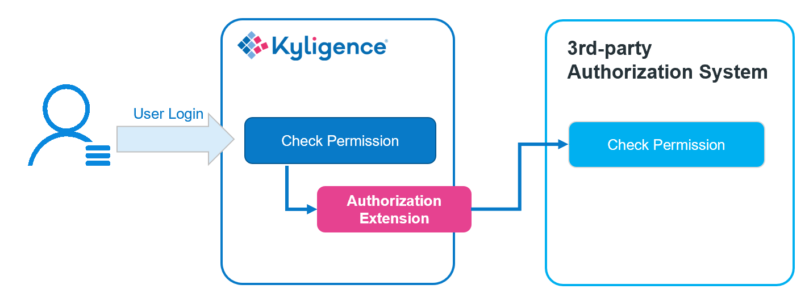

## Integrate with 3rd-party Authorization System

Kyligence Enterprise has its own access control system, however it can also integrate with your existing authorization system, to delegate permission checks to a 3rd-party system.

By default, Kyligence Enterprise uses its built-in table and column permission controls. However the system also provides an extension point through which you can define customized authorization logic. By doing so, authorization on tables and columns can be delegated to an external 3rd-party permission system.

> **Note**: Row level access control is not supported by the authorization extension at the moment. Row level access control can only be configured through the built-in access control mechanism.

This section describes the principles and steps to integrate with a 3rd-party authorization system.

### How It Works

The mechanism of integrating with a 3rd-party authorization system is shown below:



The key to integrate with a 3rd-party authorization system is to implement a customized extension, which connects to the 3rd-party authorization system for permission checking.

### How to Implement

Kyligence Enterprise ships a sample that shows how to implement an authorization extension from compiling source code to packaging and deployment. Below is more details about the sample.

#### Step 1. Setup Development Environment

Unzip `$KYLIN_HOME/samples/hive-acl-reader.tar.gz`. This is the sample project with `pom.xml` and maven project defined. Import it into your Java IDE.

Add Kyligence Enterprise library `$KYLIN_HOME/tool/kylin-tool-kap-[version].jar` to your project lib directory and to your classpath.

This sample delegates table and column permission checking to Hive by calling Hive security APIs.

> **Note**：
>
> In order to call Hive security API from remote, this sample needs below Hive configuration:
>
> * Set `hive.security.authorization.enabled` to `true`
> * Set Hive Authorization mode to `SQLStdAuth`
> * Set `hive.security.metastore.authorization.manager` to **exclude** `org.apache.hadoop.hive.ql.security.authorization.MetaStoreAuthzAPIAuthorizerEmbedOnly`

#### Step 2. Implement the Authorization Extension

The extension point of 3rd-party authorization consists of the following:

- **KapOpenTableACLProvider** (required): Implement this class to customize table level access control.
- **KapOpenColumnACLProvider** (optional): Implement this class to customize column level access control. Implementing this is optional if you only want to override the table level controls.

Below introduces how to implement these through the sample code.

*HiveAclProvider* implements *KapOpenTableACLProvider*, delegating table permission checks to Hive security APIs. Key elements of the class are:

* *HiveAclProvider()* is the constructor. In it, `HiveMetaStoreClient` is instantiated and ACL cache is initialized.

  > **Note**: In order to avoid class conflict, you may need to unset Hive parameter `HiveConf.ConfVars.METASTORE_FILTER_HOOK.varname` before initializing `HiveMetaStoreClient`.

* *getCanAccessUserList(String project, String table)* returns a user list who have the permission to access a certain table in a project. This is used by Web UI only. You may choose to always return an empty list if don't want to expose any user names in the frontend.
* *getCanAccessGroupList(String project, String table)* returns a user group list who have the permission to access a certain table in a project. This is used by Web UI only. You may choose to always return an empty list if don't want to expose any user names in the frontend.
* *getAccessTableList(String project, String username)* returns a table list of all the accessible tables for a user in a project. The table string takes format `DATABASE.TABLE` in capital letters. In the sample, the code reads the table list through `HiveMetaStoreClient` API.

The source code of HiveAclProvider is below:

```java
public class HiveAclProvider extends KapOpenTableACLProvider {
    private static final Logger logger = LoggerFactory.getLogger(HiveAclProvider.class);
    private static final String TYPE_USER = "user";
    private static final String TYPE_ROLE = "role";

    private HiveMetaStoreClient metaStoreClient;
    private HiveConf hiveConf;
    private HiveObjectRef hiveObj;
    private Cache<String, Map<String, Map<String, Set<String>>>> aclCache = CacheBuilder.newBuilder().build();

    public HiveAclProvider() throws MetaException {
        hiveConf = new HiveConf();
        hiveConf.unset(HiveConf.ConfVars.METASTORE_FILTER_HOOK.varname);
        metaStoreClient = new HiveMetaStoreClient(hiveConf);
        ScheduledExecutorService scheduledExecutor = Executors.newSingleThreadScheduledExecutor();
        scheduledExecutor.scheduleAtFixedRate(new Runnable() {
            @Override
            public void run() {
                aclCache.cleanUp();
                try {
                    List<String> databases = metaStoreClient.getAllDatabases();
                    List<String> tables;
                    Map<String, Map<String, Set<String>>> databaseAcls;

                    Map<String, Set<String>> tableAcls;
                    Set<String> roles;
                    Set<String> users;
                    List<HiveObjectPrivilege> hiveObjectPrivileges;
                    PrivilegeGrantInfo grantInfo;

                    for (String database : databases) {
                        tables = metaStoreClient.getAllTables(database);
                        databaseAcls = Maps.newHashMap();
                        for (String table : tables) {
                            users = Sets.newHashSet();
                            roles = Sets.newHashSet();
                            hiveObj = new HiveObjectRef(TABLE, database, table, null, null);
                            hiveObjectPrivileges = metaStoreClient.list_privileges(null, null, hiveObj);
                            for (HiveObjectPrivilege privilege : hiveObjectPrivileges) {
                                grantInfo = privilege.getGrantInfo();
                                if (!"SELECT".equals(grantInfo.getPrivilege())) {
                                    continue;
                                }
                                if (PrincipalType.USER.equals(privilege.getPrincipalType())) {
                                    users.add(privilege.getPrincipalName());
                                } else if (PrincipalType.ROLE.equals(privilege.getPrincipalType())) {
                                    roles.add(privilege.getPrincipalName());
                                } else {
                                    logger.info("Unsupported principal type '{}' and name '{}'", privilege.getPrincipalType(), privilege.getPrincipalName());
                                }

                            }
                            tableAcls = Maps.newHashMap();
                            tableAcls.put(TYPE_USER, users);
                            tableAcls.put(TYPE_ROLE, roles);
                            databaseAcls.put(table.toUpperCase(), tableAcls);
                        }
                        aclCache.put(database.toUpperCase(), databaseAcls);
                    }
                } catch (Exception e) {
                    throw new RuntimeException("Init ACL failed", e);
                }
            }
        }, 0, 1, TimeUnit.MINUTES);
        logger.info("Hive ACL reader init succeeded");
    }

    public List<String> getCanAccessUserList(String project, String table) {
        Map<String, Set<String>> aclInfos = getAclInfos(table);
        return aclInfos.get(TYPE_USER) == null ? Lists.newArrayList() : Lists.newArrayList(aclInfos.get(TYPE_USER));
    }

    public List<String> getCanAccessGroupList(String project, String table) {
        return Lists.newArrayList();
    }

    private Map<String, Set<String>> getAclInfos(String table) {
        String databaseName = table.split("\\.")[0];
        String tableName = table.split("\\.")[1];
        Map<String, Map<String, Set<String>>> databaseAcls = aclCache.getIfPresent(databaseName.toUpperCase());
        return databaseAcls == null ? Maps.newHashMap() : databaseAcls.get(tableName.toUpperCase());
    }

    public List<String> getAccessTableList(String project, String username) {
        List<String> ret = Lists.newArrayList();
        try {
            List<Role> roles = new HiveMetaStoreClient(hiveConf).list_roles(username, PrincipalType.USER);
            List<String> roleNames = Lists.newArrayList();
            for (Role role : roles) {
                roleNames.add(role.getRoleName());
            }
            ConcurrentMap<String, Map<String, Map<String, Set<String>>>> aclMaps = aclCache.asMap();
            Map<String, Map<String, Set<String>>> databaseAcls;
            Map<String, Set<String>> tableAcls;
            for (String database : aclMaps.keySet()) {
                databaseAcls = aclMaps.get(database);
                for (String table : databaseAcls.keySet()) {
                    tableAcls = databaseAcls.get(table);
                    if (tableAcls.get(TYPE_USER).contains(username)) {
                        ret.add(String.format("%s.%s", database, table));
                        break;
                    } else {
                        Set<String> rolesInTable = tableAcls.get(TYPE_ROLE);
                        for (String role : roleNames) {
                            if (rolesInTable.contains(role)) {
                                ret.add(String.format("%s.%s", database, table));
                                break;
                            }
                        }
                    }
                }
            }
        } catch (TException e) {
            logger.error("Failed to get ACL info from Hive, please check if Hive is working properly", e);
        }
        return ret;
    }

}
```

The *KapOpenColumnACLProvider* interface is very similar and is omitted here.


#### Step 3. Package and Deploy

1. Pack you code into a jar file using maven

   ```shell
   mvn package -DskipTests
   ```

   The built jar file should be found under the `target` folder.

2. Deploy the jar file

   Put the jar file to folder `$KYLIN_HOME/ext`.

3. Configure and restart the system

   Add the following configuration in `conf/kylin.properties` and restart to take effect.

   ```properties
   # Enable the authorization extension, enable related services and interceptors
   kylin.security.table-acl-service-clz=io.kyligence.kap.rest.service.KapOpenTableACLService
   kylin.security.column-acl-service-clz=io.kyligence.kap.rest.service.KapOpenColumnACLService
   kylin.query.interceptors=io.kyligence.kap.rest.security.KapOpenTableInterceptor
   
   # Set the table ACL provider in full class name, required
   kylin.security.table-acl-provider-clz=HiveAclProvider
   
   # Set the column ACL provider in full class name, optional
   #kylin.security.column-acl-provider-clz=SomeColumnAclProvider
   ```
   
4. Log in to Kyligence Enterprise and verify

   After Kyligence Enterprise is restarted, the configuration is activated and the authorization extension is enabled. Try login to the system to check if the authorization is handled by the 3rd-party system correctly.
