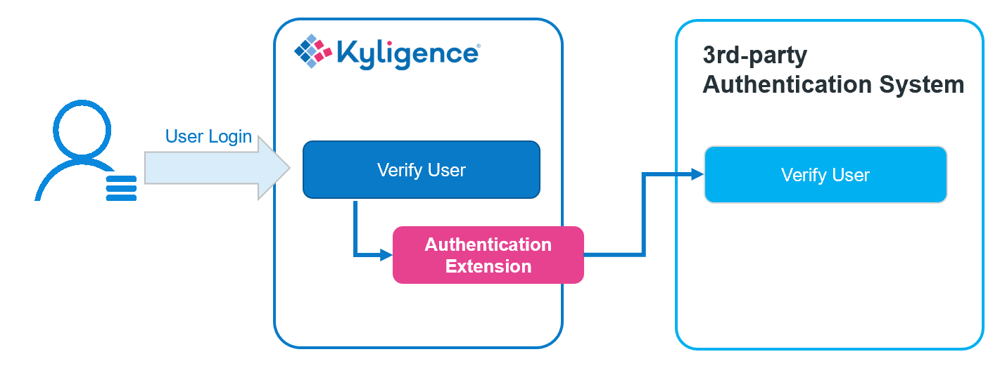

## Integrate with 3rd-party User Authentication System

In addition to the user authentication integration with LDAP, Kyligence Enterprise also supports the integration with 3rd-party user authentication systems.

By default, Kyligence Enterprise has its user management system that provides user authentication and authorization. When a user logs into Kyligence Enterprise, the system verifies the user name and password against the internal user system. In addition, Kyligence Enterprise also provides an extension point where user can plug-in customized authentication logic. When such plug-in is enabled, the system will call the customized code to do authentication, which typically delegates to a 3rd-party system.

This section describes the principles and steps to integrate with a 3rd-party user authentication system.

### How It Works

The mechanism of integrating with a 3rd-party user authentication system is shown below:



The key to integrate with a 3rd-party user authentication system is to implement a customized extension, which connects to the 3rd-party user authentication system for user verification.

### How to Implement

Kyligence Enterprise ships a sample that shows how to implement an authentication extension from compiling source code to packaging and deployment. Below is more details about the sample.

#### Step 1. Setup Development Environment

Unzip `$KYLIN_HOME/samples/static-user-manager.tar.gz`. This is the sample project with `pom.xml` and maven project defined. Import it into your Java IDE.

Add Kyligence Enterprise library `$KYLIN_HOME/tool/kylin-tool-kap-[version].jar` to your project lib directory and to your classpath.

The sample creates a memory-based user system with two users called *admin* and *test*, *admin* with administrator privileges and *test* with normal privileges.

#### Step 2. Implement the Authentication Extension

The extension point of 3rd-party user authentication consists of the following:

- **KapOpenAuthenticationProvider** (required): Authenticates a login user. This implementation is mandatory.
- **KapOpenUserService** (optional): Used for getting user list, checking user existence, etc. Implementing this is not mandatory but is often needed.
- **KapOpenUserGroupService** (optional): Used for getting user group list, checking user group members, etc. Implementing this is not mandatory but is often needed.

Below introduces how to implement these three classes through the sample code.

1. Implement the *KapOpenAuthenticationProvider* class:

   ```java
   public class StaticAuthenticationProvider extends KapOpenAuthenticationProvider {
       private static final Logger logger = LoggerFactory.getLogger(StaticAuthenticationProvider.class);
     
       @Override
       public boolean authenticateImpl(Authentication authentication) {
           String name = authentication.getName();
           Object credentials = authentication.getCredentials();
           ManagedUser user = (ManagedUser) getUserService().loadUserByUsername(name);
           if (!credentials.equals(user.getPassword())) {
               return false;
           }
           return true;
       }
   }
   ```

   - The *authenticateImpl(Authentication authentication)* is used to check whether the username and password are valid, that is, whether the user is allowed to log in. The argument to this method is an *Authentication* object with two key properties:
     - *principal*: Username passed on the page
     - *credentials*: The password passed on the page
   - Other methods should be covered selectively according to your actual needs.

2. Implement the *KapOpenUserService* class：

   ```java
   public class StaticUserService extends KapOpenUserService {
   		private static final Logger logger = LoggerFactory.getLogger(StaticUserService.class);
   		private List<ManagedUser> users = Lists.newArrayList();
     
      	@PostConstruct
      	public void init() throws IOException {
           ManagedUser admin = new ManagedUser();
           admin.addAuthorities(Constant.ROLE_ADMIN);
           admin.setPassword("123456");
           admin.setUsername("admin");
           admin.setDisabled(false);
           admin.setLocked(false);
           users.add(admin);
           ManagedUser test = new ManagedUser();
           test.addAuthorities(Constant.ROLE_ANALYST);
           test.setPassword("123456");
           test.setUsername("test");
           test.setDisabled(false);
           test.setLocked(false);
           users.add(test);
      	}
   
   	@Override
      	public List<ManagedUser> listUsers() {
      			return users;
      	}
      
      	@Override
      	public List<String> listAdminUsers() {
           List<String> admins = Lists.newArrayList();
           for (ManagedUser user : users) {
             if (user.getAuthorities().contains(new SimpleGrantedAuthority(Constant.ROLE_ADMIN))) {
               admins.add(user.getUsername());
             }
           }
           return admins;
      	}
      
      	@Override
      	public boolean userExists(String s) {
           for (ManagedUser user : users) {
             if (s.equals(user.getUsername())) {
               return true;
             }
           }
           return false;
      	}		
   
   		@Override
      	public UserDetails loadUserByUsername(String s) throws UsernameNotFoundException {
           for (ManagedUser user : users) {
             if (s.equals(user.getUsername())) {
               return user;
             }
           }
           throw new UsernameNotFoundException(s);
      	}
   
      	@Override
      	public void completeUserInfo(ManagedUser user) {
      
      	}
   }
   ```

   - The *init()* method is used to do some initialization operations. This method must be annotated with *@PostConstruct*. In this sample, we created two users.

   - *The listUsers()* method is used to return all users, and the return value of this method is a collection of *ManagedUser*. *ManagedUser* contains several key attributes:
     - username: username
     - password: user's password
     - disabled: whether to disable
     - locked: whether to lock
     - authorities: user's role

     In this sample, we return directly to the list of users created during initialization: *users*.

   - The *listAdminUsers()* method is used to return all administrator users. The return value of this method is a **List** consisting of user names. In this sample, this method simply filters out the admin users among all *users*.

   - The *userExists(String s)* method is used to return whether the user exists based on the username. In this sample, we traverse the *users* directly.

   - The *loadUserByUsername(String s)* method is used to return a user.

   - The *completeUserInfo(ManagedUser user)* method is used to add user information.

     > **Note:** In Kyligence Enterprise, *completeUserInfo* is a mandatory method. Please leave it empty rather than delete it if you don't need to add user information.

   - Other methods should be implemented according to your actual needs.

3. Implement the *KapOpenUserGroupService* class:

   ```java
   public class StaticUserGroupService extends KapOpenUserGroupService {
      	private static final Logger logger = LoggerFactory.getLogger(StaticUserGroupService.class);
      	
      	@Autowired
      	@Qualifier("userService")
      	UserService userService;
      	
      	@Override
      	public List<ManagedUser> getGroupMembersByName(String s) {
           try {
               List<ManagedUser> ret = Lists.newArrayList();
               List<ManagedUser> managedUsers = userService.listUsers();
               for (ManagedUser user : managedUsers) {
                 if (user.getAuthorities().contains(new SimpleGrantedAuthority(s))) {
                   ret.add(user);
                 }
               }
             	return ret;
           } catch (Exception e) {
             	throw new RuntimeException("");
           }
      	}
      	
      	@Override
      	protected List<String> getAllUserGroups() {
           List<String> groups = Lists.newArrayList();
           groups.add(Constant.ROLE_ADMIN);
           groups.add(Constant.ROLE_ANALYST);
           return groups;
       }
   }
   ```

   - The *getGroupMembersByName(String s)* returns all users in the user group. In this case, it is returned directly from the user in the UserService above.

   - The *getAllUserGroups()* returns all user groups. In this case, a static set of user group is returned directly.

   - Other methods should be covered selectively according to your actual needs.

     > **Caution:** If your user management system does not have user groups, then you only need to maintain an empty implementation in the above methods.

   

#### Step 3. Package and Deploy

1. Pack you code into a jar file using maven

   ```shell
   mvn package -DskipTests
   ```

   The built jar file should be found under the `target` folder.

2. Deploy the jar file

   Put the jar file to folder `$KYLIN_HOME/ext`.

3. Configure and restart the system

   Add the following configuration in `conf/kylin.properties` and restart to take effect.

   ```properties
   # Set the security profile to custom
   kylin.security.profile=custom
   
   # Set the KapOpenAuthenticationProvider, required
   kylin.security.custom.authenticaton-provider-clz=StaticAuthenticationProvider
   
   # Set the KapOpenUserService, optional
   kylin.security.custom.user-service-clz=StaticUserService
   
   # Set KapOpenUserGroupService, optional
   kylin.security.custom.user-group-service-clz=StaticUserGroupService
   ```

4. Log in to Kyligence Enterprise and verify

   After Kyligence Enterprise is restarted, the configuration is activated and the user authentication extension is enabled. Try login to the system to check if the authentication is handled by the 3rd-party system correctly.
