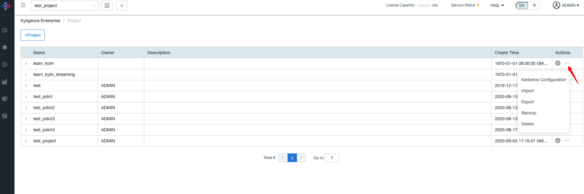
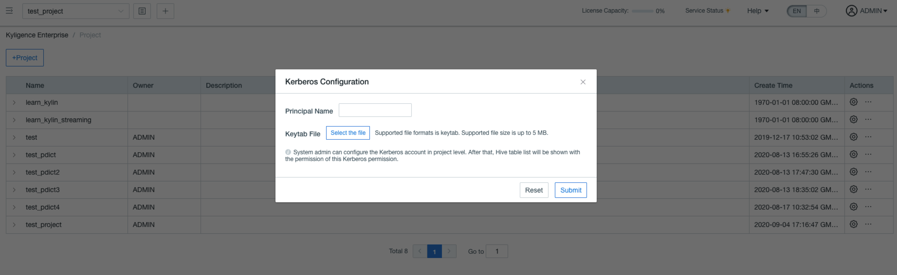

## Integrate with Kerberos in Project Level

Starting with version 3.4.5.2111, Kyligence supports project-level configuration of different Kerberos accounts when turned on Kerberos integration.

This enables projects to have different permissions loading source tables, providing more refined management capabilities for enterprise-level customers.

### Prerequisites

To enable project-level Kerberos integration, the following conditions need to be met.

1. Kerberos is enabled in the environment and configured in Kyligence, see [Integration with Kerberos](kerberos.en.md) for more details.
2. Kerberos account who starts Kyligence service need to have the collection of Hive access permission for all Kerberos users whose projects are integrated.
3. Kerberos accounts need to be configured to belong to the Hive user group.
4. When changing the Kerberos account, the Hive permissions of the new one need to be greater than the existing one.

### How to Use

1. Add configuration `kylin.kerberos.project-level-enabled=true` to the `kylin.properties` file.
2. After adding the configuration and starting Kyligence, you can see the following settings in the setting page.

### Known limitations

1. Changing project Kerberos account requires permission check, which can last few minutes with thousands of source tables.
2. Currently only the source table loading is supported with different Kerberos account permissions, and other components, such as building jobs, are still submitted by the Kerberos user who started Kyligence.
