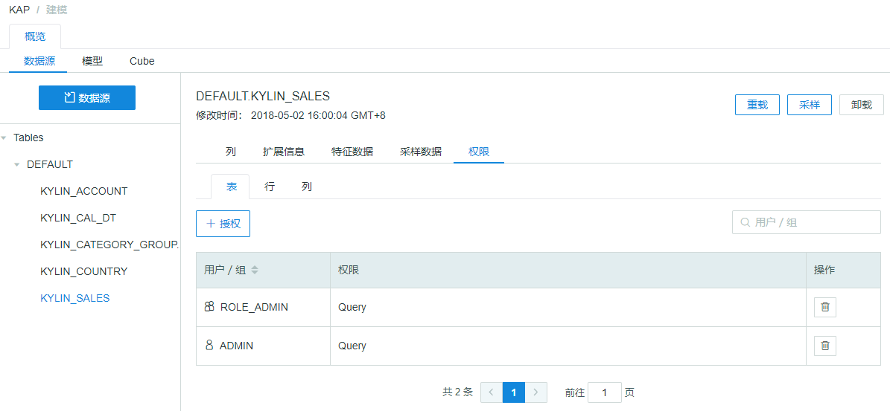
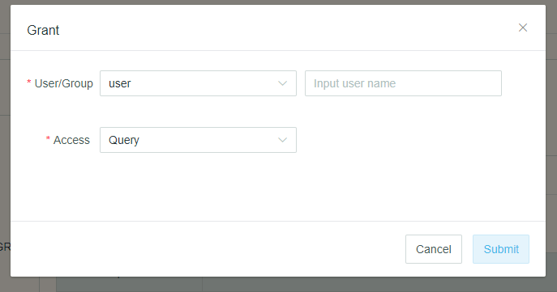
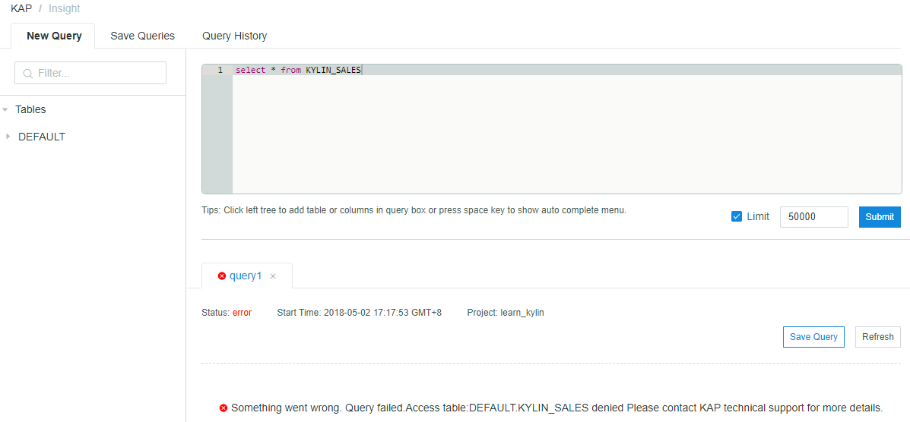

## Table-level Access Control 

*Table-level Access Control* allows Kyligence Enterprise system admin to control who can access data of Hive or KAFKA tables that have been loaded into Kyligence Enterprise. When a user/group has been revoked of query access to a table, this user/group will not be able to *query* data in this table regardless of through Cube, Table Index or Query Pushdown. The user/group can still query the Cube that has a reference to the forbidden table, as long as the query itself does not refer to the forbidden table. 

When you load the table for the first time into a project or upgrade KAP from a lower version, by default, every user/group has access to all tables that have been loaded into the project. 

Table-level Access Control needs to be set by project basis. That means even if you sync the same Hive or Kafka table from data source twice in different projects, table-level access control need to be set independently for those two projects. 

Before you set table-level access control for a user, please ensure that the user has the access permission to the project.  

> Tips: The configuration of access control might be impacted by BI frontend cache. If BI has cache that is generated from a user without Access Control, when another user logs in and browses the same report, it is possible that BI will use the cache to render the result and thus bypass the Access Control.

###Manage Table-level Access Control 

#### Grant Access

Normally, if a user has the access permission to the project, the user will be automatically granted the access control in all tables. 

A more flexible method has been supported since Kyligence Enterprise 3.1.0. After setting the project level configuration `kap.acl.project-internal-default-permission-granted = false` , new users will not be granted the access permission to tables. To grant the access permission, uesrs need to be manually granted access of selected tables.

Follow below steps to grant access at table-level:

1. Go to `Studio` on the left hand side navigation bar.
2. Go to Data Source, click on a loaded table.
3. For that table, click Access tab, choose table. 
4. Click `+Grant` to grant table access to user/group. 
5. On the pop-up window, choose the user/group and save. 

#### Revoke Access

Follow below steps to revoke access at table-level:

1. Go to `Studio` on the left hand side navigation bar.
2. Go to `Data Source`, click on a loaded table.
3. For that table, click `Access` tab, choose table. 
4. Choose a user/group that you want to revoke table-level access. 
5. Under `Action`, click `delete` button.  

### Validate Table-level Access Control

In this example, we take the user `joanna` as an example to validate the table-level access control. The validation of table-level access control for a group is the similar. User `joanna` is a user who has access to `learn_kylin` project and has been revoked access of table `kylin_sales` . 

Login as user `joanna`, go to insight page, and try to query `kylin_sales` table to validate whether table-level access control has been effective. 

As shown in the screenshot below, access is denied when user `joanna` try to query table `kylin_sales`

