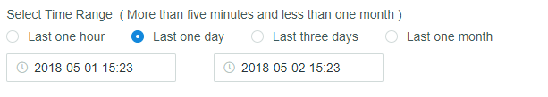
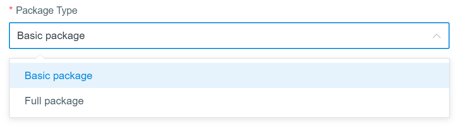
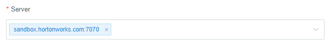
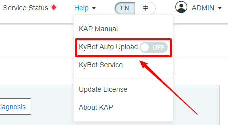
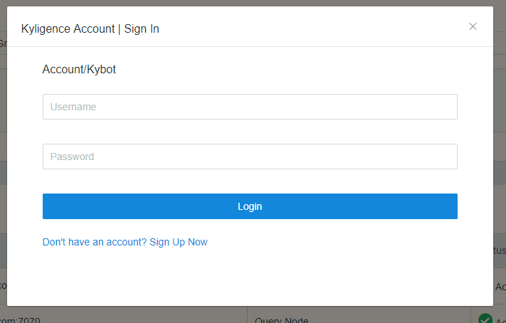
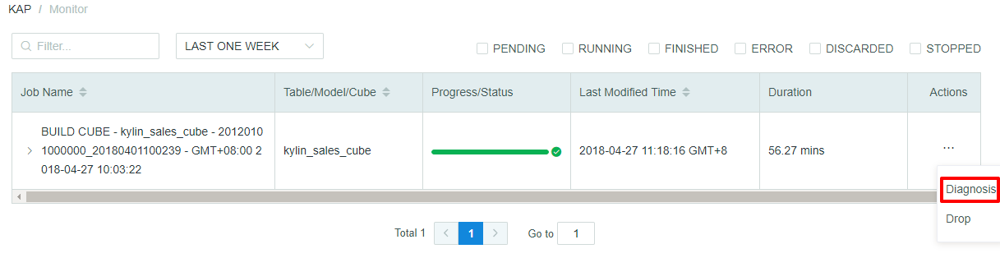

## System Diagnosis and Job Diagnosis
Kyligence Enterprise users may face with many problems during usage, such as failure in creating a Cube or querying. Kyligence Enterprise provides a `Diagnosis` function on WEB UI to pack related information into a zip package to help devops better analyze the root cause.
Diagnosis function including System Diagnosis and Job Diagnosis.

### System Diagnosis
System Diagnostic Package includes all diagnostic information of a Kyligence Enterprise instance, and users can generate System Diagnosis Package on Web UI following the following steps,

1. Click the `Diagnosis` button on `System` Page

2. Select Time Range
You can select `last one hour`, `last one day`, `last three days` and `last one month`, or self-defined.

> *Tips:* the selected time range must include the period of incidents.

3. Select Package Type

You can choose either `Basic package` or `Full package`.

> `Basic package` contains your log files, metadata and cluster information. `Full package` contains slow query or bad query information, etc. Uploading the `Basic package` is highly recommended. 

 4. Select Server

> *Tips:* if Kyligence Enterprise is deployed on multiple nodes, please locate the specific node on which incident happened, and select the right server name when generating Diagnostic Package, otherwise, the generated System Diagnostic Package may not include useful information about the issue.

5. Select method of dealing with the packages
Kyligence Enterprise provides two options to dealing with Diagnostic Packages, one is downloading to local, and the other is uploading to KyBot for further analysis.

Click `Only generate` to generate the System Diagnostic Package and download to local.

Click `Generate and sync package with KyBot` to generate the System Diagnostic Package and upload it to KyBot.

> *Tips:* More information about the usage of KyBot, please refer to [KyBot Introduction](../kybot/README.md)

Meanwhile, Kyligence Enterprise supports uploading Diagnostic Packages to KyBot website, users can enable this function by turning on the `KyBot Auto Upload` on the dropdown list of `Help`, which is on the top of the page, and log in with Kyligence Account.

### Job Diagnosis
Job Diagnostic Package includes all diagnostic information of a specific job, and users can generate Job Diagnosis Package on Web UI following the following steps,

1. Click a certain job on the `Monitor` Page, unfold `Actions` and click `Diagnosis`.

2. Select Server

3. Select method of dealing with the packages
Kyligence Enterprise provides two options to dealing with Diagnostic Packages, one is downloading to local, and the other is uploading to KyBot for further analysis.

- Click `Only generate` to generate the System Diagnostic Package and download to local.
- Click `Generate and sync package with KyBot` to generate the System Diagnostic Package and upload it to KyBot.

#### FAQ

**Q: If I failed to generate diagnostic packages because the allocated memory is insufficient. What should I do?**

Please change the `KYBOT_JVM_SETTINGS` parameters in `$KYLIN_HOME/kybot/setenv.sh`. Then restart Kyligence Enterprise and try again.

