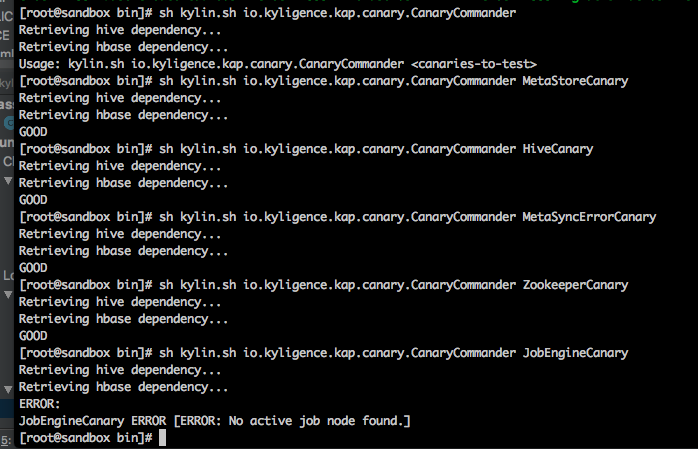

## Service Status Detection

Since KAP V2.5.6, the service status will be checked every 15 minutes. ADMIN users can check the status of services visually on the KAP WEB UI, as shown in the following picture. 

Services status turns green for being good, yellow for warnings  and red for error. Users could also click to get more detailed information.

Command lines are also supported to check the individual service status manually. Meanwhile, the results will be stored in a log file named *canary.log* (`$KYLIN_HOME/logs/canary.log`), which will also be included in the KyBot diagnostic package.

This function will mainly focus on these aspects：

- Metastore availability: to check the metastore’s connectivity, functionality and response time 
- Hive connectivity: to check the connectivity and speed of Hive
- Metadata consistency: to check the consistency of metadata
- Metadata synchronization: to check the synchronous exception of metadata and reload metadata automatically
- Spark context availability: to check the availability of  Spark session
- Zookeeper availability: to check the availability and speed of zookeeper
- Job Engine: to check the availability of job engine

### Using Command Line to  Check Manually

You can run the following command line `$KYLIN_HOME/bin/kylin.sh io.kyligence.kap.canary.CanaryCommander <canaries-to-test>`. 

> <canaries-to-test> could be replaced as the following parameters :
>
> •MetaStore availability: MetaStoreCanary 
>
> •Hive connection test: HiveCanary
>
> •Metadata consistency: MetadataCanary
>
> •Metadata synchronization: MetaSyncErrorCanary
>
> •Zookeeper availability: ZookeeperCanary
>
> •Job engine availability: JobEngineCanary
>
> The command line is not currently supported to diagnose Spark context availability.

### The Description of Service Status

The status is mainly shown as following:

- GOOD: The service status is healthy
- WARNING: There are some problems which may impact KAP performance. For example,

> MetaStoreCanary WARNING [WARNING: Creating metadata (40 bytes) is slow and it may impact KAP performance and availability.]

- ERROR: There is something wrong with the dependency service. For example,

> ERROR [JobEngineCanary-191152] canary: No active job node found.

- CRASH: The service throws the exception. For example,

> 2018-03-19 12:07:30,218 INFO  [SparkSqlContextCanary-191207] canary : Completed > SparkSqlContextCanary CRASH [CRASH: Cannot call methods on a stopped SparkContext.
> This stopped SparkContext was created at:
> org.apache.spark.sql.SparderFunc.init(SourceFile)
> io.kyligence.kap.rest.init.KapInitialTaskManager.checkAndInitSpark(SourceFile:69)
> io.kyligence.kap.rest.init.KapInitialTaskManager.afterPropertiesSet(SourceFile:44)
> org.springframework.beans.factory.support.AbstractAutowireCapableBeanFactory.invokeInitMethod
>  s(AbstractAutowireCapableBeanFactory.java:1687)
> org.springframework.beans.factory.support.AbstractAutowireCapableBeanFactory.initializeBean(AbstractAutowireCapableBeanFactory.java:1624)
> (No active SparkContext.)

There are different criteria used for different status:

- MetaStoreCanary
  - *WARNING* : The operations including writing, reading and deleting on metadata take more than 300 milliseconds. 
  - *ERROR*: The operations including writing, reading and deleting on metadata take more than 1000 milliseconds.
  - *ERROR*: Metastore failed to read a newly created resource. (msg: Metadata store failed to read a newly created resource.)
- HiveCanary
  - *WARNING*: Listing Hive databases exceeds 20 seconds.
  - *ERROR*: Listing Hive databases exceeds 30 seconds.
- MetadataCanary
  - *WARNING*: Verifying the consistency of metadata exceeds 10 seconds. 
  - *ERROR*: Verifying the consistency of metadata exceeds 30 seconds. 
  - *ERROR*: Broken metadata exists. (msg: Metadata {entities} corrupt, with rule --{rule})
- MetaSyncErrorCanary
  - *WARNING*: Metastore synchronize failed. (msg: Metadata synchronization error detected (from {node1} to {node2}). Network was unstable or overloaded? Auto recovery attempted.)
- ZookeeperCanary
  - *WARNING*: The operation of checking zookeeper's availability / locking / unlocking exceeds 3 seconds. 
  - *ERROR*: he operation of checking zookeeper's availability / locking / unlocking exceeds 10 seconds. 
  - *ERROR*: ZooKeeper is not alive. (msg: Zookeeper with connection {url} is not alive.)
  - *ERROR*: Failed to require zookeeper lock. (msg: Failed to require zookeeper lock.)
  - *ERROR*: Failed to release zookeeper lock. (msg: Failed to release zookeeper lock.)
- JobEngineCanary
  - *ERROR*: One of the KAP nodes failed to report job engine status. (msg: Node {node} failed to report job engine status)
  - *ERROR*: There is no active job engine node found. (msg: No active job node found.)
- SparkSqlContextCanary
  - *WARNING*: The time of calculating the sum from 0 to 100 exceeds 10 seconds.
  - *ERROR*: The time of calculating the sum from 0 to 100 exceeds 30 seconds.

