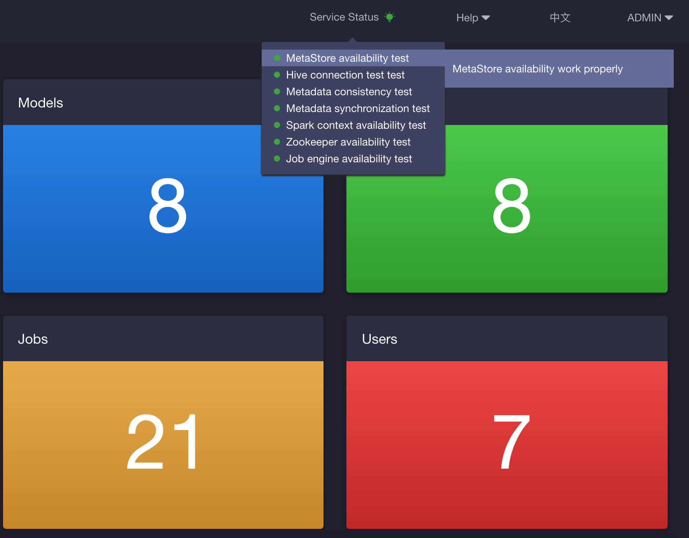

## Service Status Detection

Since KAP v2.5.6, service status will be detected every 15 minutes. As shown in the following picture, ADMIN users can view the service status and related information visually on the kAP WEB UI, and diagnose environment problem conveniently.

Services status turns green for being good, yellow for warnings and red for error. More detailed information can be viewed by hovering above the specific detection item.

Service status detection mainly focuses on following aspects：

- Hive availability: to check the connectivity of Hive and Beeline.
- Metadata store availability: to check the metastore’s connectivity, functionality and response time 
- Metadata integrity: to check the consistency of metadata and assess whether metadata is corrupted
- ZooKeeper availability: to check the connectivity and response speed of ZooKeeper
- Spark cluster availability: to check the availability of Spark 
- Garbage cleanup: to check the size of garbage
- Metadata synchronization: to check the whether metadata is synchronized successfully and if not, metadata will be reloaded automatically
- Job Engine availability: to check the availability of job engines

### Check service status manually
KAP also supports users to check service status manually through command lines, and the results will be logged in `$KYLIN_HOME/logs/canary.log`.

You can run the command line `$KYLIN_HOME/bin/kylin.sh io.kyligence.kap.canary.CanaryCLI <canaries-to-test>`, in which <canaries-to-test> could be replaced by the following parameters,

- Hive availability: `HiveCanary`
- Metadata store availability: `MetaStoreCanary`
- Metadata integrity: `MetadataCanary`
- ZooKeeper availability: `ZookeeperCanary`
- Spark cluster availability: checking through command lines is not yet supported
- Garbage cleanup: `GarbageCanary`
- Metadata synchronization: `MetaSyncErrorCanary`
- Job Engine availability: `JobEngineCanary`

### The Description of Service Status
#### Three levels of Service Status 

- *Green:* Good, indicating that the service status is healthy
- *Yellow:* Warning, indicating that there are some problems which may impact KAP performance.
- *Red:* Error or crash, indicating that there is something wrong with the service status or the service throws exception. 

#### Detailed criteria

| Canary Items          | Status: Yellow                                               | Status: Red                                                  |
| --------------------- | ------------------------------------------------------------ | ------------------------------------------------------------ |
| HiveCanary            | Listing Hive databases exceeds 20 seconds                    | Listing Hive databases exceeds 30 seconds                    |
| MetaStoreCanary       | Writing, reading and deleting on metadata exceeds 300 milliseconds. | 1.Writing, reading and deleting on metadata exceeds 1000 milliseconds  2.Metastore failed to read the latest written data |
| MetadataCanary        | Verifying the consistency of metadata exceeds 10 seconds     | 1.Verifying the consistency of metadata exceeds 30 seconds 2.Broken metadata exists |
| ZookeeperCanary       | Checking ZooKeeper's availability, locking and unlocking exceeds 3 seconds | 1.Checking ZooKeeper's availability, locking and unlocking exceeds 10 seconds  2.ZooKeeper is not alive  3.Failed to require or release ZooKeeper lock |
| SparkSqlContextCanary | The time of calculating the sum from 0 to 100 exceeds 10 seconds | The time of calculating the sum from 0 to 100 exceeds 30 seconds |
| GarbageCanary         | 1. The number of metadata garbage is larger than 50  2. The number of garbage files produced by Cube is larger than 50 3. The amount of garbage is larger  than 5G |                                                              |
| MetaSyncErrorCanary   | Metastore fails to synchronize                                 |                                                              |
| JobEngineCanary       |                                                              | 1.One of the KAP nodes failed to report Job Engine status 2.There is no active Job Engine node |

