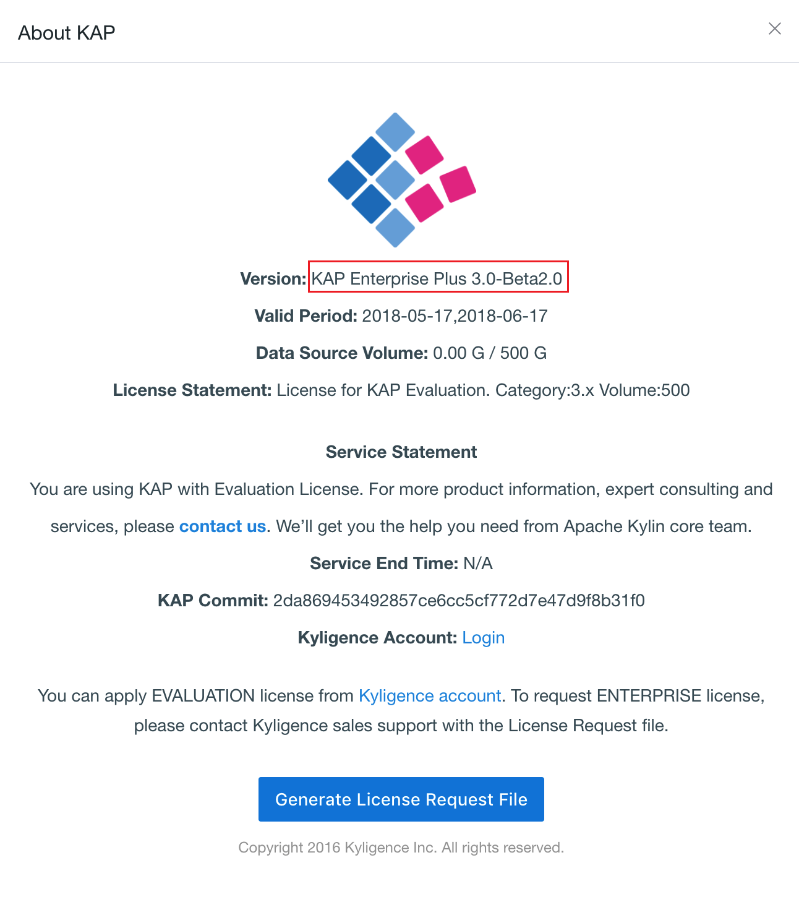

## Installing Hotfix Patch

Since KAP 3.X, you can installing hotfix patch to fix some bugs. You can contact Kyligence Support Team to obtain the patch, which enables you to upgrade KAP automatically.

1. Set the value of the environment variable KYLIN_HOME as the contemporary version and stop the running KAP instance:

   ```
   export KYLIN_HOME=/usr/local/kap-{version}
   $KYLIN_HOME/bin/kylin.sh stop
   ```

   

2. Apply the patch. Before installation, the system will back up the original version fully.

   ```
   sh patch.sh apply PATCH_PACKAGE
   ```

   > Notice: The system will change the information of the original version according to that contained in patch while some files will not be changed.
   >
   > - The files of `$KYLIN_HOME/logs` and `$KYLIN_HOME/tomcat/logs` will not be backed up. You have to backup these two files manually.
   > - The files of `$KYLIN_HOME/conf`，`$KYLIN_HOME/tomcat/conf`，`$KYLIN_HOME/ext`，`$KYLIN_HOME/meta_backups` will not be changed during the procedure of upgrading.

3. Finish installation and restart KAP.

   

   > Notice: If the new version couldn’t startup normally, you need to rollback to the original version. You can find a file named as `{original verison}-backup.tar.gz` under the installation directory. You should delete the original version and uncompress the backup file then the rollback procedure will be finished.
   >
   > If there still exists something wrong, you can contact Kyligence Support Team for more help.

   ​