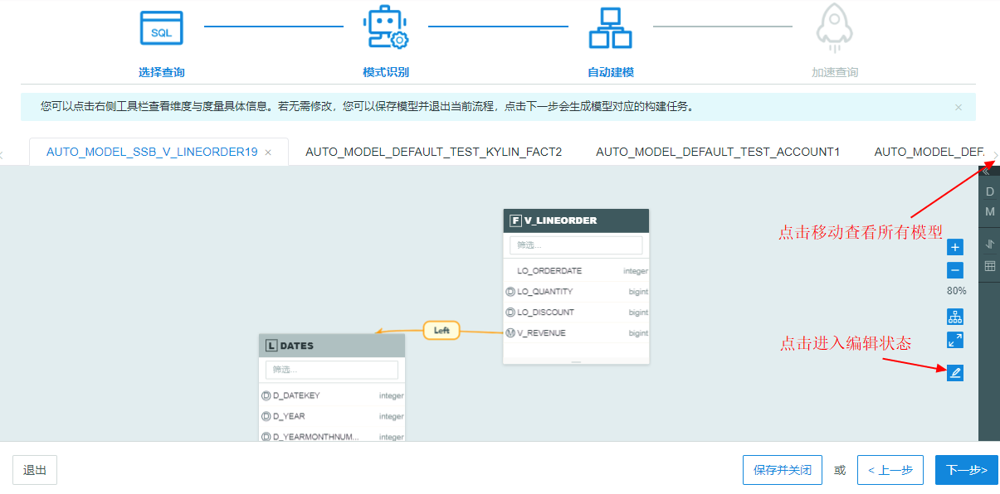
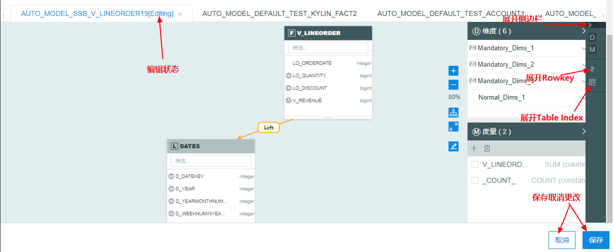
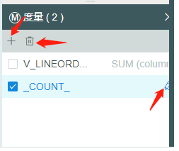
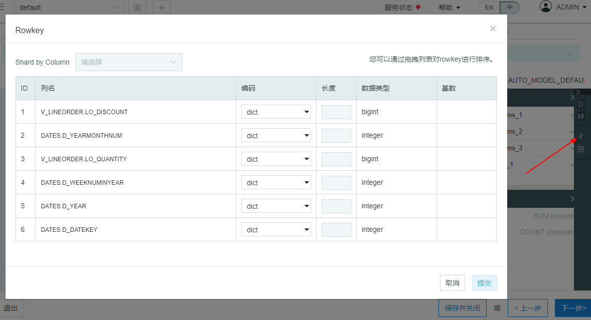
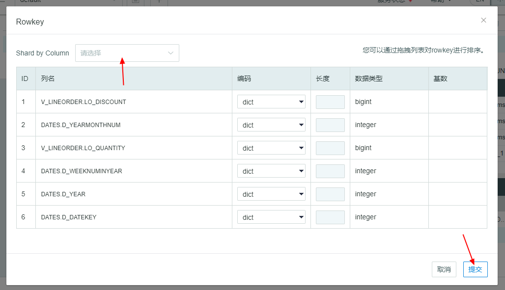
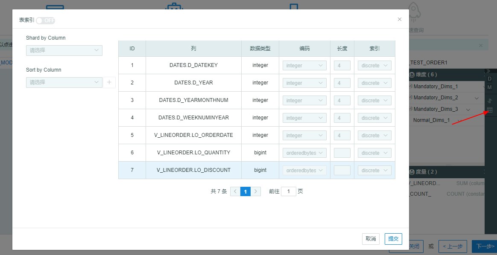
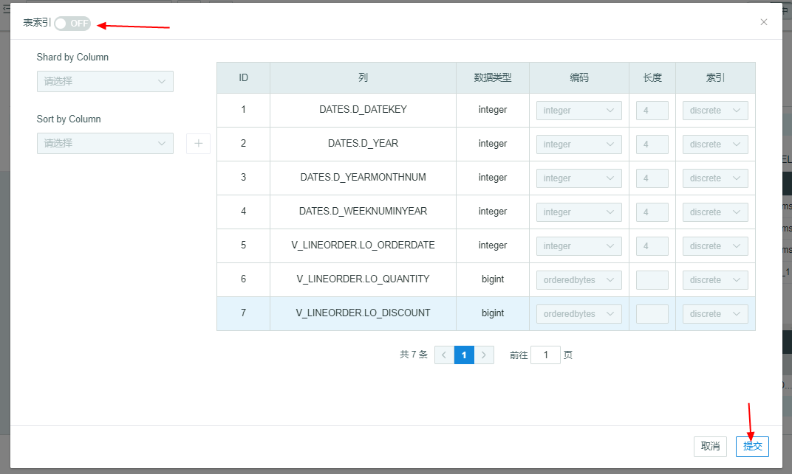

## 模型查看和编辑

在自动建模页面，您可以看到前一页勾选的全部模型。您可以调整页面比例，也可以进行页面优化，点开侧边栏您可以查看所有模型的维度，度量，表索引和Rowkeys信息。您也可以对模型进行编辑。

> 注意：模型的维度和各表间连接关系在编辑和非编辑状态均不可以更改，度量、表索引和Rowkeys在编辑状态下可以更改。
>

### 模型编辑

点击编辑按钮进入编辑状态后，模型名字上面会显示该模型处于编辑状态。

系统会自动推荐不同**维度**，包括联合维度，层级维度和必要维度，分别以 J，H和M 在维度名前标识。具体可以参照KAP手册[维度聚合组](../model/cube/aggregation_group.cn.md)。

> 注意：维度在编辑状态下无法更改。
>

**度量**在编辑状态下可以查看具体内容，也可以添加，删除和编辑。具体逻辑可以参照KAP手册设计Cube中的度量设计。

**Rowkeys**的Shardby列在表格上端，具体逻辑参照KAP手册中[设计Cube](../model/cube/create_cube.cn.md)。

**表索引**（Table Index）的Shardby和Sortby列在表格左端，默认为关闭状态。具体内容请参照KAP手册中的[明细表索引](../model/cube/table_index.cn.md)。

### 保存和关闭

如果您点击模型名称旁边的**×**来关闭模型，该模型不会被保存，如果想再次得到该模型，可以点击**上一步**回到模型识别页面重新勾选。

如果您不想构建模型，可以点击**保存并关闭**，此时模型可以在**建模→模型**中查看。