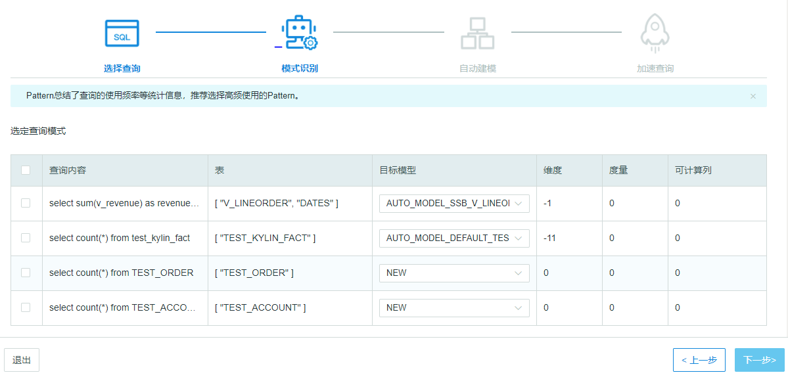
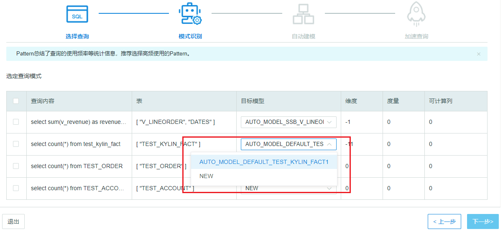

## 模式识别和选择

在模式识别页面，KAP将内容相同的SQL语句整合到了一起，并给出了推荐的模型。您可以查看查询内容，目标模型和新增加的度量等。

点击上一步您可以重新选择需要的SQL语句。

勾选了需要的SQL语句后您可以进入下一步。

点击退出您将回到任务列表或是引导页面。

### 目标模型

目标模型是与SQL语句涉及到的事实表相关的所有模型，并且KAP将根据语句推荐出一个新的模型，命名为NEW。

对于模型的**命名**遵循以下几个规则：

- 模型名称是AUTO\_MODEL\_数据集名\_事实表名\_编号。

- 编号按照同一事实表出现过的模型的个数依次累加，不同的事实表掌管各自的编号。

- 如果是NEW模型，它的编号将在该事实表下已有的最大编号上累加。

- 如果是选择了已有的模型，它将以一个新模型的身份被重新编号，编号按照该事实表下已有的最大编号累加。

您可以通过下拉框选择需要的模型，点击**下一步**查看模型具体信息。
