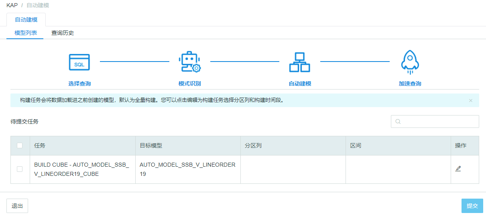
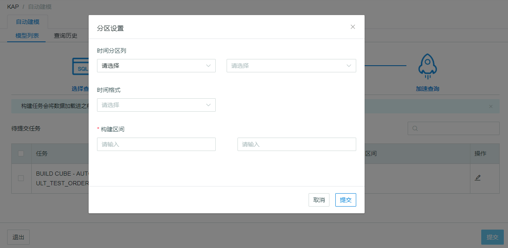

## 任务构建

您可以查看提交的任务信息，根据目标模型名称进行筛选，勾选需要构建的模型**提交**构建。如果不需要构建，点击退出即可回到任务列表页面。

默认为全量构建，如果需要更改构建时间，可以点击**操作**中的编辑，进行分区设置。分区设置请参考KAP手册中的[设计模型](../model/data_modeling.cn.md)和[构建Cube](../model/build_cube.cn.md)。

