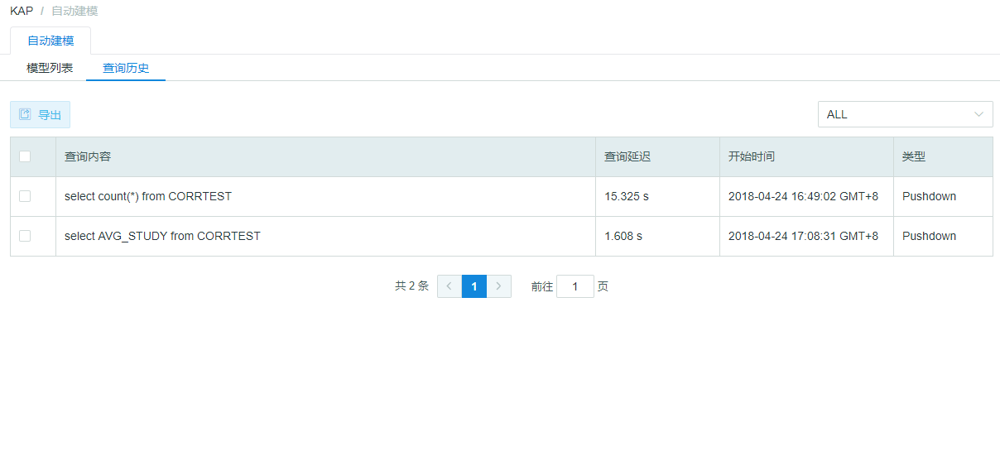

### 查询历史

**查询历史**显示了部分查询过的SQL历史，主要包括Slow（慢查询）和Pushdown（下压的查询）。您可以查看每条SQL的查询内容、查询延迟、开始时间和类型，并可以根据类型进行筛选。

默认查询延迟≥90s的查询会被归入**慢查询**，该参数可以在`$KYLIN_HOME/conf/kylin.properties` 配置文件中，添加`kylin.query.badquery-alerting-seconds`更改。

> 注意：当前查询历史默认最多存储500条去重查询，该参数可以在在`$KYLIN_HOME/conf/kylin.properties` 文件中，添加`kylin.query.badquery-history-number`更改。如果查询语句数量大于500，新的SQL查询将会替换最早保存的SQL查询语句。
>

在查询历史页面，您也可以勾选需要的SQL后点击**导出**，将SQL导出为文本文档。

