## 进入自动建模板块

启动KAP并创建项目后，点击进入**自动建模**模块，

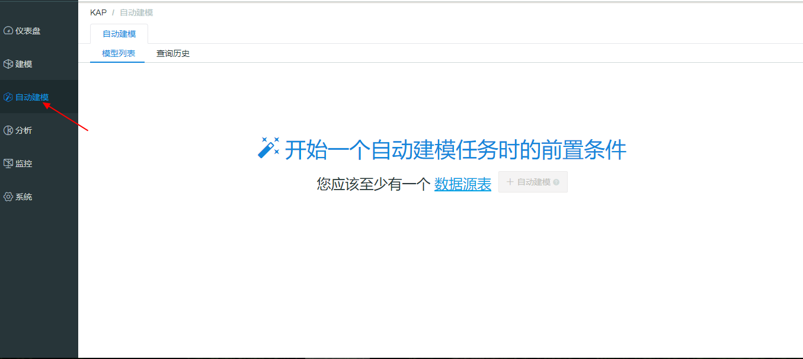

如果您之前已经完成过自动建模流程，那将进入到**任务列表**页面，点击**自动建模**将开始新的一次自动建模流程。

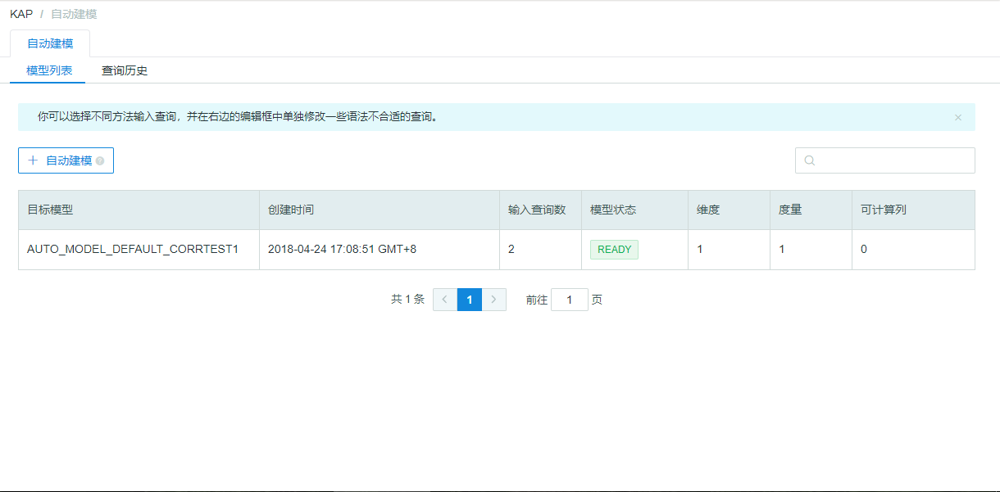

如果您没有过自动建模记录，那将进入到**引导**页面。引导页面将引导您导入数据源表，可导入数据源有Hive, RDBMS 。

> 注：虽然导入数据源页面有Kafka选项，但是自动建模不支持Kafka数据。

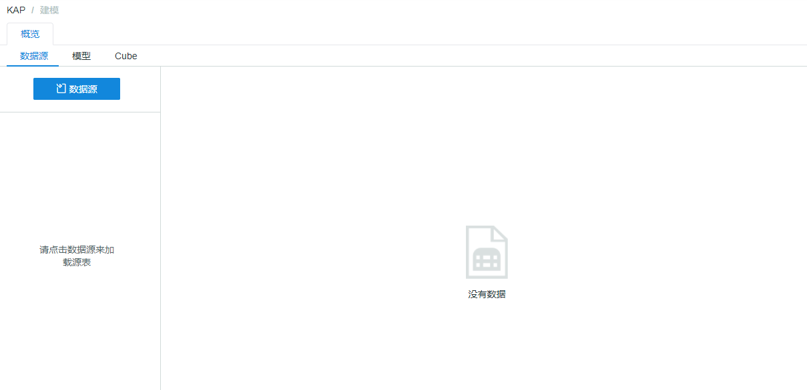

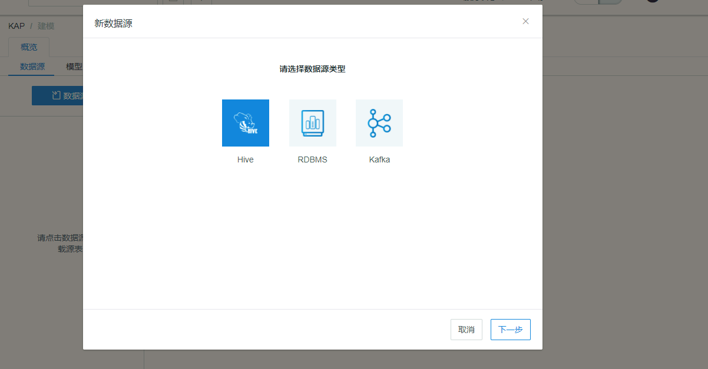

有数据源表后，点击**自动建模**按钮将开始自动建模流程。

### SQL导入和编辑

自动建模的第一步是选择查询页面，您可以查看SQL语句的内容、来源和状态，也可以通过检测状态和查询源过滤需要的语句，您还可以对语句进行编辑和删除。

点击退出您将回到任务列表或是引导页面。

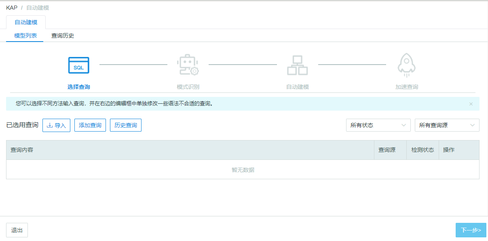

### SQL导入

自动建模提供了三种导入SQL的方式，分别是从文件导入，手动添加查询或是从历史查询中导入。

- **从文件导入**

点击已选用查询旁的**导入**按钮，会出现弹窗，您选择需要的文件导入即可。

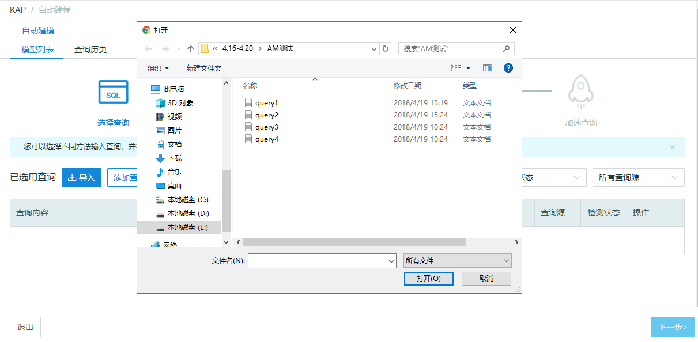

> 提示：文件大小应小于1M，文件格式应为文本文档。

- **手动添加**

选择**添加查询**，会出现弹窗，您输入需要的SQL语句即可。点击提交后系统会识别SQL语句是否可读，如果出错，将无法提交，您需要按照系统给出的错误信息对语句进行修改。

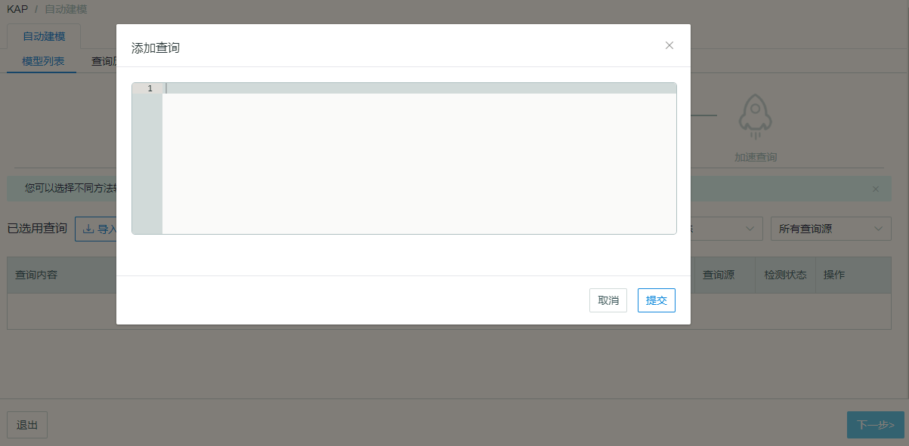

- **从历史查询中导入**

当需要对之前进行过的查询进行加速时，您可以直接从历史查询中选择需要的SQL语句。点击**历史查询**，将弹出弹窗，可以根据查询类型进行筛选，勾选需要的查询并提交即可。

> 提示：历史查询的类型有 pushdown和slow 两类，分别对应下压查询和慢查询。

### SQL编辑

导入SQL语句后，您可对语句进行内容编辑或是删除。请注意，只有当所有SQL语句**均正确**时才可以进入下一步。

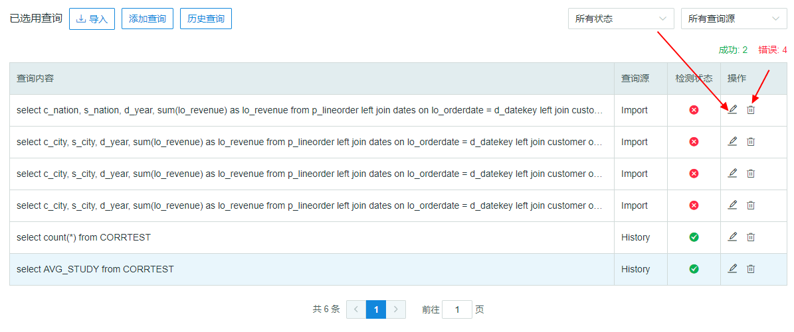

点击**编辑**按钮，您可以在右侧的编辑框内查看语句的具体内容和状态。

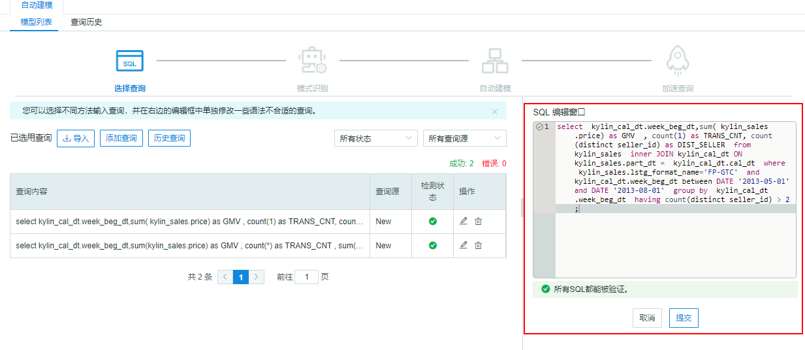

对错误语句进行编辑时，您可以点击错误语句前面的按钮查看具体错误原因。

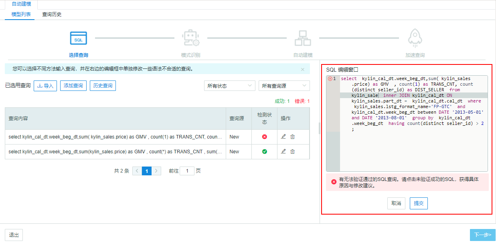

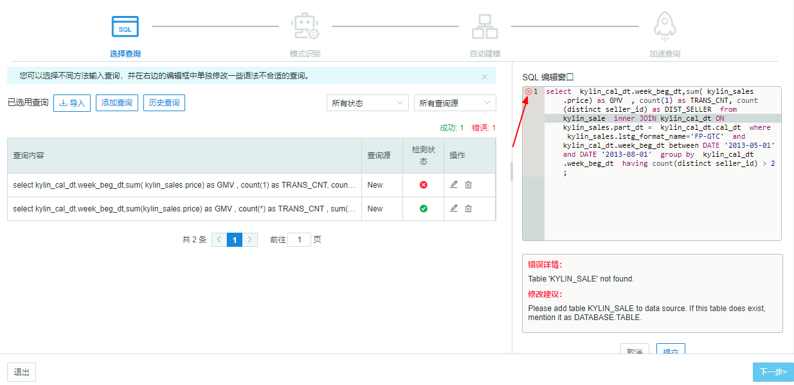

### 查询历史

查询历史显示了您做过的所有查询的历史，您可以查看查询内容，查询延迟，开始时间和类型，并可以根据类型进行筛选。

查询类型分为 Slow和Pushdown。默认查询延迟≥90s的查询会被归入慢查询，该参数可以在`$KYLIN_HOME/conf/kylin.properties` 配置文件中，添加`kylin.query.badquery-alerting-seconds`更改。

当前查询历史默认最多存储500条去重查询，该参数可以在在`$KYLIN_HOME/conf/kylin.properties` 配置文件中，添加`ylin.query.badquery-history-number`更改。如果查询语句数量大于该值，新的查询语句将会替换最早保存的查询语句。

您可以勾选需要的SQL，点击**导出**，将SQL导出为文本文档。

