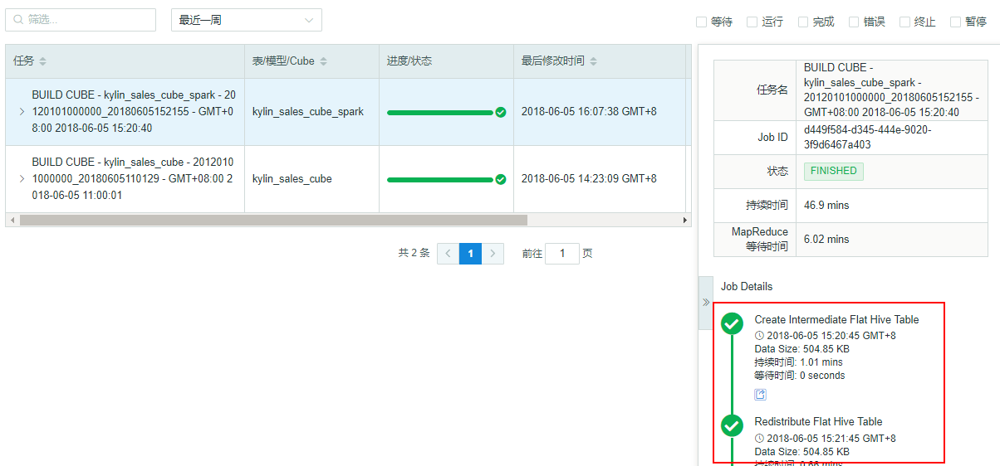

##创建Cube过程中使用SparkSQL

KAP在Cube创建过程中默认应用Hive来做部分预计算。因为SparkSQL在Hive上有更好的性能，所以使用SparkSQL可能会在特定步骤中提高创建速度。





在构建Cube中使用SparkSQL需要一个正在运行的Spark Thrift server。需要注意的是尽管理论上这个Spark Thrift server可以同样被用于下压查询，但是**非常建议**分别使用不同的Thrift server用作查询和Cube构建。在同一个Thrift server使用混合查询和工作时，性能可能无法令人满意。例如，一个大的构建工作可能会占用所有的executor资源并且将下压查询的时间阻塞很长一段时间。

请按照下列步骤来开启SparkSQL在Cube创建中的使用：

1. 首先，准备一个被用作Cube创建的Spark Thrift server。
2. 根据您的环境，在`conf/kylin.propertier`设置如下：

   ```  kylin.source.hive.enable-sparksql-for-table-ops=true
   kylin.source.hive.enable-sparksql-for-table-ops=true
   kylin.source.hive.sparksql-beeline-shell=/path/to/spark-client/bin/beeline
   kylin.source.hive.sparksql-beeline-params=-u jdbc:hive2://localhost:10000;principal=Spark-Kerberos-Principal
   ```

需要注意的是对于JDBC URL，`localhost:10000`需要被替换为您自己的Thriftserver的地址和端口；只有在您集群可以使用安全模式下才会需要`principal`参数。

3. 关闭KAP并且运行环境检查脚本来确认相关配置。

   ```sh
   bin/kylin.sh stop
   bin/check-env.sh
   ```

   该环境检查脚本将会通过连接Spark Thrift server并且进行一些SQL操作来验证上面的一些设置。在出现任何错误的情况下，您可以使用如下命令行来寻找故障。该命令行应该可以正常连接Thrift server。

   ```${kylin.source.hive.sparksql-beeline-shell} ${kylin.source.hive.sparksql-beeline-params}```

4. 重启KAP后设置生效。

### 其他说明###

请不要对于一些在SprakSQL配置中关于Hive客户端的设置（将在下方列出）感到疑惑，这些设置是用来访问Hive元数据和检索Hive表结构等。尽管看起来很相似，但所用目的并不相同。

 ```
# Hive client, valid value [cli, beeline]
kylin.source.hive.client=cli

# Absolute path to beeline shell, can be set to spark beeline instead of the default hive beeline on PATH
#kylin.source.hive.beeline-shell=beeline

# Parameters for beeline client, only necessary if hive client is beeline
#kylin.source.hive.beeline-params=-u jdbc:hive2://localhost:10000
 ```
