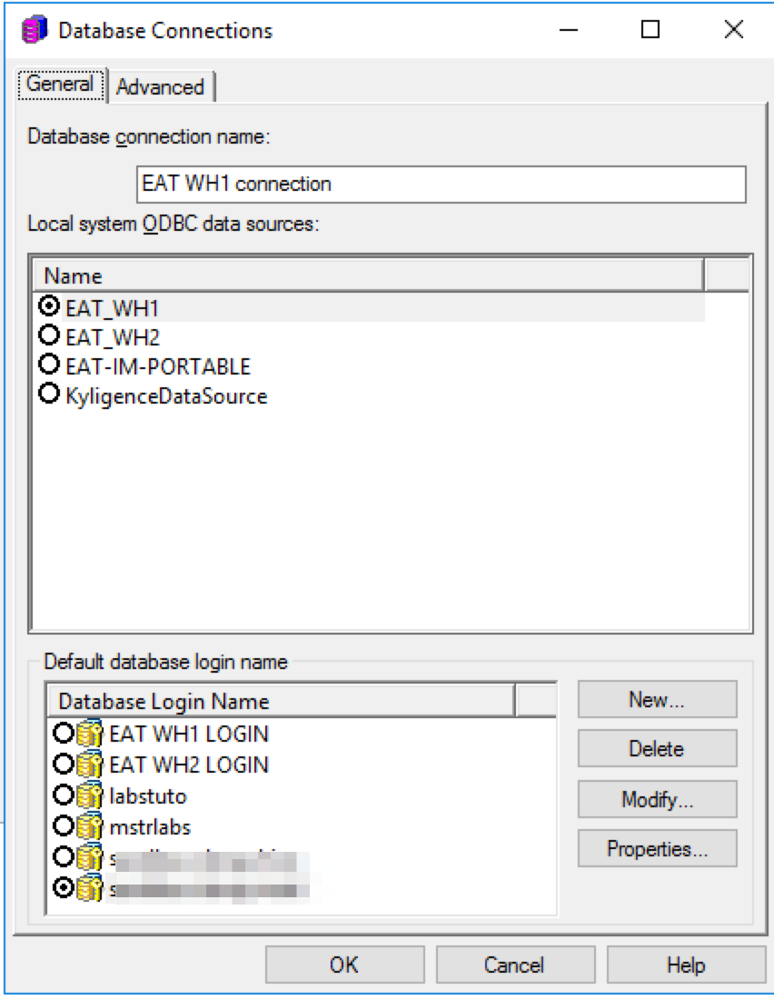

# Linux下安装与配置Kyligence ODBC驱动

在本文中，我们将向您介绍如何在安装和配置Kyligence ODBC驱动（Linux版本）。

### 安装库的依赖

我们建议您使用unixODBC(http://www.unixodbc.org/) 来管理ODBC连接信息。

对于64位系统：

1.  在Redhat和CentOS上安装unixODBC

   `sudo yum install unixODBC-devel -y` 

2. 如果是Ubuntu，请使用如下命令行安装

   `sudo apt-get install unixODBC-devel`

### 安装Kyligence ODBC驱动

1. 在 [Kyligence Account 页面](http://account.kyligence.io)申请下载 Kyligence ODBC (Linux版本）驱动程序

2. 解压下载的压缩包

   `tar zxf KyligenceODBC_linux.tar.gz`

   > *注：请不要将 ODBC 安装文件放在 root 目录下，否则会因为读写权限问题可能导致BI Server访问失败。*

3. 设置第三方库的环境变量

   `cd ODBC_DRIVER/`
   `source setenv.sh`

4. 检查库的依赖

   `ldd libKyligenceODBC64.so`
   如果检查成功，您将会看到如下输出：

   ```
   linux-vdso.so.1 =>  (0x00007ffd773f5000)
   libz.so.1 => /lib64/libz.so.1 (0x00007f15a5c38000)
   libdl.so.2 => /lib64/libdl.so.2 (0x00007f15a5a34000)
   libcrypto.so.10 => /usr/local/ODBCDriver/ThirdParty/libcrypto.so.10 (0x00007f15a564f000)
   libssl.so.10 => /usr/local/ODBCDriver/ThirdParty/libssl.so.10 (0x00007f15a53e2000)
   libm.so.6 => /lib64/libm.so.6 (0x00007f15a50e0000)
   libpthread.so.0 => /lib64/libpthread.so.0 (0x00007f15a4ec3000)
   libc.so.6 => /lib64/libc.so.6 (0x00007f15a4b02000)
   /lib64/ld-linux-x86-64.so.2 (0x00007f15a8800000)
   libgssapi_krb5.so.2 => /lib64/libgssapi_krb5.so.2 (0x00007f15a48b6000)
   libkrb5.so.3 => /lib64/libkrb5.so.3 (0x00007f15a45d0000)
   libcom_err.so.2 => /lib64/libcom_err.so.2 (0x00007f15a43cc000)
   libk5crypto.so.3 => /lib64/libk5crypto.so.3 (0x00007f15a419a000)
   libkrb5support.so.0 => /lib64/libkrb5support.so.0 (0x00007f15a3f8a000)
   libkeyutils.so.1 => /lib64/libkeyutils.so.1 (0x00007f15a3d86000)
   libresolv.so.2 => /lib64/libresolv.so.2 (0x00007f15a3b6c000)
   libselinux.so.1 => /lib64/libselinux.so.1 (0x00007f15a3946000)
   libpcre.so.1 => /lib64/libpcre.so.1 (0x00007f15a36e5000)
   liblzma.so.5 => /lib64/liblzma.so.5 (0x00007f15a34c0000)
   ```

   如果检查失败，依赖库不存在，您将看到如下输出：

   ```
   linux-vdso.so.1 =>  (0x00007ffd773f5000)
   libz.so.1 => /lib64/libz.so.1 (0x00007f15a5c38000)
   libdl.so.2 => /lib64/libdl.so.2 (0x00007f15a5a34000)
   libcrypto.so.10 => not found
   libssl.so.10 => not found
   libm.so.6 => /lib64/libm.so.6 (0x00007f15a50e0000)
   libpthread.so.0 => /lib64/libpthread.so.0 (0x00007f15a4ec3000)
   libc.so.6 => /lib64/libc.so.6 (0x00007f15a4b02000)
   /lib64/ld-linux-x86-64.so.2 (0x00007f15a8800000)
   libgssapi_krb5.so.2 => /lib64/libgssapi_krb5.so.2 (0x00007f15a48b6000)
   libkrb5.so.3 => /lib64/libkrb5.so.3 (0x00007f15a45d0000)
   libcom_err.so.2 => /lib64/libcom_err.so.2 (0x00007f15a43cc000)
   libk5crypto.so.3 => /lib64/libk5crypto.so.3 (0x00007f15a419a000)
   libkrb5support.so.0 => /lib64/libkrb5support.so.0 (0x00007f15a3f8a000)
   libkeyutils.so.1 => /lib64/libkeyutils.so.1 (0x00007f15a3d86000)
   libresolv.so.2 => /lib64/libresolv.so.2 (0x00007f15a3b6c000)
   libselinux.so.1 => /lib64/libselinux.so.1 (0x00007f15a3946000)
   libpcre.so.1 => /lib64/libpcre.so.1 (0x00007f15a36e5000)
   liblzma.so.5 => /lib64/liblzma.so.5 (0x00007f15a34c0000)
   ```

   ​

### 设置ODBC DSN 

我们建议您使用unixODBC(http://www.unixodbc.org/) 来管理ODBC连接信息。

1. 将Kyligence ODBC添加入配置文件

   **ODBC驱动配置文件** – /etc/odbcinst.ini (或者 /usr/local/etc/odbcinst.ini)

   ```
   [{DriverName}]
   APILevel=1
   ConnectFunctions=YYY
   Description={Description}
   Driver={DriverPath}
   Setup={DriverPath}
   DriverODBCVer=03.80
   SQLLevel=1
   Locale=en-US
   ```

   **DSN配置文件** – /etc/odbc.ini (or /usr/local/etc)

   ```
   [{DSName}]
   Driver = {DriverName}
   PORT = {KapPort}
   PROJECT = {KapProject}
   SERVER = {KapUrl}
   ```

   以下是样例配置： 

   **/etc/odbcinst.ini**

   ```
   [KyligenceODBC]
   APILevel=1
   ConnectFunctions=YYY
   Description=Sample 64-bit Kyligence ODBC Driver
   Driver=/home/kylin/KyligenceODBC/ODBC_DRIVER/libKyligenceODBC64.so
   Setup=/home/kylin/KyligenceODBC/ODBC_DRIVER/libKyligenceODBC64.so
   DriverODBCVer=03.80
   SQLLevel=1
   Locale=en-US
   ```

   **/etc/odbc.ini**

   ```
   [KyligenceDataSource]
   Driver = KyligenceODBC
   PORT = 80
   PROJECT = learn_kylin
   SERVER = http://kapdemo.chinaeast.cloudapp.chinacloudapi.cn
   ```

   > *注：请确认odbc.ini 文件中的 DSN 名称和 BI桌面环境下配置的DSN名称完全一致，保证BI应用由桌面客户端发布至服务器端时连接正常*

2. 使用命令行工具"isql DSN [UID '[PWD]']测试连接

   `isql KyligenceDataSource ADMIN 'KYLIN'`

3. 发送查询测试 

   `SQL> select count(*) from kylin_sales;`
   如果连接成功，则会返回如下结果

   ```
   +---------------------+
   | EXPR$0              |
   +---------------------+
   | 4957                |
   +---------------------+
   SQLRowCount returns 1
   1 rows fetched
   ```

### 故障排查

1. SQL无法连接错误      

   a. 检查ODBC配置文件和DSN配置文件是否正确
   b. 确认已执行命令行

   `source setenv.sh`

2. (11560) Unable to locate SQLGetPrivateProfileString function.

   此错误可以运行命令行解决：  

   `export LD_PRELOAD=/usr/lib/libodbcinst.so`

### 附录:

#### 在MicroStrategy Linux Intelligence Server上创建DSN

1. 在Linux shell下，浏览至Microstrategy的安装目录。

2. 打开文件ODBC.ini，按如下格式添加DSN配置信息。

   ```
   [DSN_Name]
   ConnectionType=Direct
   Driver=<ODBC_HOME>/libKyligenceODBC64.so
   PORT=<PORT_NUMBER>
   PROJECT=<PROJECT_NAME>
   SERVER=<SERVER_NAME>
   ```

3. 添加如下配置信息，映射DSN至ODBC。 

   ```
   [ODBC Data Sources]
   <DSN_Name>=KyligenceODBC
   ```

   以下就是一个名为“EAT1_WH"的DSN配置样例：

   ```
   [ODBC Data Sources]
   KyligenceDataSource=KyligenceODBC

   [EAT_WH1]
   ConnectionType=Direct
   Driver=/home/kylin/ODBCDriver/libKyligenceODBC64.so
   PORT=57070
   PROJECT=mstr
   SERVER=http://106.75.137.52
   ```

4. 完成DSN配置后，我们建议您重启Microstrategy Intelligence Server，确保刚创建的DSN已经生效。 

5. 现在您就可以在MicroStrategy Linux I-Server上使用该DSN创建新的数据库连接了。

   
