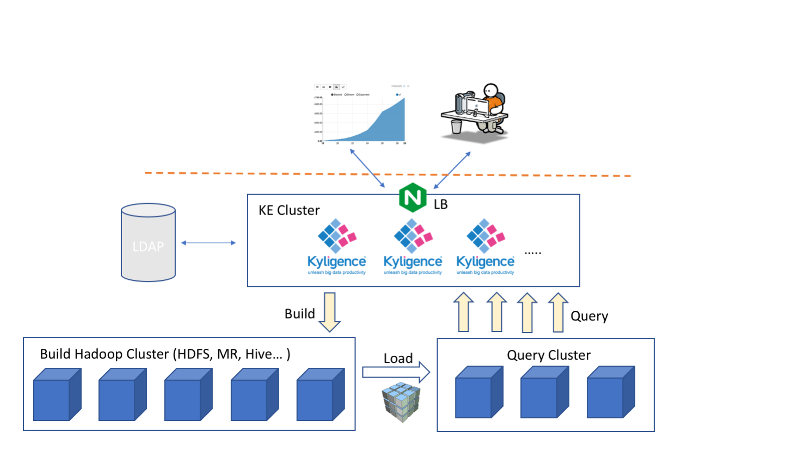

## 读写分离部署
**Kyligence Enterprise企业版的读写分离部署**

Kyligence Enterprise 在使用构建Hadoop 集群进行 Cube 构建等任务的同时，使用 查询Hadoop 集群处理 Cube 查询。前者中存在很多写操作，而后者中则以只读操作为主。如果您需要完全隔离上述两种工作负载，让它们各自独立运行，减少甚至避免它们之间的相互影响及其可能引发的性能不稳定，以响应即时性较高的查询，可以将 构建 和 查询 集群分开部署，即读写分离部署，其部署架构如图所示：

可以将构建和查询所使用的集群分开，以使得它们相互之间不会因资源竞争而导致效率下降。

前置检查步骤如下：

1. 确认您需要部署的 构建 集群和 查询 集群的 Hadoop 核心版本一致，且分别有各自的 Zookeeper 等必要组件；

2. 确认在您需要运行 Kyligence Enterprise 的服务器上安装和配置 构建Hadoop 集群的客户端，并确认`hdfs`、`mapred`、`hive`等命令能够正常使用，且Hadoop 集群上的服务和资源能够正常访问；

3. 确认 构建 集群和 查询 集群的网络可以在无须额外验证的情况下互相连通；

   > 提示：您可以尝试重 构建 集群的任一节点上拷贝文件至 查询 集群的任一节点，以验证两个集群之间的网络连通状况。

4. 确认在您需要运行 Kyligence Enterprise 的服务器上，通过为`hdfs`命令指定 查询 集群 NameNode 地址的方式，能够访问 查询 集群的 HDFS；
   > 提示：在构建集群上执行此命令可以获取查询集群hdfs数据 hadoop fs -ls hdfs://readcluster/ 

5. 尽可能使得您需要运行 Kyligence Enterprise 的服务器在网络上靠近 查询 集群，以降低密集查询时的网络延迟；

6. 如果集群开启kerberos，需要确保以下条件就绪；
> -   构建集群和查询集群属于不同的域
> -   构建集群和查询集群已配置互信

进行读写分离部署的步骤如下：

6. 部署两个 Kyligence Enterprise 安装包到构建和查询集群，定义构建集群上的KE为Job KE, 定义查询集群上的KE为Query KE;(添加配置项，[ALL]表示两个KE都需配置，[Query]表示Query KE需要配置，[Job]表示Job KE需要配置)
> - [ALL]kylin.source.hive.client=beeline
> - [ALL]kylin.source.hive.beeline-shell=beeline
> - [ALL]kylin.source.hive.beeline-params 配置beeline连接参数
> - [ALL]kylin.storage.columnar.separate-fs-enable=true
> - [ALL]kylin.storage.columnar.file-system=hdfs://CDHLOCAL:8020/ （注意：这里CDHLOCAL需要替换成查询集群namenode机器的hostname;如果配置了HA的情况下，此处应该设置成查询集群nameservice）
> - [ALL]kylin.metadata.url 配置Jdbc ResourceStore
> - [ALL]kylin.env.zookeeper-connect-string 配置zk的连接
> - [ALL]kylin.source.hive.table-dir-create-first=true FI需配置
> - [Query]kylin.server.mode=query
> - [Job]kylin.server.mode=job

7. 需要拷贝构建集群上的hive-site.xml文件到Query KE的conf目录下;

8. 如果集群开启kerberos，需要进行以下配置；
> -   需要配置kerberos集成, 可以查看[配置kerberos集成](../../security/kerberos.cn.md)
> -   [Query]kap.storage.columnar.spark-conf.spark.yarn.access.namenodes=hdfs://readcluster,hdfs://writercluster

6. 重新启动 Kyligence Enterprise