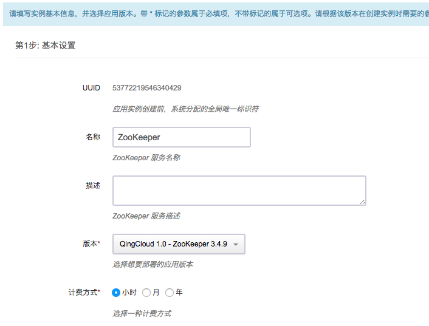
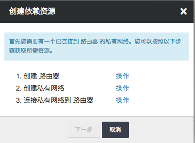
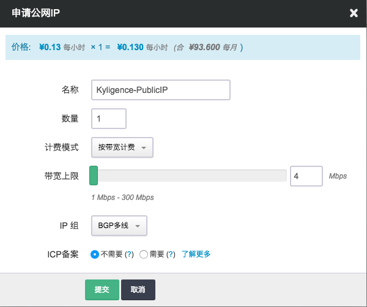
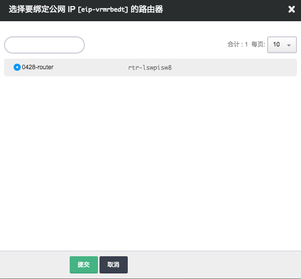
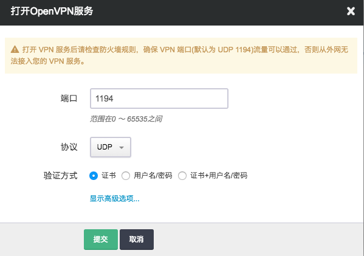
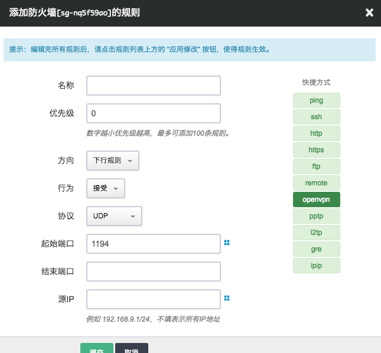
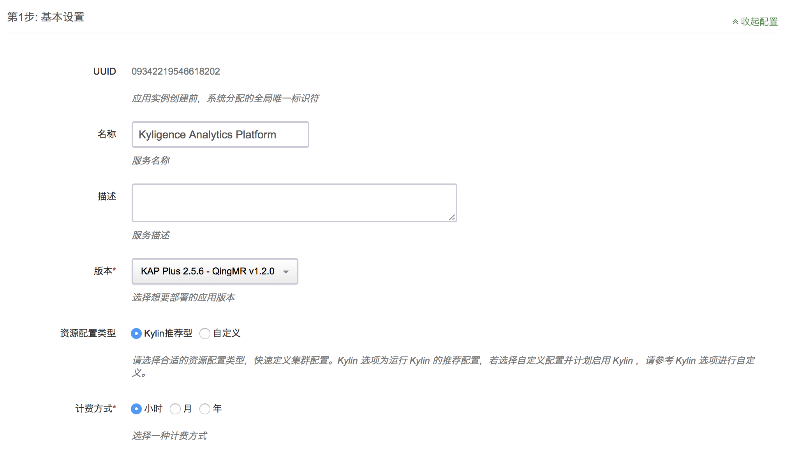
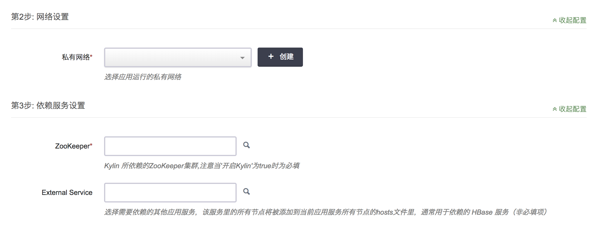

## 在青云 AppCenter 上部署

### 青云 AppCenter

青云 AppCenter 是青云提供的云上企业级应用交付平台，包含了一系列云上大数据生态应用，如Hadoop、Zookeeper等，可以显著降低云端应用开发、部署及运维的复杂度。

在青云AppCenter中，Kyligence Analytics Platform是一个独立的应用程序，允许用户一键部署一个全新的包含Hadoop、Hive、Kyligence Enterprise的完整集群；同时，Kyligence Enterprise也是青云Hadoop服务（QingMR）中的一部分，允许用户在部署QingMR服务时通过勾选安装Kyligence Enterprise到Hadoop集群当中。

### 安装 Kyligence Enterprise

#### 前置条件：Zookeeper，网络配置

1）由于Kyligecne Analytics Platform需要依赖ZooKeeper进行集群状态的管理，需要首先部署ZooKeeper集群。如果已有ZooKeeper集群，这步可以忽略。

2）创建ZooKeeper集群：选择“大数据平台”->"ZooKeeper"



3) 网络配置，在创建Kyligence集群或者ZooKeeper集群时，都会提示创建私有网络，按照提示可以顺利创建所需要的“路由器”，“私有网络”，并绑定“私有网络”到“路由器”上。



4) 创建公网IP



创建好“公网IP”之后，需要绑定到之前创建的“路由器”上。



5）配置VPN，进入“路由器”，选择“VPN服务”，这里推荐大家使用“Open VPN”服务。更多配置VPN的方式请参考：[VPN配置参考](https://docs.qingcloud.com/product/network/vpn)



6) 配置防火墙，打开OpenVPN服务需要的1194端口。



7）我们推荐使用 [Tunnelblick](https://tunnelblick.net/)作为VPN服务的客户端

#### 在应用市场安装 Kyligence Enterprise

1) 打开Kyligence Enterprise应用页面：[Kyligence Enterprise](https://appcenter.qingcloud.com/apps/app-oi15yp53/Kyligence%20Enterprise)，单击右侧“部署到QingCloud”按钮。

2) 输入服务基本信息，如资源配置类型、计费方式等



3) 选择依赖的私有网络和Zookeeper服务。

> 您可以通过AppCenter中的Zookeeper应用快速部署一个Zookeeper服务，然后在此处选择创建好的Zookeeper服务。



4) 根据性能需求和集群规模，配置环境参数。有关参数的介绍，请参考：[生产环境推荐配置](../../config/recommend_settings.cn.md)

5) 同意《用户协议》后，单击“提交”按钮。若干分钟之后，您的Kyligence Enterprise服务就创建好了。

创建好Kyligence Enterprise服务之后，您可以首先通过VPN接入创建的私有网络，然后通过Kyligence Enterprise服务器的内网IP访问Kyligence Enterprise服务，如http://<内网IP>:7070/kylin

#### 在QingMR中安装Kyligence Enterprise

请按照青云官方文档操作：[官方文档](https://docs.qingcloud.com/product/big_data/QingMR/README.html)

### **申请试用 License 并登录**

第一次打开时，Kyligence Enterprise 检测到没有安装 license，会要求用户提供 license 文件。如果您没有 Kyligence Enterprise 的 license，可在这个页面立即申请一个试用 license。点击“申请试用许可”，输入您的 email 地址、公司名称及您的名字，点击”提交“，Kyligence Enterprise 会自动下载一个试用 license，随后您就可以继续使用了。两个月免费试用期过后，您可以联系 Kyligence 购买正式 license。


Kyligence Enterprise 默认管理员账号的用户名是 “ADMIN”，默认密码是 ”KYLIN”。初次登录后会提示修改密码，为了确保服务安全性，请更改密码并将其记录在安全的地方，供后面使用。

### **玩转样例 Cube**

Kyligence Enterprise 安装时会自动创建一个样例 Cube 以及它所需要的 Hive 表。登录 Kyligence Enterprise 后，在左边“建模 -> Cube”页，您会看到此样例 Cube “kylin_sales_cube”。初始时它的状态是”Disabled”，需要构建。点击“操作” -> “构建”，选择结束日期如 ‘2014-01-01’，随后 Kyligence Enterprise 会开始构建。


您可以在 “Monitor” 页监控此构建任务直至完成。任务完成后，Cube 的状态会更新为 “Ready”，意味着它可供查询。这时您可以在 ”Insight” 页输入一句查询 SQL，例如：

```
select part_dt, sum(price) as total_selled, count(distinct seller_id) as sellers from kylin_sales group by part_dt order by part_dt;
```

Kyligence Enterprise 能够很快返回查询结果。您可以拷贝这条 SQL 到 Hive 命令行中执行，以感受它们的响应时间差异。


至这里您已经体验了如果使用 Kyligence Enterprise 来加速查询分析。然而，写 SQL 依然是一件麻烦的事情，您可以使用一些可视化工具（如 KyAnalyzer）通过拖拽选择的方式开展分析。

### **使用 KyAnalyzer 敏捷分析**

您可以使用与 Kyligence Enterprise 相同的账户登录到 KyAnalyzer ，在 “Admin Console” 页，点击 “Sync Cubes from Kylin”，然后选择 ”kylin_sales_cube” 进行同步，这样这个 Cube 的定义会被导入到 KyAnalyzer。


点击 ”New query” 打开一个新的空白页，点击 ”Cubes” 旁的刷新按钮，在下拉列表中选择 ”kylin_sales”，点击选择一个维度和一个度量，KyAnalyzer 会自动生成查询语句、发送查询并展示结果。


点击右上角的 ”Chart Mode” 按钮，KyAnalyzer 会根据结果数据生成图表，如下图所示，是不是很容易？


现在您已经创建了一个 Cube，并通过拖拽的方式生成了第一个图表。如果需要，您还可以将 Kyligence Enterprise 跟更高级的 BI 工具如 Tableau、PowerBI、Excel 等进行集成。有关详细信息，参阅手册中的“与可视化工具集成”一章。

### SSH登陆服务器

想要通过SSH方式登陆Kyligence Enterprise节点，需要配置一个VPN，然后通过内网IP访问Kyligence Enterprise节点。配置VPN的方式请参考：[VPN配置参考](https://docs.qingcloud.com/product/network/vpn)
默认的SSH登陆认证信息参考：[Kylin 使用指南](https://docs.qingcloud.com/product/big_data/QingMR/README.html#5-kylin-%E4%BD%BF%E7%94%A8%E6%8C%87%E5%8D%97)
