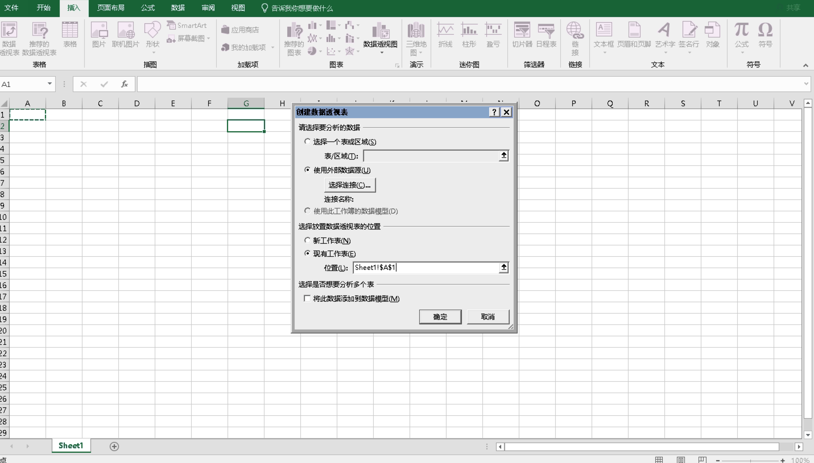
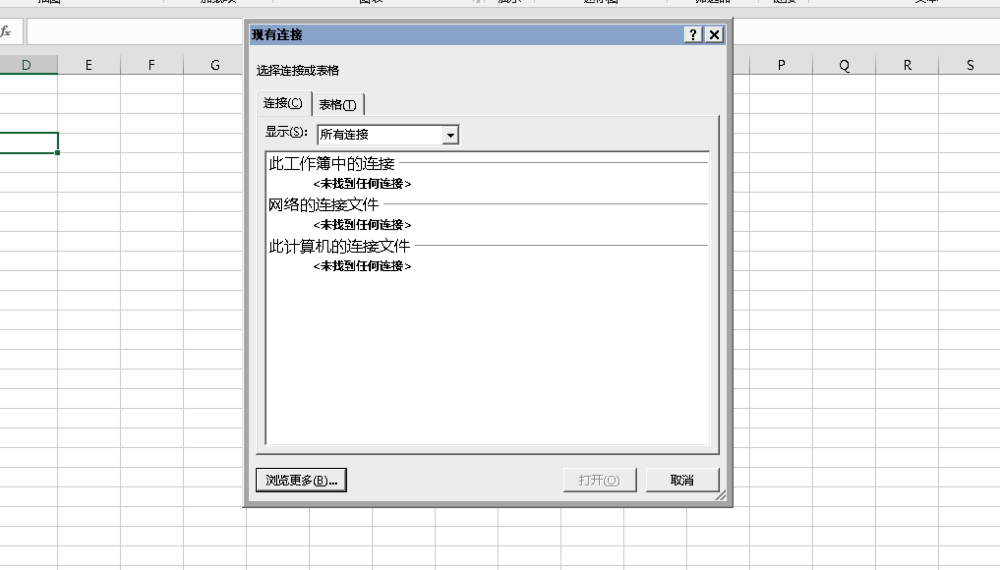
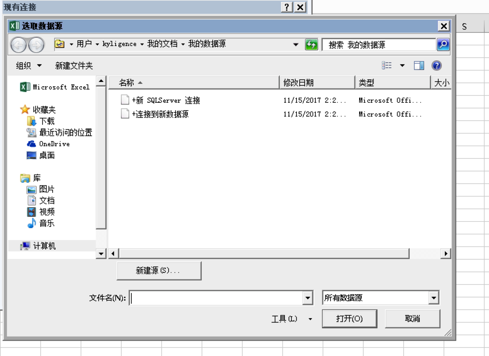
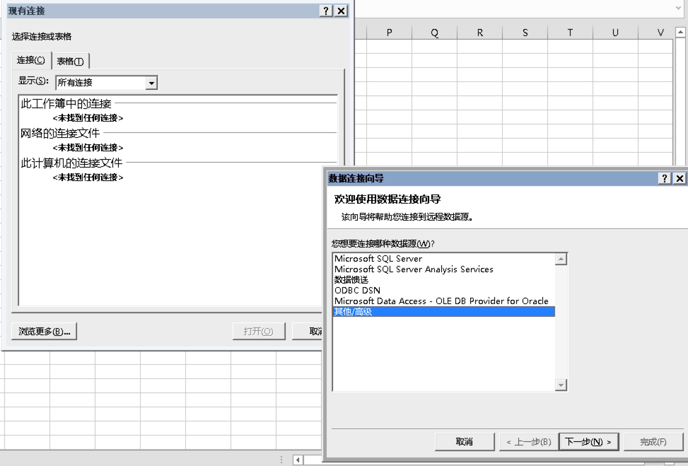
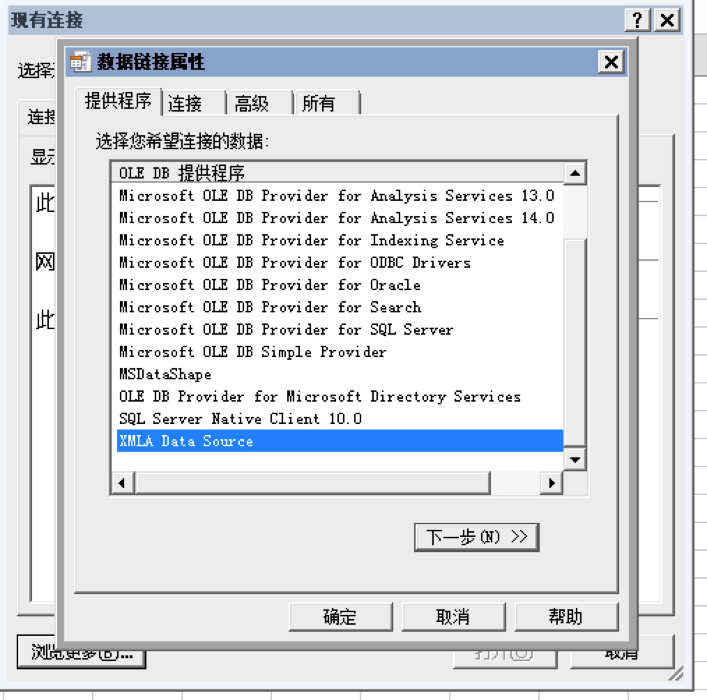
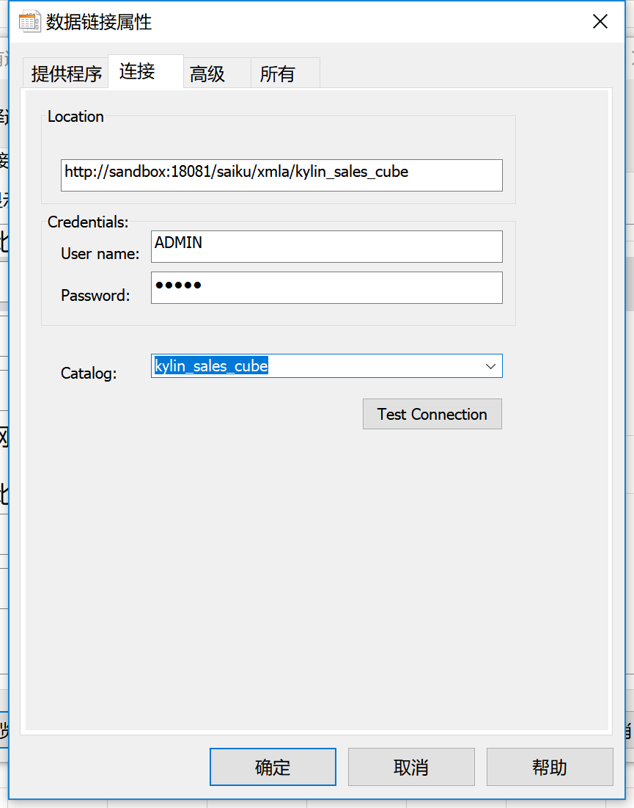
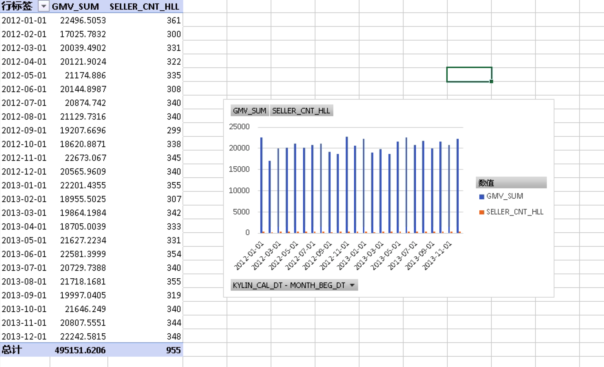

## 通过KyAnalyzer在本产品中集成Excel

这节将介绍如何使用Excel分析本产品中的数据。您的Excel将能够通过KyAnalyzer来查询本产品，而不需要导入数据到Excel中。

### 运行原理

Excel能够通过一些插件（例如XMLA）来关联KyAnalyzer，调用XMLA查询API。KyAnalyzer将XMLA的查询从Excel转换为SQL，推送给本产品。查询结果将通过KyAnalyzer从本产品返回到Excel，最终展现在透视表中。

### 使用条件

1. Excel为2013版及以上
2. 安装XMLA连接Excel的插件。可以点击[下载](https://sourceforge.net/projects/xmlaconnect/)。
3. KyAnalyzer已安装并且部署到你的本产品，请参照本产品手册[KyAnalyzer章节](http://docs.kyligence.io/books/v2.5/en/kyanalyzer/kyanalyzer.en.html)来看如何安装和部署KyAnalyzer。

### 建立对KyAnalyzer的连接 

现在你的KyAnalyzer已经在运行了，你可以连接到KyAnalyzer并且使用Excel中的透视表了。

在Excel中，点击`插入`菜单，点击`透视表`。

选择`使用外部数据源`。

在现有连接中，点击`浏览更多`。

下一步，选择`新建源`。

在数据连接向导中，选择`其他/高级`。

在数据连接属性中，选择`XMLA数据源`。

接下来，您需要在Location一栏中填写连接KyAnalyzer的地址信息，样本如下：`http://<host>:<port>/saiku/xmla/<cube_name>`
用户名和密码是您的**本产品**登陆用户名和密码。

在Catalog下选择想要连接到的Cube。

现在Cube已经被连接到Excel了。点击完成关闭数据连接助手。

现在，您可以使用Excel透视表分析本产品的Cube了。

