## 与帆软集成

帆软是国内最大、实力最强的 web 报表工具、商业智能等数据类产品研发的公司。旗下产品FineReport是中国报表软件著名品牌，FineBI 是新型商业智能软件优秀代表。帆软产品被成功实施于上万个信息化应用项目，客户遍及各行各业，每天有超过50万人通过帆软的产品来查阅、填报、分析数据。近日，Kyligence已认证帆软旗下FineBI（4.1版本）产品与FineReport（9.0版本）产品。本文将分别介绍KAP与FineBI、FineReport的集成。

### 与 FineBI 集成

* **安装 FineBI**

  有关 FineBI 的安装说明，请访问 [FineBI 下载页面](http://www.finebi.com/product/download/)。

- **安装 Kyligence JDBC 驱动程序**

  FineBI 通过JDBC连接 KAP，所以首先需要在FineBI 上安装 Kyligence JDBC 驱动程序。

1.  获取 Kyligence JDBC 驱动程序

   请参考 [Kyligence JDBC 驱动程序说明](http://docs.kyligence.io/books/v2.5/zh-cn/driver/jdbc.cn.html)。

2. 向 FineBI 增加 JDBC 驱动程序

​       Windows版：拷贝JDBC驱动程序到 安装路径\webapps\WebReport\WEB-INF\lib

​       Linux版：拷贝JDBC驱动程序到 安装路径\webapps\WebRepor\WEB-INF\lib

- **建立 KAP 数据源连接**

1. 新建数据源

   在主页面选择 数据配置->数据连接管理，点击新建数据连接，选择 APACHE-KYLIN。

   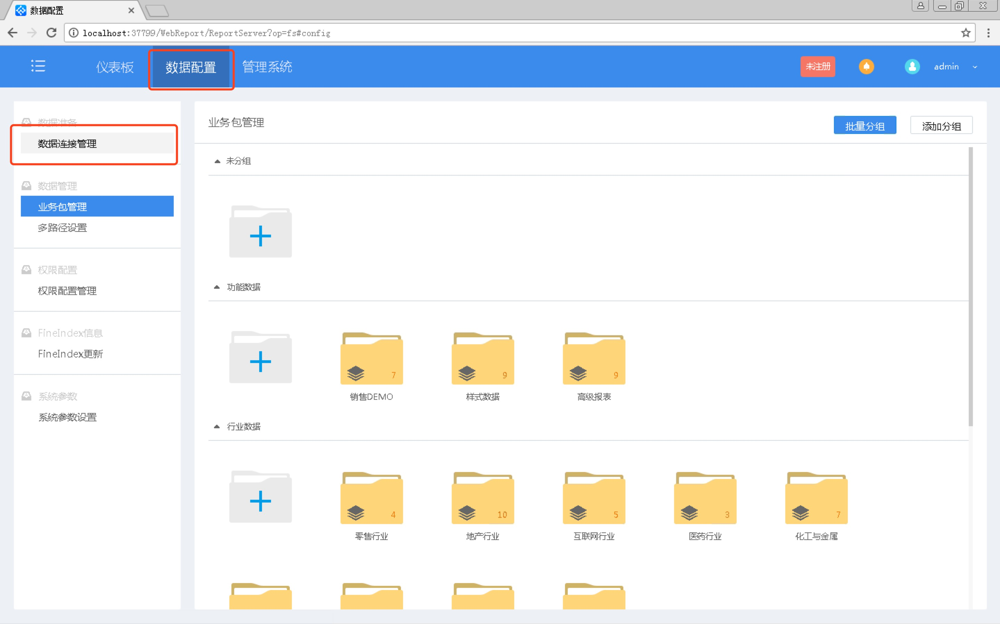

   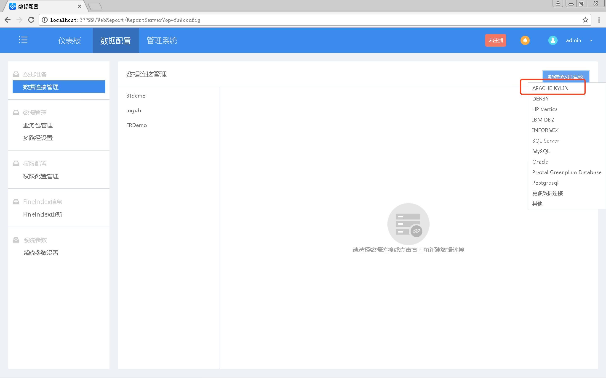

2. 保存数据源

   将服务器IP地址等信息填写到连接字符串（字符串格式为:jdbc:kylin://\<hostname\>:\<port\>/\<project_name\>) 然后点击测试连接，测试成功后点击确定保存数据源连接。

   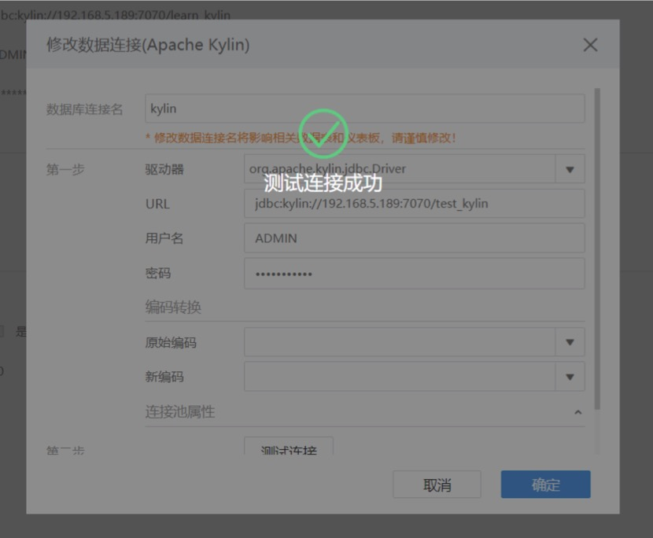

- **新建业务包**

  在主页面选择数据配置->业务包管理，选择FineDirect方式，新建一个业务包。

  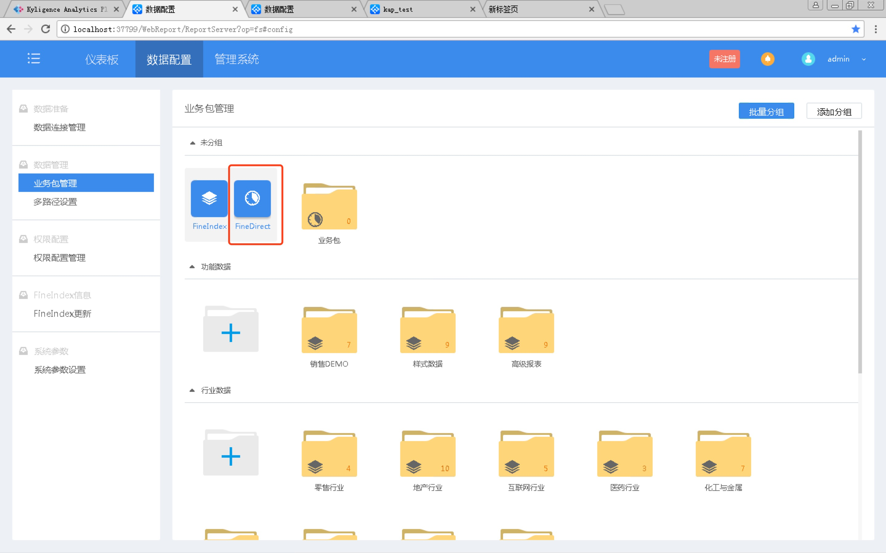

  将需要的表添加到业务包中 。

  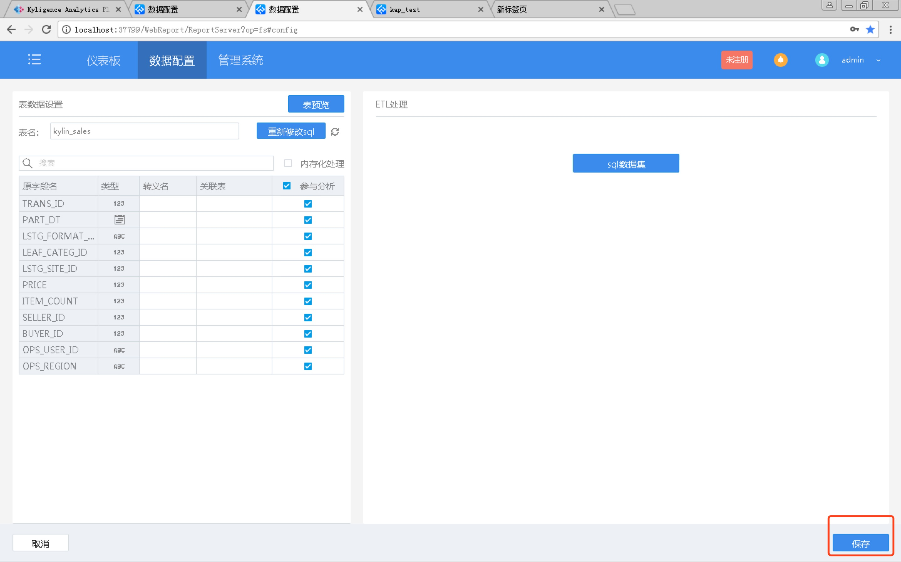

- **制作仪表板**

  在主页面选择仪表板->新建仪表板，新建一个仪表板。

  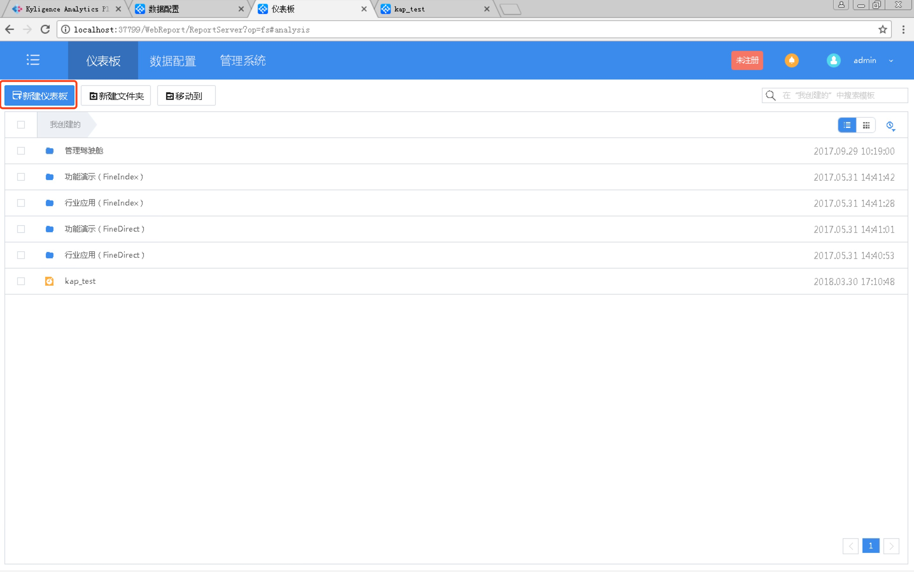

  编辑仪表板，自由使用KAP中的数据。

  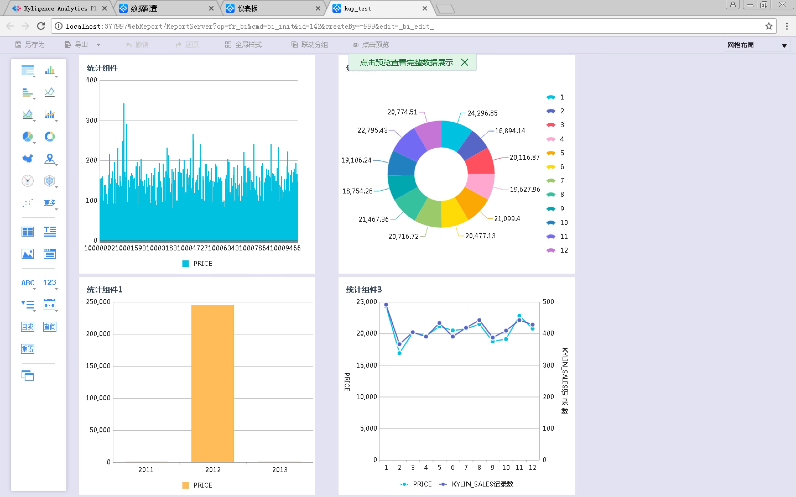

### 与 FineReport 集成

- **安装 FineReport**

  有关 FineReport 的安装说明，请访问 [FineBI 下载页面](http://www.finereport.com/product/download)。

- **安装 Kyligence JDBC 驱动程序**

  FineBI 通过JDBC连接 KAP，所以首先需要在FineBI 上安装 Kyligence JDBC 驱动程序。

1. 获取 Kyligence JDBC 驱动程序

   请参考 [Kyligence JDBC 驱动程序说明](http://docs.kyligence.io/books/v2.5/zh-cn/driver/jdbc.cn.html)。

2. 向 FineReport 增加 JDBC 驱动程序

   拷贝JDBC驱动程序到 安装路径\WebReport\WEB-INF\lib 路径下,然后重启设计器。

- **建立 KAP 数据源连接**

  在主页面选择服务器->定义数据连接，选择新建 JDBC 数据源。

  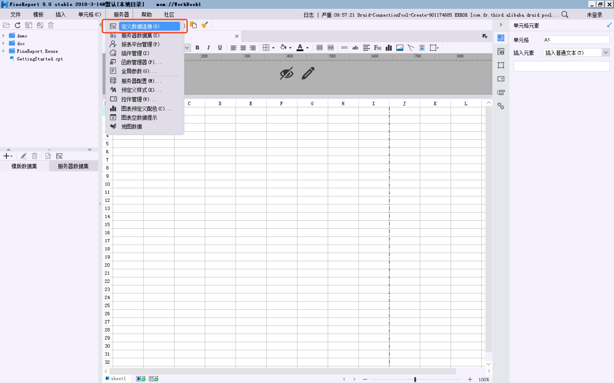

  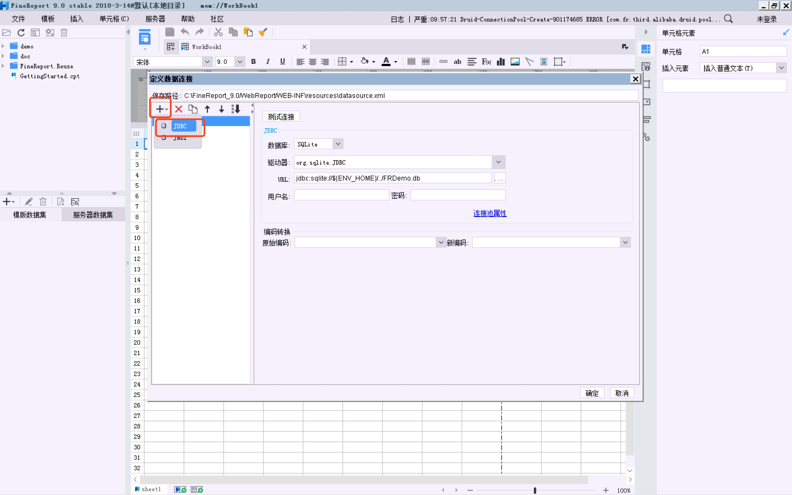

  选择数据库类型为 Others ,驱动器填写：org.apache.kylin.jdbc.Driver，URL填写：jdbc:kylin://\<hostname\>:\<port\>/\<project_name\>，填写用户名、密码，然后点击测试连接，连接成功后点击确定保存。

  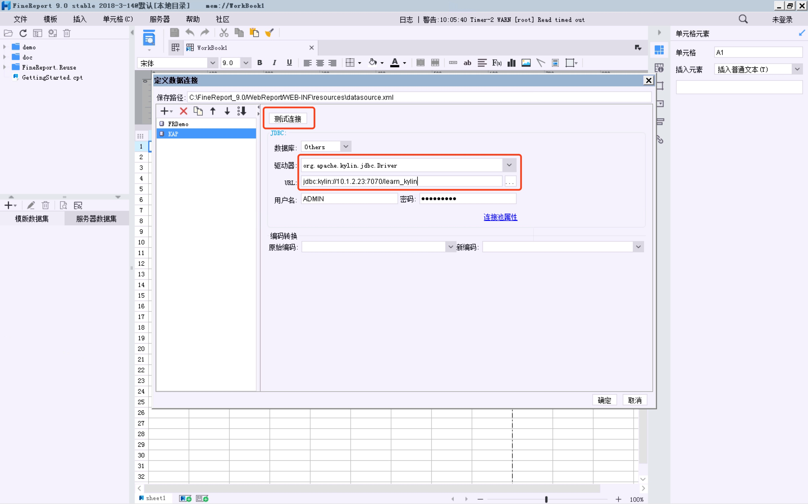

- **建立 KAP 数据集**

  在主页面选择服务器->服务器数据集，选择新建 数据库查询 ,数据源选择KAP的数据源，然后将编辑查询语句。

  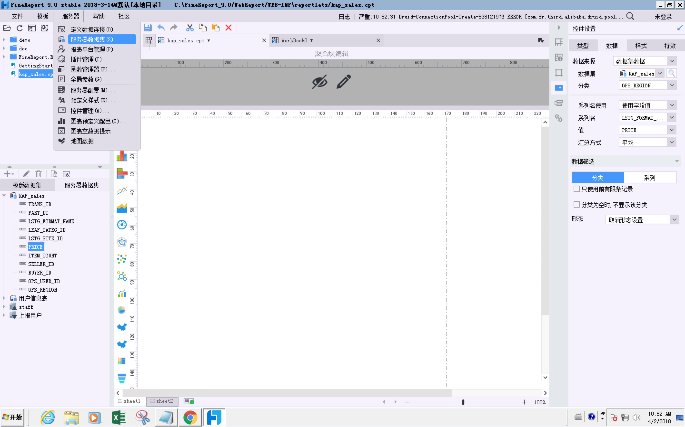

  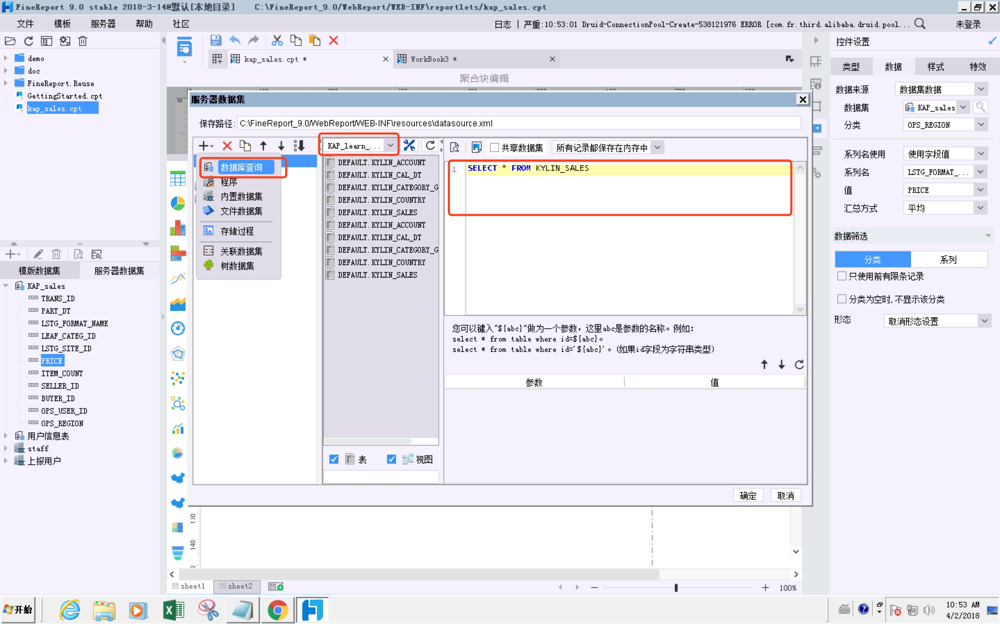

-  **制作报表**

  在主页面选择文件->新建聚合报表，选择KAP的数据集，编辑报表，自由使用KAP中的数据。

  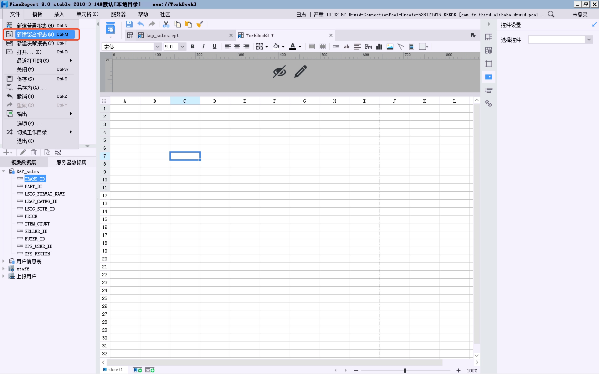

  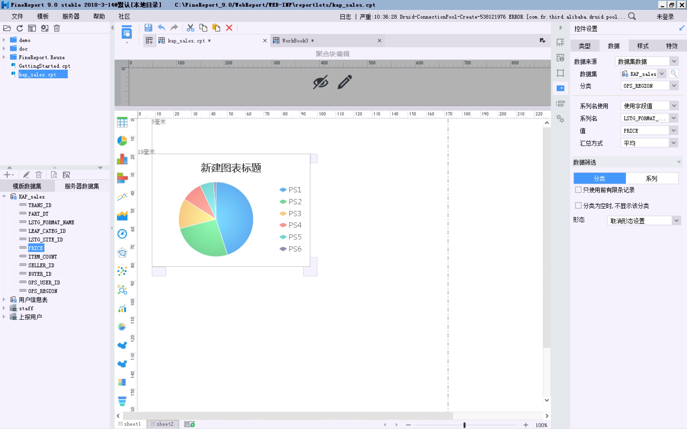

