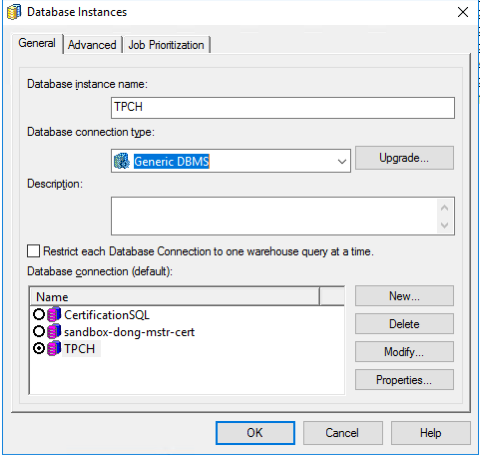
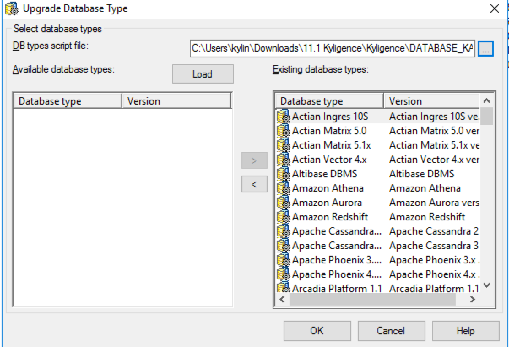
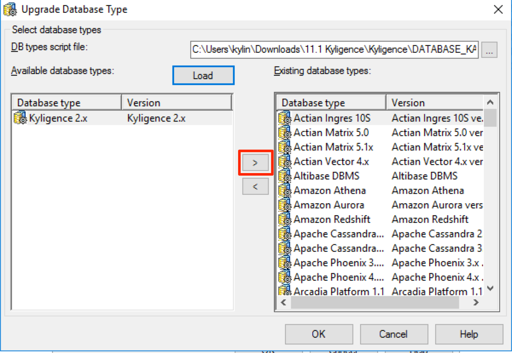
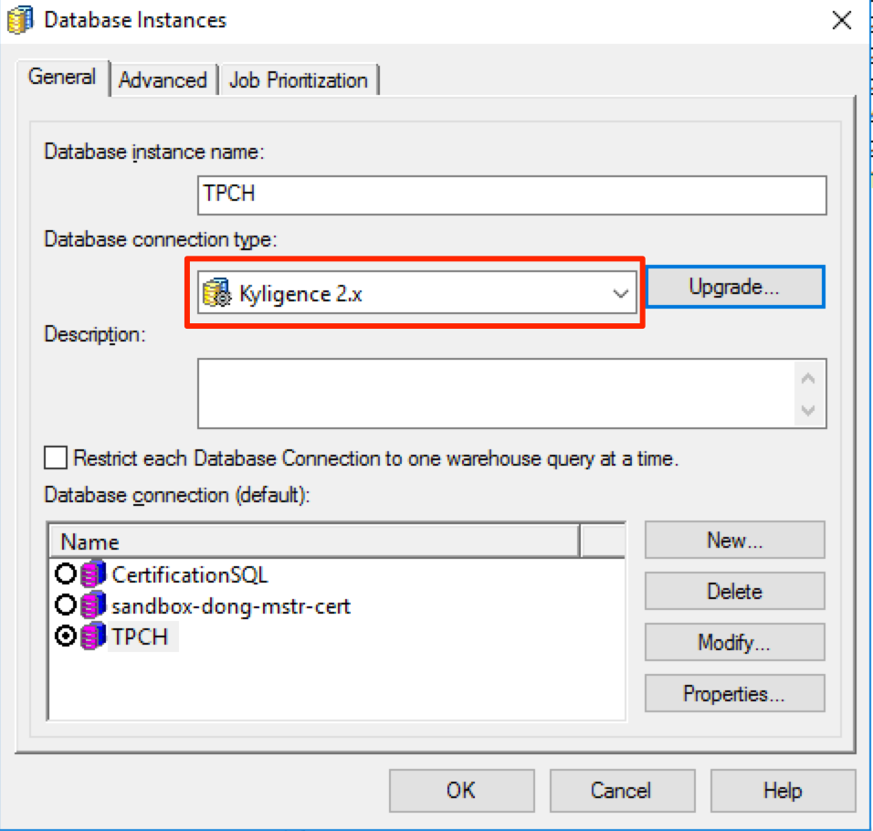

## 与 MicroStrategy Secure Enterprise 集成

### 支持的平台:

Kyligence目前支持 MicroStrategy Secure Enterprise 10.8及更高版本。

### 前提条件:

1. 已经安装 MicroStrategy Secure Enterprise 10.8或更高版本。
2. 已经安装 Kyligence Analytics Platform 2.x 。
3. 已经在安装 MicroStrategy Intelligence Server 的机器上安装了 JDK 1.8或更高版本。
4. 已经在安装 MicroStrategy Intelligence Server 的机器上安装了64位的 Kyligence ODBC 驱动程序。 有关如何下载和配置 Kyligence ODBC 驱动程序的详细信息，请参阅 KAP用户手册中 “ [Kyligence ODBC 驱动](http://docs.kyligence.io/books/v2.5/zh-cn/driver/kyligence_odbc.cn.html)” 章节。


### 为MicroStrategy Intelligence Server 安装Kyligence 连接器 

#### 更新数据库对象

1. 在安装 MicroStrategy Intelligence Server 的计算机上下载并拷贝连接器文件。 连接器文件可以点击以下[链接](https://community.microstrategy.com/s/article/Kyligence-Analytic-Platform)下载。

2. 在 MicroStrategy 的安装目录之外的其他目录解压zip文件

3. 启动 MicroStrategy Developer 并登录到2-tier项目源。 转到数据库实例管理器，并编辑您已连接到Kyligence数据源的实例。点击位于 “ 数据库连接类型” 旁边的 “ 升级” 按钮，如下所示：

   

4. 出现以下窗口。浏览文件，使得数据库类型脚本文件指向在**步骤1**中获得的 ”Database_KAP.PDS“ 文件。单击 “加载” 按钮，如下图所示：

   

5. 现在左侧窗格中的可用数据库类型中出现了 Kyligence。 使用箭头按钮将 "Kyligence" 对象从左侧窗格移动到右侧，如下图所示：

   

6. 单击确定。“Kyligence 2.x”现在显示为可用的数据库连接类型。 

   在数据库实例管理器中选择 “Kyligence 2.x”。

   

7. 点击确定并保存数据库实例。

8. 重新加载项目，以使新设置生效。


#### 更新Intelligence Server上的数据类型映射

1. 将 DTMAPPING.xslt 和 AddConnector.jar 复制到需要安装连接器的机器。

2. 查找安装Intelligence Server的机器上的DTMAPPING.pds文件的位置

   > 在Windows上，默认位置是C：\ Program Files（x86）\ Common Files \ MicroStrategy，也指向环境变量$ MSTR_CLASSPATH

3. 用 DTMAPPING.pds 所在的文件夹替换 <location> 并运行以下命令。

   ``` java -jar AddConnector.jar --target <location>\DTMAPPING.pds --file DTMAPPING.xslt```

   > 注：运行该命令需要具有复制和修改现有 DTMAPPING.pds文件的权限。该命令将在 <location> 中创建原始 DTMAPPING.pds文件的备份。

4. 重启 Intelligence Server.

#### 在 MicroStrategy Web 中安装 Kyligence Connector

接下来需要在 MicrStrategy 集群中所有的 MicrStrategy Web 计算机中完成如下的配置：

1. 将 DBproperties.xslt 文件和 AddConnector.jar 文件复制到运行MicroStrategy Web的机器。 并将文件的所在路径记为<location1>。

2. 找到DBProperties.xml文件的所在路径，并将此路径记为<location2>。

  > DBProperties.xml文件的路径默认为
  >
  > * Microsoft IIS: C:\Program Files (x86)\MicroStrategy\Web ASPx\WEB-INF\xml\DBproperties.xml
  > * Tomcat (on Windows): C:\Program Files (x86)\Common Files\MicroStrategy\Tomcat\apache-tomcat-8.0.30\webapps\MicroStrategy\WEB-INF\xml\DBProperties.xml
  > * Tomcat (on Linux): /opt/apache/tomcat/apache-tomcat-8.0.43/webapps/MicroStrategy/WEB-INF/xml/DBproperties.xml
  >

3. 替换<location1>和<location2>，并执行如下命令：

  ```
  java -jar <location1>\AddConnector.jar --target <location2>\DBProperties.xml --file <location2>\DBproperties.xsl
  ```

  > 注：
  >
  > 运行该命令需要具有复制和修改现有DBproperties.xml文件的权限。
  >
  > 在Windows上，<location>需要以反斜杠 “ \ ” 字符结束，在Linux上需要以正斜杠 “ / ” 字符结束。
  >
  > 该命令将在<location2>中创建原始DBProperties 文件的备份。

4. 运行上述命令后，请重新启动您的应用程序服务器。

5. 设置连接器图标:

   * 默认情况下，数据导入主页中的图标是如下所示数据库的常规图标：

     

   * 要自定义图标，请将KyligenceConnectorFiles.zip中的图标文件放到`<MSTR_WEB_SERVER>\javascript\ mojo\css\images\DI\connectors\` 路径中。

     


然后在数据源处搜索 Kyligence 来连接 Kyligence，或者可以在 “Hadoop” 连接类别下找到Kyligence。

 


