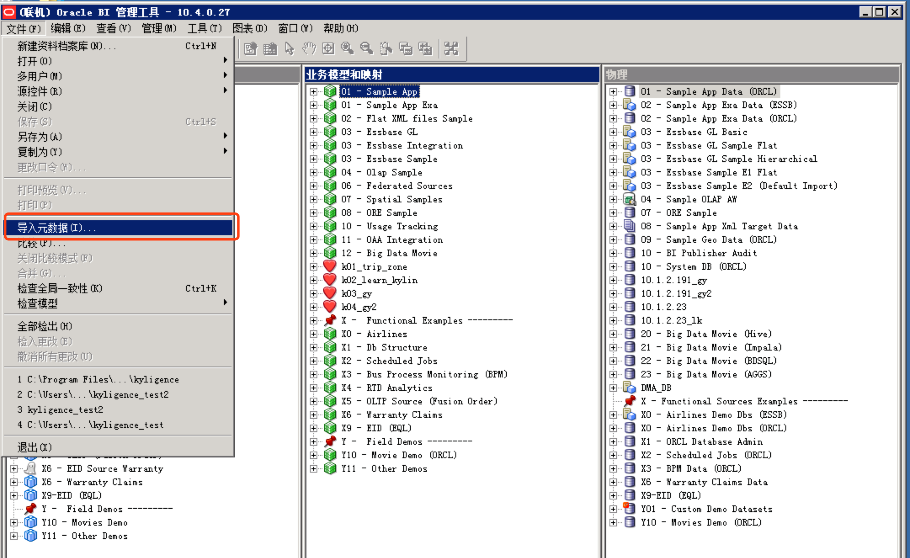

## 与OBIEE集成

自从KAP3.0版本开始，支持与OBIEE 11G进行集成。

### 配置ODBC及DSN

1. 配置Client

   需要先安装BI Adminstrator tool ，安装后在ODBC管理器中增加对BIEE server的连接DSN 。

   

   连接后在BI Adminstrator tool中点击**打开-联机**打开即可管理BIEE server中的数据模型。

   

2. 设置DSN

   在client端和server端都需要安装Kylignece ODBC并配置DSN，且两端的DSN名称应**保持一致**。

   有关Windows下Kyligence ODBC的配置，请参考[Windows下安装与配置Kyligence ODBC驱动](http://docs.kyligence.io/v2.5/zh-cn/driver/kyligence_odbc_win.cn.html)。

   有关Linux下配置Kyligence ODBC的配置，请参考[Linux下安装与配置Kyligence ODBC驱动](https://docs.oracle.com/middleware/11119/biee/BIEMG/deploy_rpd.htm#CHDFEEHC)中的Configuring Database Connections Using Native ODBC Drivers部分。

   在`obdc.ini`文件中增加的Kyligence数据源格式为：

   ```
   [KyligenceDataSource]

   Driver = KyligenceODBC64

   PORT = 7070

   PROJECT = learn_kylin

   SERVER = http://kapdemo.chinaeast.cloudapp.chinacloudapi.cn   #(Optional)

   UID = KYLIN   #(Optional)

   PWD = ADMIN
   ```


> 注：ODBC版本至少为2.2版本。

### 创建数据模型

1. 在BI Administrator tool中点击**增加数据源**。

   

2. 选择OBDC2.0，将KAP中的表导入。

   

3. 导入成功后，在物理模型里找到KAP数据源，复选需要建模的表右键进行建模。

   

4. 点击**新建联接**定义表关联关系，然后保存物理模型。

   

5. 保存模型后需要手动检索并更改数据类型为字符串的物理列，如果长度显示为0，则需要更改为KAP中字段的实际长度。

   

6. 保存物理模型后新建业务模型，然后将刚才增加的物理模型拖动到业务模型，并保存到业务模型。

   然后将刚才增加的逻辑模型拖动到表示层，并保存到表示。

   点击BI Administrator tool中左上角的**文件-保存**，保存整个模型。

   

7. 重启BIEE server。


### 创建分析

有两种方式可以使用刚才创建的模型中的数据进行分析。

- **方法一**

  1. 在BIEE主页点击**新建-分析**，使用在client端创建的主题区域即可使用KAP进行分析。这种方式使用拖拽查询方式方式。

     

  2. 拖动所需字段到所选列即可，度量需要点击字段右下角的**编辑公式**编辑聚合方式。

     

     其他需要再加工的字段都可以在**编辑公式**里进行再定义。

     

  3. 点击**结果**即可看到查询结果，然后编辑所需图表类型及相关样式即可。

     


- **方法二**

  1. 在BIEE主页点击**新建-分析-创建直接数据库查询**，使用自定义SQL进行查询。

     

  2. 选择在client端创建的数据源的连接池名进行连接，输入查询SQL进行分析。

     连接池名称格式：`dsn_name"."connect_pool_nam`

     

  3. 点击**结果**即可得到查询结果，点击结果左下角的**新建视图**可以更改图表类型。

     

     

### 注意事项

1. 根据BIEE的开发规范，在client端创建的模型最少需要有两张表，否则上载模型会导致BIEE无法启动服务。
2. 由于BIEE产生的查询SQL不带schema ，拖拽查询则需要一个项目里只含有一个database的表。在连接池查询时使用**自定义SQL查询**可以避免此问题 。