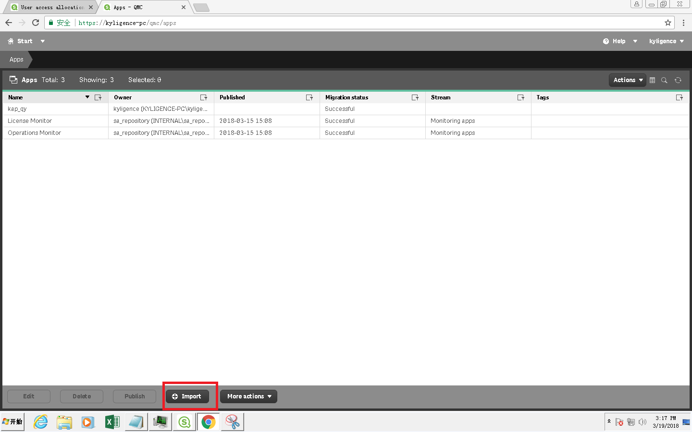
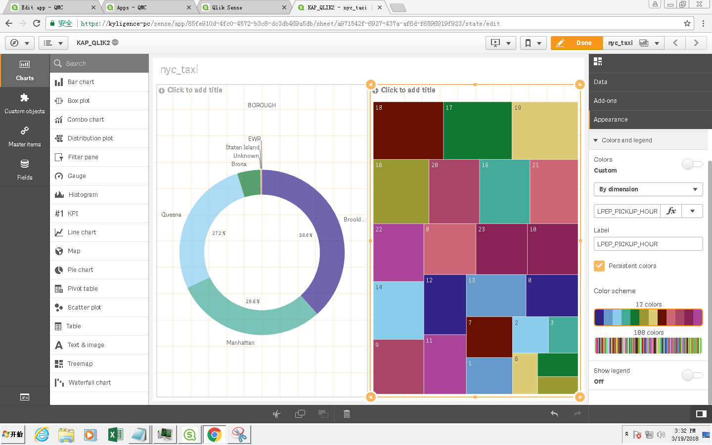

## 与 Qlik Sense 集成

Qlik Sense 
是新一代自助式数据可视化工具。它是一款完整的商业分析软件，便于开发人员和分析人员快速构建和部署强大的分析应用。近年来，该工具成为全球增长率最快的 BI 产品。它可以与 Hadoop Database（Hive 和 Impala）集成。现在也可与 KAP 集成。本文将分步介绍 KAP 与 Qlik Sense 的连接。

### 安装 Kyligence ODBC 驱动程序

有关安装信息，参考页面 [Kyligence ODBC 驱动程序教程](../driver/kyligence_odbc.cn.md)。

### 安装 Qlik Sense

有关 Qlik Sense 的安装说明，请访问 [Qlik Sense Desktop 下载页面](https://www.qlik.com/us/try-or-buy/download-qlik-sense)。

### 与 Qlik Sense Desktop 连接
配置完本地 DSN 并成功安装 Qlik Sense 后，可执行以下步骤来连接 KAP 与 Qlik Sense：

1. 从 Windows 桌面快捷方式或单击**开始 -> 所有程序 -> Qlik Sense -> Qlik Sense Desktop**，打开应用程序 **Qlik Sense Desktop**。

2. 输入 Qlik 用户名和密码，接着系统将弹出以下对话框。单击**创建新应用程序**。


为新建的应用程序指定名称，该名称不得与现有的应用程序相同。创建完成后，打开此应用程序。在本例中，我们将此应用程序命名为“Kylinfortesting”。


3. 应用程序视图中有两个选项，选择下方的**脚本编辑器**。


此时会显示数据加载编辑器窗口。单击页面右上方的**创建新连接**。


然后选择创建的 **DSN**，不需要填写帐户信息，单击**创建**即可。


4. 将 "TimeFormat"、"DateFormat" 和 "TimestampFormat" 的默认脚本更改为：

`SET TimeFormat='h:mm:ss';`
`SET DateFormat='YYYY-MM-DD';`
`SET TimestampFormat='YYYY-MM-DD h:mm:ss[.fff]';`

5. 配置 Direct Query 模式：

在常见的 KAP 生产场景中， Cube 包含 PB 级数据，我们建议用户在 Qlik Sense 中使用 Direct Query 模式，而不用将数据导入 Qlik Sense。

在脚本编辑器中查询脚本的最前面，输入 `Direct Query`，即可启用 Direct Query 模式。 

下图是以 Learn_kylin 项目中的 kylin_sales_cube 为例，进行 Direct Query 查询的脚本。


定义完此脚本后，Qlik Sense 可根据此脚本生成 SQL。建议定义的维度和度量与 KAP Cube 中的维度和度量对应。下面附上完整的脚本，供您参考。

也可通过创建 Native 表达式来使用 KAP 内置函数，如：

`NATIVE('extract(month from PART_DT)') ` 

请确保将脚本中的 `LIB CONNECT TO 'kylin';` 修改成你创建的 DSN 名称。

```sql
SET ThousandSep=',';
SET DecimalSep='.';
SET MoneyThousandSep=',';
SET MoneyDecimalSep='.';
SET MoneyFormat='$#,##0.00;-$#,##0.00';
SET TimeFormat='h:mm:ss';
SET DateFormat='YYYY/MM/DD';
SET TimestampFormat='YYYY/MM/DD h:mm:ss[.fff]';
SET FirstWeekDay=6;
SET BrokenWeeks=1;
SET ReferenceDay=0;
SET FirstMonthOfYear=1;
SET CollationLocale='en-US';
SET CreateSearchIndexOnReload=1;
SET MonthNames='Jan;Feb;Mar;Apr;May;Jun;Jul;Aug;Sep;Oct;Nov;Dec';
SET LongMonthNames='January;February;March;April;May;June;July;August;September;October;November;December';
SET DayNames='Mon;Tue;Wed;Thu;Fri;Sat;Sun';
SET LongDayNames='Monday;Tuesday;Wednesday;Thursday;Friday;Saturday;Sunday';

LIB CONNECT TO 'kylin';


DIRECT QUERY
DIMENSION 
  TRANS_ID,
  YEAR_BEG_DT,
  MONTH_BEG_DT,
  WEEK_BEG_DT,
  PART_DT,
  LSTG_FORMAT_NAME,
  OPS_USER_ID,
  OPS_REGION,
  NATIVE('extract(month from PART_DT)') AS PART_MONTH,
   NATIVE('extract(year from PART_DT)') AS PART_YEAR,
  META_CATEG_NAME,
  CATEG_LVL2_NAME,
  CATEG_LVL3_NAME,
  ACCOUNT_BUYER_LEVEL,
  NAME
MEASURE
	ITEM_COUNT,
    PRICE,
    SELLER_ID
FROM KYLIN_SALES 
join KYLIN_CATEGORY_GROUPINGS  
on( SITE_ID=LSTG_SITE_ID 
and KYLIN_SALES.LEAF_CATEG_ID=KYLIN_CATEGORY_GROUPINGS.LEAF_CATEG_ID)
join KYLIN_CAL_DT
on (KYLIN_CAL_DT.CAL_DT=KYLIN_SALES.PART_DT)
join KYLIN_ACCOUNT 
on (KYLIN_ACCOUNT.ACCOUNT_ID=KYLIN_SALES.BUYER_ID)
JOIN KYLIN_COUNTRY
on (KYLIN_COUNTRY.COUNTRY=KYLIN_ACCOUNT.ACCOUNT_COUNTRY)
```

点击窗口右上角的**加载数据**，这样 Qlik Sense 将发送查询，根据脚本来测试连接。


6. 创建新报告。单击窗口左上方的**应用程序视图**。


在弹出页面上单击**创建新工作表**。


选择所需的图表类型，并根据需要添加维度和度量项。


这样，新的工作表创建完成，KAP 与 Qlik Sense 相连。现在您可以在 Qlik Sense 中查看 KAP 数据。


注意，如果要使查询击中 Cube，创建的度量应与 Cube 中定义的度量匹配。例如，在 Learn_kylin 项目的 kylin_sales_cube 中，我们使用 Sum(price)：


### 与 Qlik Sense Hub 连接 


#### 将Qlik Sense Desktop 中的应用上传到 Qlik Sense Hub

1.从浏览器进入 **Qlik Managerment Console(QMC)**，选择**License and tokens**模块。


2.在**QMC -> License and tokens -> User access allocations** 中选择**Allocate**，增加当前用户，开启**Qlik Sense Hub**的使用权限。


3.在QMC中选择**Apps**模块


4.在QMC中选择Apps模块，选择**Import**,从本地导入由**Qlik Sense Desktop**所创建的应用。



5. 选择**Publish**,可以发布刚才导入或之前已经存在的应用。


6.进入**Qlik Sense Hub**,在**Streams**模块中即可发现刚才发布的应用，如果只是导入而没有发布的话，应用则存在于**Personal**模块中。


7.进入刚才发布的KAP_QLIK应用，可以查看在**Qlik Sense Desktop**中所创建的图表。


#### 直接在Qlik Sense Hub 中连接 KAP

1.通过浏览器在**Qlik Sense Hub**中新建应用，连接到KAP数据源，连接方法同在**Qlik Sense Desktop**中连接KAP。


2.编辑刚才创建的应用，自由使用KAP中的数据。


3.编辑图表，制作方法和在**Qlik Sense Desktop**中一样。




