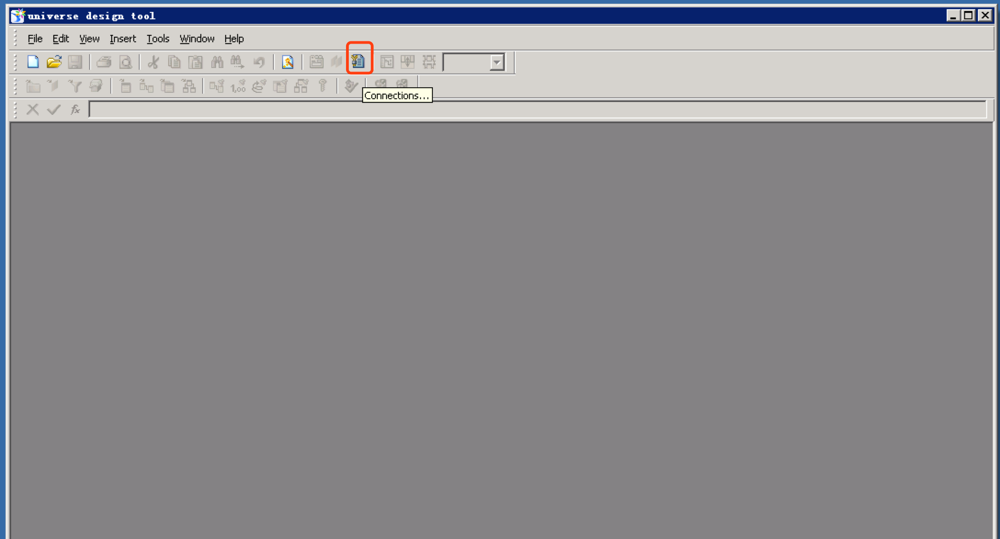
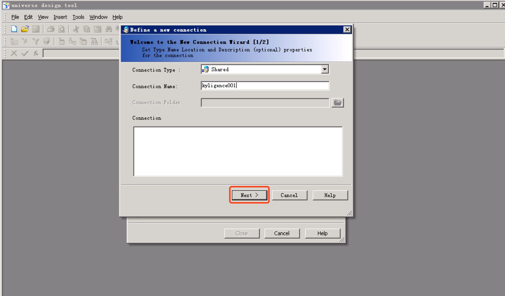

## 与SAP BO集成

自从KAP3.0版本开始，支持与SAP BO Web Intelligence 4.1进行集成。

### 配置ODBC及DSN

有关Kyligence ODBC的配置，请参考[Windows下安装与配置Kyligence ODBC驱动](http://docs.kyligence.io/v2.5/zh-cn/driver/kyligence_odbc_win.cn.html)。

### 使用Universe设计工具进行建模

1. **管理数据连接**

   1.1 点击**conections**，管理数据连接。

   

   点击**新增**连接，增加连接。

   

   

   1.2 选择Generic ODBC 数据源。

   

   1.3 输入用户名、密码和DSN名称即可。

   

   1.4 选择连接池类型为始终保持连接，然后保存该连接即可。

   

2. **创建数据模型**

   2.1 打开**Universe** 设计工具，使用刚才新建的数据连接创建模型。

   

   2.2 将需要使用的表增加到右侧。

   

   2.3 将度量按照聚合形式增加到右侧，点击完成保存即可。

   

   2.4 导入表后会进入建模，首先会根据列名自动匹配连接关系，如果没有被连接的表可以点击**增加连接**进行连接。

   

   2.5 点击连接线即可修改连接关系，如left join需要改为1:N（维度表：事实表）的关系。编辑全部关系后点击保存即可。

   

   > 注：此处如果需要outer join，需要在参数里设置**ANSI92=Yes**。
   >
   > 

