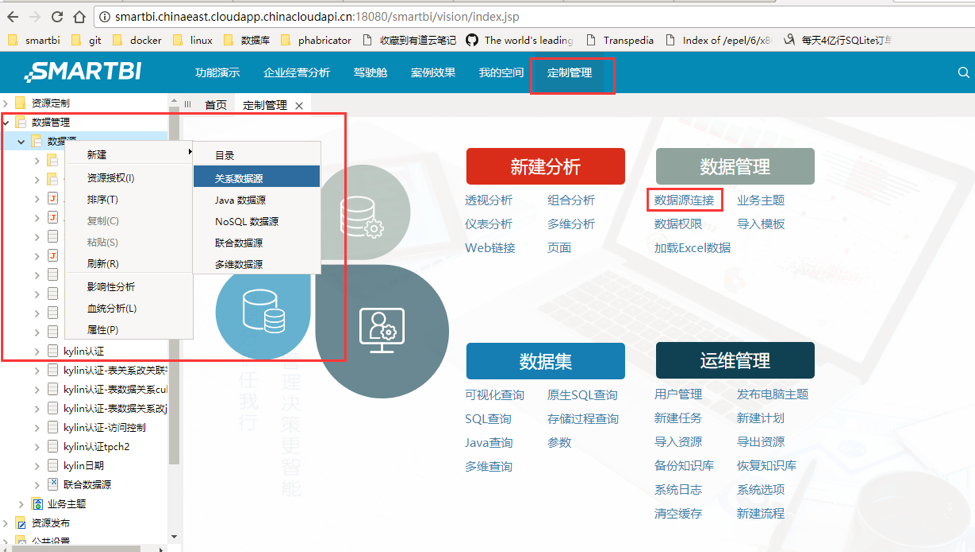
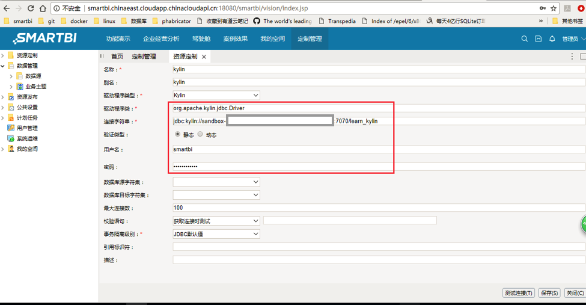
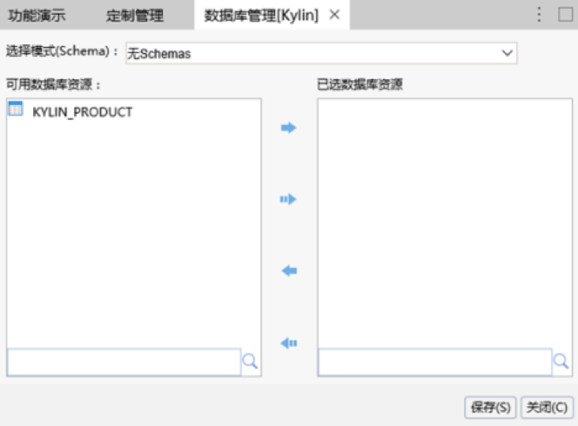
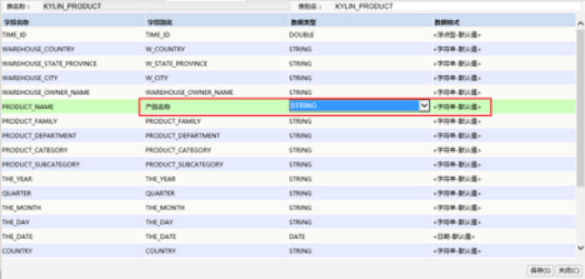
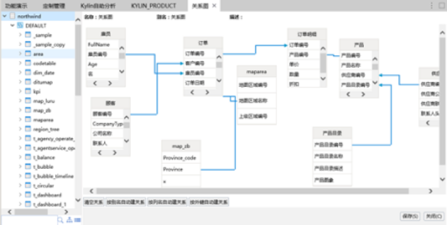
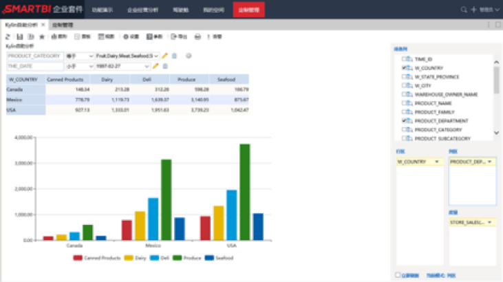
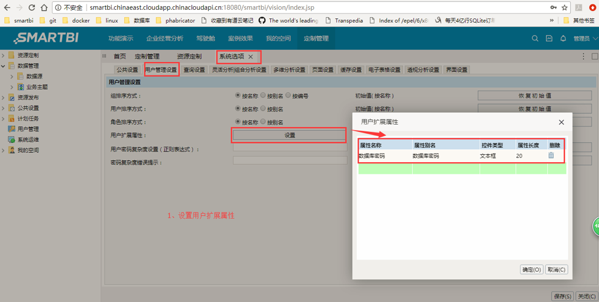
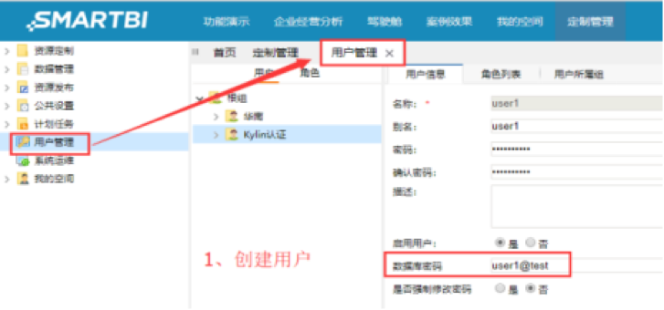
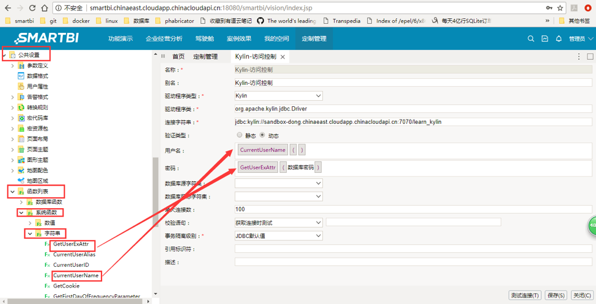

## 与 Smartbi Insight 集成

Smartbi Insight
是企业级的商业智能分析平台，定位于前端数据分析，对接各种数据库、数据仓库和大数据平台，构建交互式仪表盘，满足多样性的数据分析应用需求，如大数据分析、企业报表平台、自主探索分析等。本文将分步介绍 Smartbi Insight 与 KAP 的连接。

### 1. 安装 Smartbi Insight

有关 Smartbi Insight 的安装说明，请访问 [Smartbi Insight 下载页面](http://www.smartbi.com.cn/download)

### 2. 安装 Kyligence JDBC 驱动程序

Smartbi Insight 通过JDBC连接 KAP，所以首先需要在Smartbi Insight 上安装 Kyligence JDBC 驱动程序

2.1 获取 Kyligence JDBC 驱动程序：

请参考 [Kyligence JDBC 驱动程序说明](http://docs.kyligence.io/books/v2.5/zh-cn/driver/jdbc.cn.html)

2.2 删除 Smartbi Insight 自带的 JDBC 驱动程序：**_JDBC_kylin-jdbc-1.5.0-SNAPSHOT.jar** 

*Linux*环境下默认目录为： smartbi/WEB-INF/lib/

*Windows*环境下默认目录为：C:\Users\smartbi\Desktop\

2.3 向 Smartbi Insight 中添加 KAP 的 JDBC 驱动：

请参考 [如何向Smartbi中添加数据库驱动或JAVA类jar说明](http://wiki.smartbi.com.cn/pages/viewpage.action?pageId=29854476)

### 3. 建立 KAP 数据源连接 

#### 3.1 进入界面：

在 **定制管理> 数据管理 >数据源** 节点下右键选择新建关系数据源，或是在定制管理快捷按钮选择 **数据源连接**，则打开数据源连接窗口。

#### 3.2 新建数据源：

选择**Kylin**驱动程序类型，将服务器IP地址等信息填写到连接字符串（字符串格式为:**jdbc:kylin://<hostname>:<port>/<project_name>**) ，然后**保存**数据源连接。

这里默认选择用户验证类型为**静态验证**，输入KAP的用户名和密码进行连接。

如需使用**动态验证**方式，请参考本文下方的**用户的动态验证方式**。

#### 3.3 管理数据源：

对数据源进行管理，将表结构信息（表名、字段名、字段类型等）添加到 Smartbi Insight 中。

也可以对选择设置字段别名，设置数据类型、数据格式等操作。

对于星型模型的多表关联，会按照按外键、列名等方式自动创建表之间的关联关系，也可以手动拖拽建立关联关系。（注：这里的关联关系需要与接下来使用的cube中的**关联关系**相匹配）

### 4. 制作图表

新建透视分析，选择新建的数据源，拖拽字段到行列区和过滤区，进行自助式探索分析。可将任意字段作为查询条件进行数据筛查，并进行数据的排序、钻取、行列互换、同环比时间计算等。

根据分析需要，灵活生成各种分析图表。

### 5. 使用用户的动态验证方式

5.1 首先设置用户的扩展属性

5.2 创建新用户

5.3 在建立数据源连接时选用动态验证方式，将左侧菜单栏中的**用户名**及**密码**字符串拖动过来即可。

