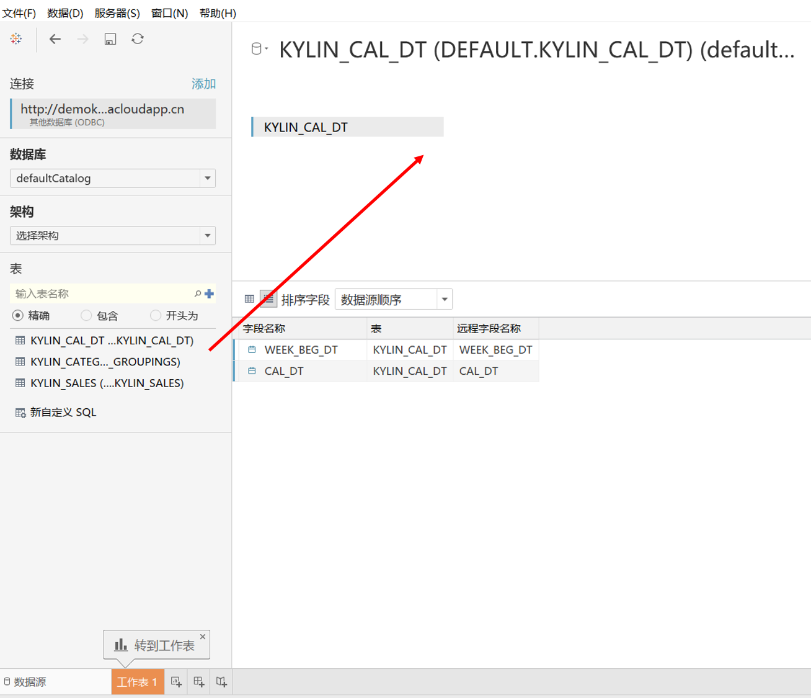

## 与 Tableau  集成

### 安装 Kyligence ODBC 驱动程序

有关安装信息，参考页面 [Kyligence ODBC 驱动程序教程](../driver/kyligence_odbc.cn.md)。

### 连接 KAP 
在Tableau 中创建新的数据连接，单击左侧面板中的`其他数据库(ODBC)`

并在弹出窗口中选择`Kyligence ODBC Driver` ，点击连接

输入服务器地址、端口、项目、用户名和密码，点击`Connect`可获取有权限访问的所有项目列表。或者选择DSN,使用已经保存的DSN直接连接即可。

### 映射数据模型

在左侧的列表中，选择数据库`defaultCatalog`并单击”搜索“按钮，将列出所有可查询的表。用鼠标把表拖拽到右侧区域，就可以添加表作为数据源。

**注意：Tableau 会发送查询"select \* from fact\_table"，如果被查询表格数据量太大，Tableau可能需要等待很长时间拿到返回结果。请参见[配置](../config/basic_settings.cn.md#kylinqueryforce-limit)对KAP进行配置绕过该问题。**

根据模型中的表连接关系，创建表与表的连接关系。

Tableau 中有两种数据源连接类型，选择 `连接`选项以确保使用`实时`模式，以保证实时连接KAP。

### 可视化
现在你可以进一步使用Tableau进行可视化分析。

### 发布到Tableau服务器
如果希望发布到Tableau服务器, 点击`服务器`菜单并选择`发布工作簿`。

### 查看KAP明细数据
> 注：查看KAP明细数据需要在KAP Cube中配置了Table Index或KAP开启了查询下压。

如图，当在Tableau中查看聚合数据时，点击需要查看明细的行或列。点击如图所示图标，选择查看数据的图标。
点击查看完整数据，即可看到对应的数据明细

### 从KAP同步模型至Tableau
#### 在KAP中导出TDS文件

选择一个Ready状态的Cube, 在更多操作中选择导出TDS，即可下载TDS文件。

#### 用TDS文件连接Kyligence数据源
在安装了tableau的环境上，双击TDS文件，填写认证信息，即可连接Kyligence数据源

