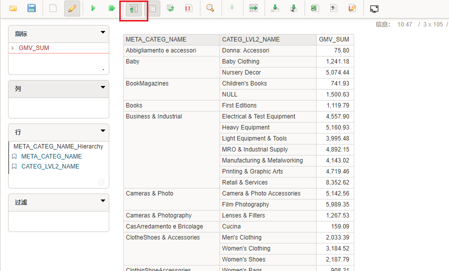
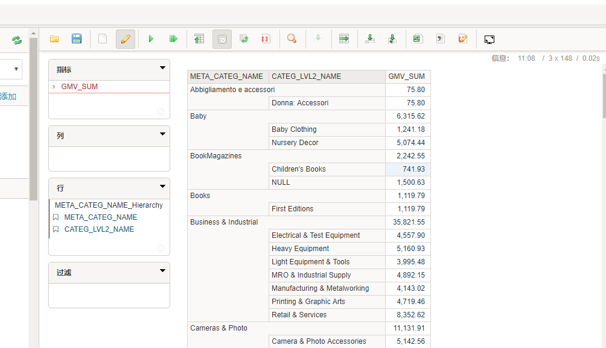
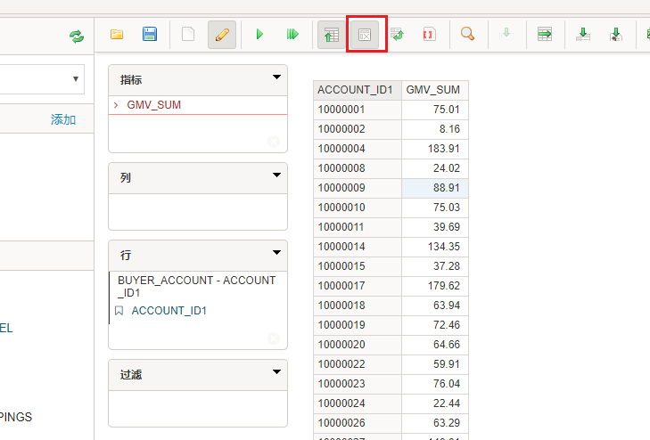
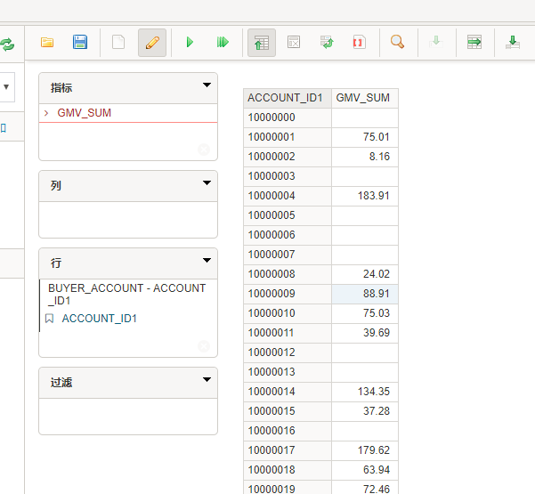

## KyAnalyzer 自助式敏捷 BI 工具

KyAnalyzer 无缝集成 Kyligence Enterprise (Kylin)，便于用户以最简单、快捷的方式访问 Kyligence Enterprise 中的数据。

### 使用 KyAnalyzer 的前提条件
* Kyligence Enterprise 版本需为 2.1 或之后版本
* Apache Kylin 版本需为 1.5.4.1 或之后版本
* KyAnalyzer 暂不支持 *left join* 查询，使用者构建 Cube 模型时需将 join 关系指定为 *inner join*

### 安装
1. 登录 [KyAccount](http://account.kyligence.io/) 申请并下载 KyAnalyzer 的安装包和许可证。

2. 解压 KyAnalyzer 安装包后，将生成目录 kyanalyzer-{version} 

   ```tar -zxf KyAnalyzer-{version}.tar.gz```

   对于 2.4.0 版本及之前的版本，需要将许可证文件 kyAnalyzer.lic 拷贝至 kyanalyzer-{version}/conf 下

   ```mv kyAnalyzer.lic kyanalyzer-{version}/conf```

   对于 2.5.0 版本及以后的版本，将直接使用 Kyligence Enterprise 的许可证进行认证，只需将配置文件 kyanalyzer.properties 中的 `kap.host` 配置为当前具有有效许可证的 Kyligence Enterprise 即可。

3. KyAnalyzer 依赖于 mondrian 的 jar 包，为了符合其开源协议，需要单独下载并拷贝。
   * 对于 KyAnalyzer V2.1.3 及之前的版本，需要单独下载[ mondrian-kylin-1.2.jar ]( https://github.com/Kyligence/kylin-mondrian/blob/master/build/mondrian-kylin-1.2.jar )包，并拷贝至 kyanalyzer-server-{version}/tomcat/webapps/saiku/WEB-INF/lib 下
   * 对于 KyAnalyzer V2.1.3 以上的版本，在Linux环境下，启动脚本会自动下载所需的 mondrian 包并将它拷贝至 tomcat 下
   * 在无网络环境或Windows下安装 KyAnalyzer V2.5.0-2.5.1 版本时，可通过访问链接 [mondrian-kylin-2.0.jar](https://github.com/Kyligence/kylin-mondrian/blob/master/build/mondrian-kylin-2.0.jar) 下载 jar 包，并将它拷贝至 kyanalyzer-server-{version}/tomcat/webapps/saiku/WEB-INF/lib 下。安装 KyAnalyzer V2.5.4 及以上版本时，可通过访问链接 [mondrian-kylin-2.1.jar](https://github.com/Kyligence/kylin-mondrian/blob/master/build/mondrian-kylin-2.1.jar)
   * ) 下载 jar 包，并将它拷贝至 kyanalyzer-server-{version}/tomcat/webapps/saiku/WEB-INF/lib 下

4. 在 kyanalyzer-server-{version}/conf 目录下有个配置文件kyanalyzer.properties，需要在该文件中配置好 Kyligence Enterprise 的 IP 及端口信息。kap.host 为 Kyligence Enterprise 的 IP，默认为 localhost，kap.port 为 Kyligence Enterprise REST API 的端口，默认为 7070。有关 mondrian 的所有配置，可以参考 conf/mondrian.properties.template，配置到 mondrian.properties 中（注：在 Kyligence Enterprise V2.2 之后，我们将 kap.host 及 kap.port 配置移到 kyanalyzer.properties 中，同时在 conf 下引入了mondrian.properties）。

### 启动
通过 kyanalyzer-{version} 目录下的 start-analyzer.sh 启动 KyAnalyzer，默认端口为 8080。

```sh start-analyzer.sh  ```

服务器启动后，访问 http://{hostname}:8080 页面。如果要停用服务器，在 kyanalyzer-{version} 文件夹下运行：

```sh stop-analyzer.sh```

如果服务器未正常启动，则检查 tomcat/logs 目录下的日志记录，查看详细出错信息。启动时通过 tomcat/logs/catalina.out 可以监控到启动时是否有错。如果存在端口冲突，请修改 tomcat/conf/server.xml，找到如下配置项：

```$xslt
<Connector port="8080" protocol="HTTP/1.1"
               connectionTimeout="20000"
               redirectPort="8443" />
```
将 `port` 改为可用的端口即可。

**根目录下的文件信息：**


### 升级
KyAnalyzer 的数据信息主要存储在根目录下的 repository 和 data 目录下。假设要将 KyAnalyzer 从 KyAnalyzer-1 升级到 KyAnalyzer-2，则升级步骤如下：

* 备份 KyAnalyzer-1 的元数据
  + 运行命令 `mkdir backup`，在 KyAnalyzer-1 目录下创建备份文件夹
  + 运行命令 `cp -r data repository ./backup/` ，将元数据备份至 backup 文件夹

* 将 KyAnalyzer-2 中的元数据恢复至 KyAnalyzer-1 中
  + 安装新的 KyAnalyzer，作为 KyAnalyzer-2。假设 KyAnalyzer-2 和 KyAnalyzer-1 的文件夹分别为 {KyAnalyzer-2} 和 {KyAnalyzer-1}
  + 在 KyAnalyzer-2 文件夹下，使用命令 `rm -rf data repository` 删除 KyAnalyzer-2 的自带元数据文件夹
  + 在 KyAnalyzer-2 文件夹下，运行 `cp -r ${KyAnalyzer-1}/backup/* ./`

* 注意：默认端口为 8080，即可通过 http://{hostname}:8080 访问 KyAnalyzer 登录页面。如果需要修改此端口，请同步修改 tomcat/conf/server.xml 文件或者将 KyAnalyzer-1 的 server.xml 文件复制到 KyAnalyzer-2 的 tomcat/conf/server.xml 中。

### 关于 KyAnalyzer、Kyligence Enterprise 和 Mondrian-Kylin 的版本及功能描述

<table>
    <tr>
    <th>KAP</th>
    <th>KyAnalyzer</th>
    <th>Mondrian-Kylin</th>
    <th>COUNT_DISTINCT</th>
    <th>TOP_N</th>
    <th>自定义度量保存</th>
    <th>正常查询</th>
    <th></th>
    </tr>
    <tr>
        <td>2.0</td>
        <td>&gt;=2.1</td>
        <td>1.0</td>
        <td>❎</td>
        <td>❎</td>
        <td>❎</td>
        <td>✅</td>
        <td></td>
    </tr>
    <tr>
        <td>2.0</td>
        <td>&gt;=2.1</td>
        <td>1.1</td>
        <td>✅</td>
        <td>❎</td>
        <td>❎</td>
        <td>❎</td>
        <td></td>
    </tr>
    <tr>
        <td>&gt;=2.1</td>
        <td>&gt;=2.1</td>
        <td>1.0</td>
        <td>❎</td>
        <td>❎</td>
        <td>❎</td>
        <td>✅</td>
        <td></td>
    </tr> 
    <tr>
        <td>&gt;=2.1</td>
        <td>&gt;=2.1</td>
        <td>1.1</td>
        <td>✅</td>
        <td>✅</td>
        <td>❎</td>
        <td>✅</td>
        <td></td>
    </tr>
    <tr>
        <td>2.5.0-2.5.1</td>
        <td>2.5.0-2.5.1</td>
        <td>2.0</td>
        <td>✅</td>
        <td>✅</td>
        <td>✅</td>
        <td>✅</td>
        <td></td>
    </tr>
    <tr>
        <td>&gt;=2.5.4</td>
        <td>&gt;=2.5.4</td>
        <td>2.1</td>
        <td>✅</td>
        <td>✅</td>
        <td>✅</td>
        <td>✅</td>
        <td>最新</td>
    </tr>
</table>

### 认证
KyAnalyzer 的用户认证是通过 Kyligence Enterprise 认证进行的，所以只需要输入 Kyligence Enterprise 的帐号和密码即可登录。用户的管理也是通过 Kyligence Enterprise 进行。Kyligence Enterprise 中的系统管理员在 KyAnalyzer 中同样具有 Admin 角色。


### 管理控制台
该页面仅管理员可见。为了同步 Kyligence Enterprise 中的 Cube，针对每一个 Cube，KyAnalyzer 中都必须创建一个对应的 schema 文件，同时配置对应的数据源 (Data Source)。KyAnalyzer 将通过这些配置信息组成 SQL 发送给 Kyligence Enterprise。KyAnalyzer 将这一块自动化掉，用户不需要手动创建 schema 及数据源。只需要点击页面左侧的 **Sync Cubes From Kylin**，右侧下拉框会列出 Kyligence Enterprise 中的所有项目。


选中项目后，点击绿色的按钮 **Sync Cubes From Kylin**，Kyligence Enterprise 中该项目下所有状态为 **READY** 的 Cube 信息将会同步过来。


KyAnalyzer 提供了对 schema 的在线编辑功能，对 mondrian schema 熟悉的用户可以根据需要修改，正常情况下不需要修改这块。

### 用户的 Cube 查询权限
KyAnalyzer 的 Cube 查询权限与该用户在其所连接的 kylin/kap 的查询权限相同，具体操作方法见[管理权限](../security/acl.cn.md)。

### 新建查询
点击导航栏的**新建查询**按钮，接着点击**刷新**按钮获取最新的元数据，然后在**多维数据**下拉框中选中要查询的 Cube，这样会列出所有相关的维度和指标。报表制作区域有**指标**，**列**，**行**，**过滤** 四个区域，其中**指标**区域只能拖拽指标，**列**和**行**区域可以拖拽维度，多个维度可以组合为层级维度等。


### 数据展现形式
KyAnalyzer 支持多种展现形式，如：表格、柱状图、堆积柱状图、百分比堆积柱状图、折线图、面积图、热点图、树状地图、环形图、散点图和瀑布图等。下面列举部分示例：

#### 柱状图


#### 饼图


#### 数据透视表


#### 支持 COUNT DISTINCT


#### 对层级维度进行层次化展示
在 KyAnalyzer 中，当您同步 Cube 时，也会将 Cube 中的层级信息同步至 KyAnalyzer。这样您便可以在层级维度执行下钻和上卷操作。


### 隐藏父节点和非空的字段

#### 隐藏父节点

隐藏父节点的按钮在运行按钮旁边，默认为开启状态，此时父节点的指标值不单独显示，仅能查看子节点的指标值，关闭该功能之后可以显示父节点的指标值。

如下图所示，可以看到父节点所对应的指标值并没有显示：



将隐藏父节点取消选择，再执行查询，可以看到显示出父节点的指标值：



#### 非空的字段

非空的字段的按钮在隐藏父节点按钮旁边，默认为开启状态，只显示含有非空指标的维度。

如下图所示，仅显示含有非空指标值的维度：



将非空的字段取消选择，再执行查询，可以看到显示出全部的指标值，包括为空的：




### Kyligence Enterprise权限继承说明

Kyligence Enterprise管理员在项目上为用户／组分配了管理权限后，用户／组会相应地继承数据源、模型及Cube上的访问权限，具体可查看[管理权限](../security/acl.cn.md)。

KyAnalyzer继承了Kyligence Enterprise所设置的权限，具体展现如下表所示：

| 权限所设范围 | Kyligence Enterprise显示 | KyAnalyzer显示           |
| ------------ | ------------------------ | ------------------------ |
| Row          | 仅查询所设行的数据       | 仅查询所设行的数据       |
| Column       | 无法查询所设列的数据     | 无法查询所设列的数据     |
| Table        | 无法查询表格数据         | 含有该表的Cube均不可查询 |

