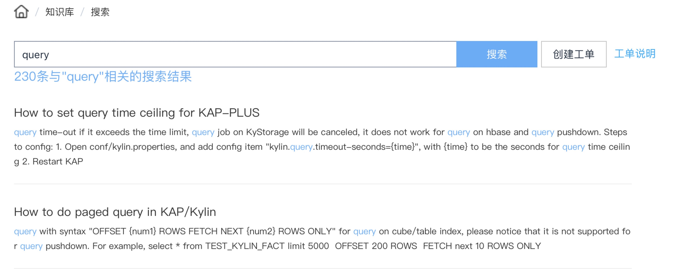

## KyBot 快速入门
### KyBot是如何工作的？


### 如何登录注册 KyBot？
KyBot 默认访问地址：[https://kybot.io](https://kybot.io)，用户可以根据提示信息完成注册 KyAccount 账号。

### 如何混淆敏感信息
相关配置请在 `$KYLIN_HOME/kybot/kybot-client.properties` 中进行如下修改：

> * 提示：对 KyBot Client 的配置修改，对通过网页、脚本生成的诊断包有效

- 有两种混淆级别，分别是 `OBF` = 混淆、`RAW` = 不混淆。
- **邮箱账号**等隐私信息**默认是混淆的**。
- **基数**默认不混淆，可以通过修改 `kybot.obf.cardinality` 参数为 `OBF` 来启用混淆。
 + **基数混淆范围**：
 	+ `tiny`： <20 
 	+ `small`： <100 
 	+ `medium`： <1000 
 	+ `high`： <10,000 
 	+ `very high`： <100,000 
 	+ `ultra high`： >=100,000

- **主机名**默认不混淆，可以通过修改 `kybot.obf.hostname` 参数为 `OBF` 来启用混淆，另外需要通过`kybot.obf.hostname.pattern`参数定义主机名的模式，如 `kybot.obf.hostname.pattern=\*.kybot.io` 


### 如何生成诊断包？
#### 通过网页生成诊断包
KAP 从 v2.3开始，支持一键上传诊断包到 KyBot，当前版本的操作步骤如下：
> * 提示：如果用户的服务器需要通过代理访问外网，需要在 `kylin.properties` 中添加如下配置项：
>
```
kap.external.http.proxy.host // http 代理服务器地址
kap.external.http.proxy.port // http 代理服务器端口
```
> 修改配置完成后，重启 KAP 使配置生效。

1.登录KAP WEB UI，单击`系统`页面的`诊断`按钮生成系统诊断包；单击`监控`页面中某个任务，点击`操作`，展开后单击`诊断`按钮生成任务诊断包。

> * 提示：第一次使用该功能需要输入登录 KyAccount 的用户名和密码。

2.单击`生成诊断包并上传至 KyBot`。

> * 提示：如果用户的 KAP 节点无法访问外网，请单击`下载诊断包`按钮，将诊断包下载到本地，然后手动上传到 KyBot。

更多关于生成系统诊断包和任务诊断包的内容，请参考[系统诊断与任务诊断](../troubleshooting/diag.cn.md)。

#### 如何通过脚本生成诊断包
用户可以通过 `$KYLIN_HOME/kybot/kybot.sh`生成系统诊断包，通过 `$KYLIN_HOME/kybot/kybot.sh -jobId <job_id>`生成任务诊断包。

> * 提示：
> 
> 1. 生成的诊断包存放的默认路径是 `$KYLIN_HOME/kybot_dump/`，如果用户想要指定其他目录作为存放诊断包的路径，可以通过将 `$KYLIN_HOME/kybot/kybot.sh` 中的 `destDir="$KYLIN_HOME/kybot_dump/"` 修改为 `destDir="${Your_directory}"`
>
> 2. KAP 从 v2.5.5版本后生成系统诊断包不包含垃圾信息（比如 Hive 临时表等），之前版本用户可以在执行脚本时附加参数 `-includeGarbage false`
>
> 3. 如您遇到 **Invalid option** 提示，请您尝试前往[ KyBot 官网](https://kybot.io)，下载最新的 KyBot Client。


### 如何上传诊断包？
登录 KyBot 网站，单击页面顶部的`上传`按钮，拖拽或单击`上传`按钮上传诊断包，上传成功后即加入分析队列，用户可以在上传页面查看分析进度，分析完成之后就可使用全部功能。


### 页面功能介绍
#### 1. 仪表盘
观察 KAP 集群的健康情况

- Cube 使用情况统计


-  Query 执行情况统计


#### 2. 调优
优化 Cube 和查询，找到系统瓶颈，给予优化建议

- Cube 详情及使用分析


- SQL查询解析及统计分析


#### 3. 故障排查
基于知识库和日志分析，提供有效的故障解决方案

- 异常统计


#### 4. 帮助中心
用户可以通过查询知识库、提交工单，获得技术支持。

- **知识库**：用户可以通过关键词搜索，查看遇到的问题是否已有已知的解决方案。



- **我的工单**：企业级用户可以将已经提交的诊断包和问题描述整合提交工单，Kyligence 技术支持工程师将快速定位问题并及时给出解决方案。 
