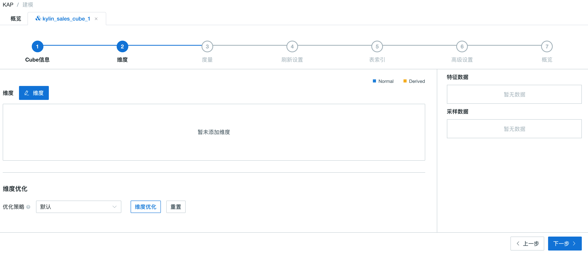
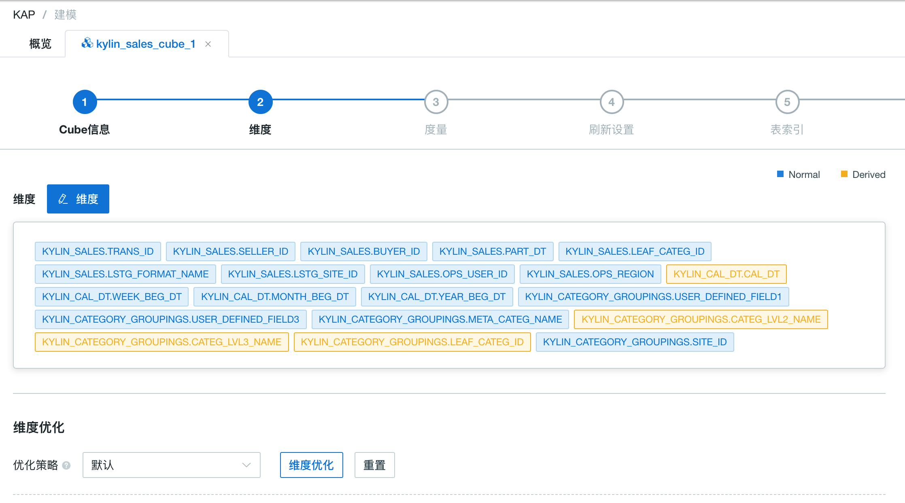
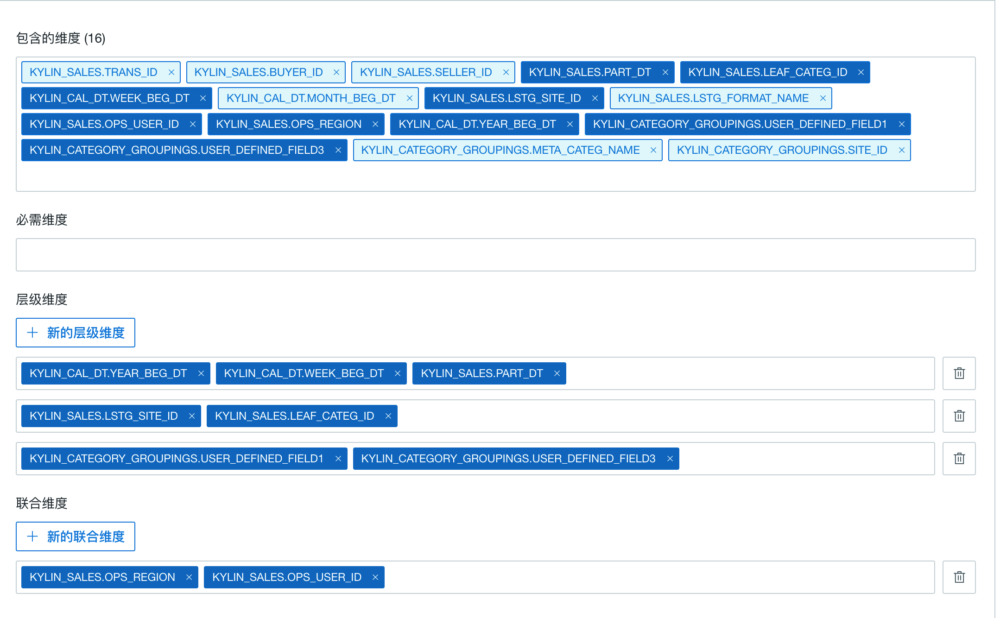
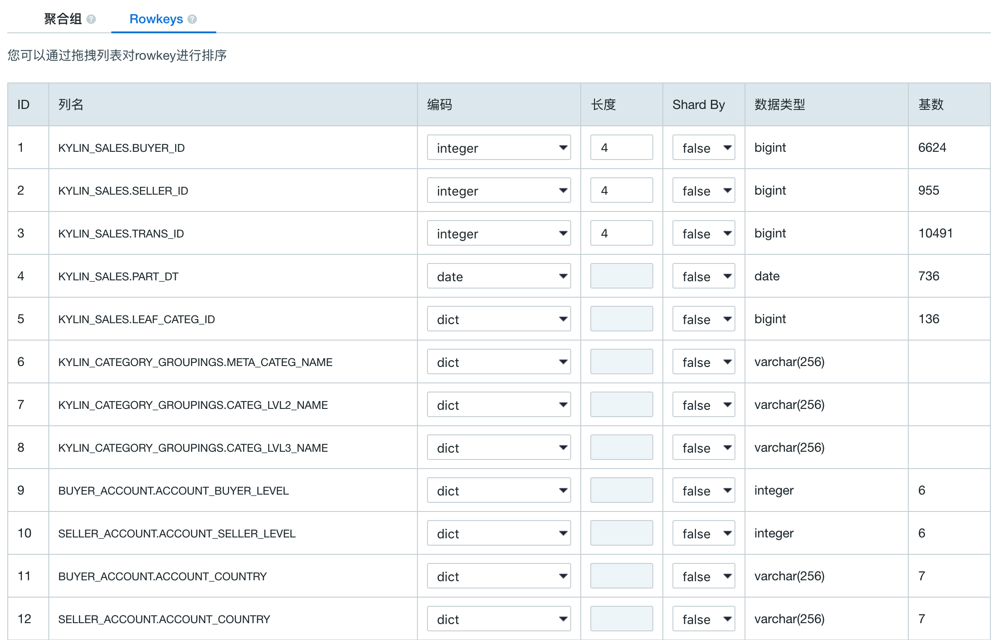
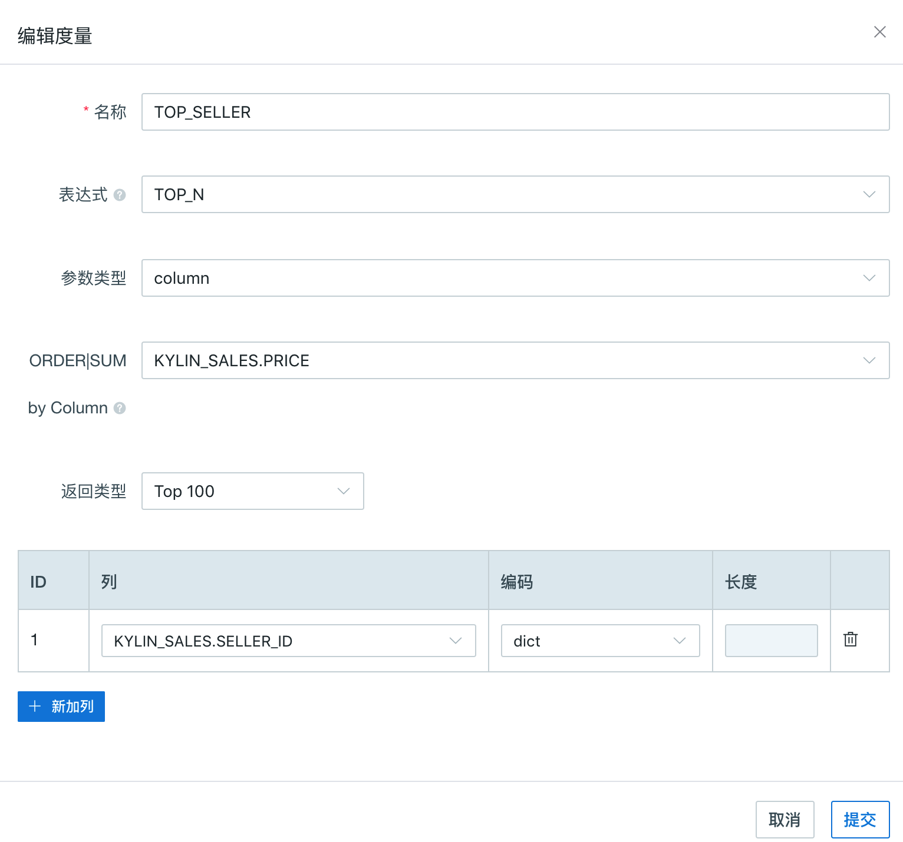

## 创建 Cube

本文将以KAP自带的样例数据(learn_kylin)为例，介绍Cube的创建过程。


打开KAP的Web UI，首先选择learn_kylin项目，这里我们创建一个新的cube命名为kylin_sales_cube_1。


### 基本信息

单击提交后，您将会在界面上方，看到创建一个cube的全部流程。




### 维度设置

从数据模型的维度中选择一些列作为Cube的维度。这里的设置会影响到生成的Cuboid数量，进而影响Cube的数据量大小。在选择维度时，每一个维度列可以作为**普通维度**（Normal），也可以作为**衍生维度**（Derived）。相对于普通维度来说，衍生维度并不参与维度的Cuboid，衍生维度对应的外键（FK）参与维度Cuboid，从而降低Cuboid数。在查询时，对衍生维度的查询会首先转换为对外键所在维度的查询，因此会牺牲少量性能。一些基本的设计规则如下：

在KYLIN\_CATEGORY\_GROUPINGS表里，和商品分类相关的三个字段（META\_CATEG\_NAME、CATEG\_LVL2\_NAME、CATEG\_LVL3\_NAME）都可能出现在过滤条件中，我们先把他们添加为普通类型维度，方法如下：单击蓝色的“维度”按钮，然后选择所需的列，将其设置为**普通维度**。

此外，在查询中还经常把时间作为过滤或聚合的条件，如按周过滤、按周聚合等。这里我们以按周为例，需要用到KYLIN_CAL_DT中的WEEK_BEG_DT字段，但是该字段实际上可以由PART_DT字段决定，即根据每一个PART_DT值可以对应出一个WEEK_BEG_DT字段，因此，我们添加WEEK_BEG_DT字段为**衍生维度**。

同样的，KYLIN_CATEGORY_GROUPINGS表中还有一些可作为衍生维度的字段，如USER_DEFINED_FIELD1、USER_DEFINED_FIELD3、UPD_DATE、UPD_USER等。

在事实表上，表征交易类型的LSTG_FORMAT_NAME字段也会用于过滤或聚合条件，因此，我们再添加LSTG_FORMAT_NAME字段作为普通维度。
最终，维度的设置结果如下图所示：


这里我们推荐您使用（点击）一键优化功能。这个功能可以根据您选择的维度，对cube的维度做最优的处理，即节省存储空间的同时最大的优化查询速度。优化的方法包括聚合组(AGG)，rowkey和最大组合维度数（MDC）的设置。更多优化后的细节如下图所示。




Rowkey的顺序对于查询性能来说至关重要，一般把最常出现在过滤条件中的列放置在Rowkey的前面，在这个案例中，我们首先把PART_DT放在Rowkey的第一位。接下来，按照层级把商品分类的字段跟随其后。由于参与Cuboid生成的维度都会作为Rowkey，因此我们需要把这些列添加为Rowkey当中。在这个案例中，总共需要添加7个Rowkey。在每个Rowkey上，还需要为列值设置编码方法。KAP支持的基本编码类型如下：

1. "dict" 适用于大部分字段，默认推荐使用，但在超高基情况下，可能引起内存不足的问题。
2. "boolean" 适用于字段值为: true, false, TRUE, FALSE, True, False, t, f, T, F, yes, no, YES, NO, Yes, No, y, n, Y, N, 1, 0
3. "integer" 适用于字段值为整数字符，支持的整数区间为[ -2^(8*N-1), 2^(8*N-1)]。
4. "int" 已弃用，请使用最新的integer编码。
5. "date" 适用于字段值为日期字符，支持的格式包括yyyyMMdd、yyyy-MM-dd、yyyy-MM-dd HH:mm:ss、yyyy-MM-dd HH:mm:ss.SSS，其中如果包含时间戳部分会被截断。
6. "time" 适用于字段值为时间戳字符，支持范围为[ 1970-01-01 00:00:00, 2038/01/19 03:14:07]，毫秒部分会被忽略。time编码适用于time, datetime, timestamp等类型。
7. "fix_length" 适用于超高基场景，将选取字段的前N个字节作为编码值，当N小于字段长度，会造成字段截断，当N较大时，造成RowKey过长，查询性能下降。只适用于varchar或nvarchar类型。
8. "fixed_length_hex" 适用于字段值为十六进制字符，比如1A2BFF或者FF00FF，每两个字符需要一个字节。只适用于varchar或nvarchar类型。
   在这个案例中，我们除了把LSTG_FORMAT_NAME设置为fixed_length类型（长度为12）外，将其余的Rowkey都设置为dict编码。 

Rowkey设置的结果应该如下：




### 度量设置

根据数据分析中的聚合需求，我们需要为Cube定义度量的聚合形式。如果您继续点击一键优化，根据数据类型，系统会自动创建好一些默认的COUNT()聚合和SUM()聚合。默认建好的聚合仍然可以手动修改或删除。在这个案例中，我们还需要通过PRICE的不同聚合形式考量销售额，如总销售额为SUM(PRICE)、最高订单金额为MAX(PRICE)、最低订单金额为MIN(PRICE)。因此，我们手动创建三个度量，分别选择聚合表达式为SUM、MIN、MAX，并选择PRICE列作为目标列。

其次，我们还需要通过COUNT(DISTINCT SELLER_ID)考量卖家个数。根据前面章节的介绍，KAP默认使用HyperLogLog算法进行COUNT_DISTINCT的计算，该算法是个近似算法，在创建度量时需要选择一个近似度，本案例对精确性要求不高，为了提升查询性能，我们选择精度较低的“Error Rate < 9.75%”。同样的，我们再创建一个COUNT(DISTINCT LSTG_FORMAT_NAME)的度量考量不同条件下的交易类型。


在销售业务分析的场景中，往往需要挑选出销售业绩最好的商家，这时候就需要TOP-N的度量了。在这个例子中，我们会选出SUM(PRICE)最高的一些SELLER_ID，实际上就是执行如下的SQL语句：

```sql
SELECT SELLER_ID, SUM(PRICE) FROM KYLIN_SALES 
GROUP BY SELLER_ID 
ORDER BY SUM(PRICE)
```
因此，我们创建一个TOP-N的度量，选择PRICE字段作为SUM/OPDER BY字段，选择SELLER_ID字段作为GROUP BY字段，并选择TOPN(100)作为度量的精度。


最终添加的度量如下图所示：


### 更新设置

**触发自动合并的时间阈值(Auto Merge Thresholds)**：一般的，一个销售统计的SQL查询往往会按周、月进行过滤和聚合，所以我们可以设置Cube自动按周或月进行自动合并，设置**触发自动合并的时间阈值(Auto Merge Thresholds)**如下所示：


**保留时间阈值**：对于时间久远的不需要再被查询的Segment，KAP通过设置**保留时间阈值**可以自动清除这些Segment，以节省磁盘空间。每当构建新的Segment时，KAP会自动检查老的Segment，当这些Segment的结束日期与当前最新Segment的结束日期的差值大于**保留时间阈值**，则会被清除。如设置为1年，最新的Cube构建到当天，那么结束日期是一年以前的Segment会被清除。如果无需自动清理，可以默认设置**保留时间阈值**为0。

**分区起始时间**：在创建数据模型的时候我们提到，我们希望采用增量构建方式对Cube进行构建，并选择了PART_DT字段作为分区时间列。在创建Cube时，我们需要指定Cube构建的起始时间，在这个例子中，根据样例数据中的时间条件，在Cube的创建过程中，“1970-01-01 08:00:00“默认为**分区起始时间**。

**调度器**：是一个可以设置的Cube构建调度工具。

- 勾选调度器的复选框后，您即可以设置**第一次自动构建的时间**和一个固定的**构建周期**。

  > 举例：
  >
  > 假设某电信公司有一个cube，每日早晨8点都手工触发一次对当日数据的构建。对于这个场景，可以设置一个调度器。第一次构建时间为“2017-08-01 08:00:00”，构建周期为“24小时”；则这样的设置代表在2017年8月1日早晨8点开始构建，此后每经过24小时构建一次，构建24小时内的数据。

- 勾选复选框后，即等同于**启用**该调度器。


### 表索引

为了支持对明细数据进行高效的查询，KAP提供了表索引功能。对于定制查询，KAP使用构建良好的Cube来进行高效的处理；对于非定制查询，Query Pushdown提供了补充和完善。上述功能使得用户能够快速获取聚合查询的结果。如果用户在分析过程中对明细数据感兴趣，则可以通过表索引来达成目的。使用步骤与注意事项参见[表索引](table_index.cn.md)。

> **对Plus版本**：表索引是Plus版本的特有功能。如果启用，KAP将在构建Cube之外也保存所有的原始记录，支持高速的明细查询。


### 高级设置

在这里添加的配置项可以在Cube级别覆盖从kylin.properties配置文件读取出来的全局配置。在这个案例中，我们可以直接采用默认配置，在此不做任何修改。

关于cube配置参数的修改可以参见[多重配置重写](../../config/config_override.cn.md)。

在**高级设置**中，可以选择 Cube 构建引擎。默认情况下，KAP 使用 MapReduce 作为 Cube 构建引擎，但也可以手动切换成 Spark(Beta)。关于如何配置和使用 Spark 构建引擎的详情，参见[配置 Spark 构建引擎](../../config/spark_engine_conf.cn.md)。	

### Cube概览

请读者仔细确认这些基本信息，包括数据模型名称、事实表以及维度和度量个数。确认无误后单击“保存”按钮，并在弹出的确认提示框中选择“Yes”。
​	
最终，Cube的创建就完成了。我们可以刷新Cube列表，从中可以看到新创建的Cube了。因为新创建的Cube没有被构建过，是不能被查询的，所以状态仍然是“禁用”。


