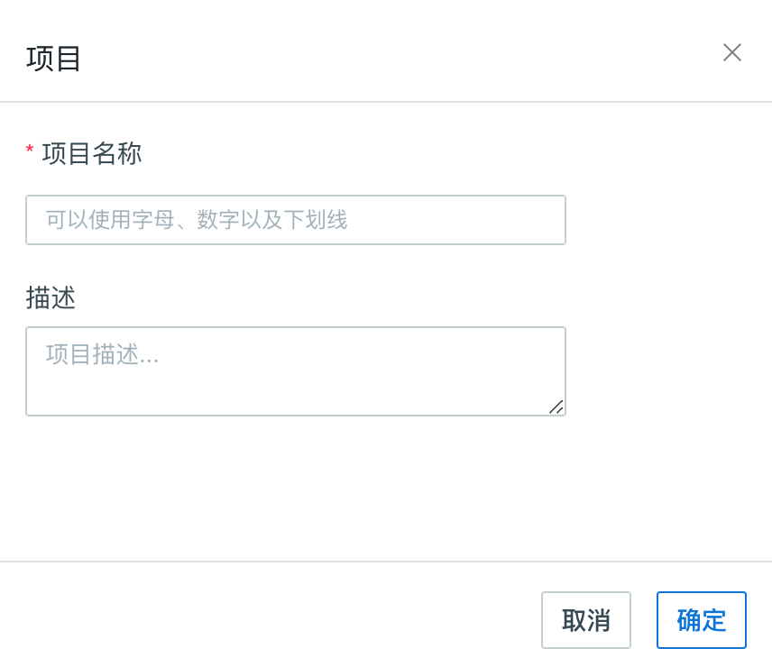
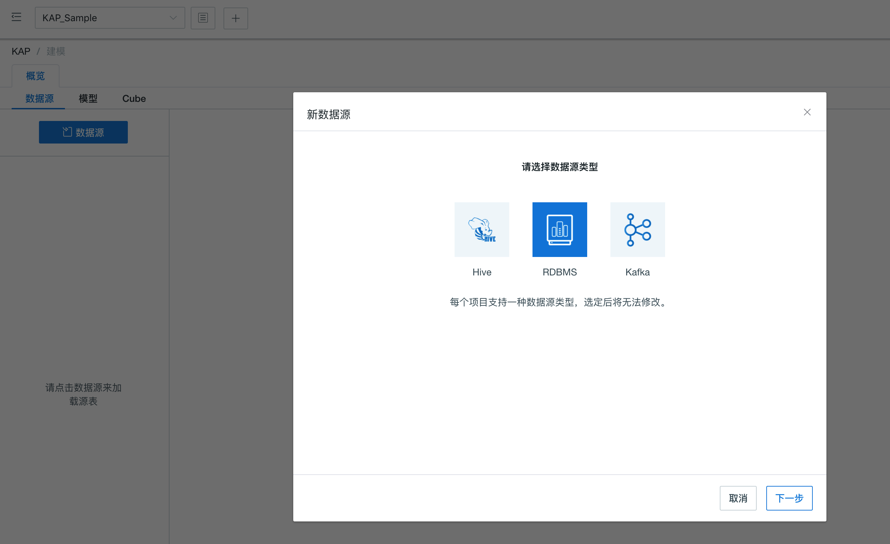
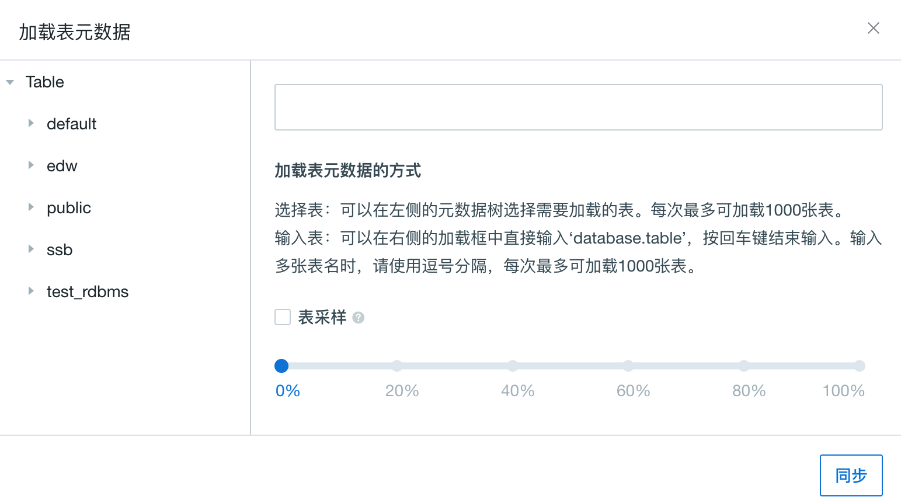
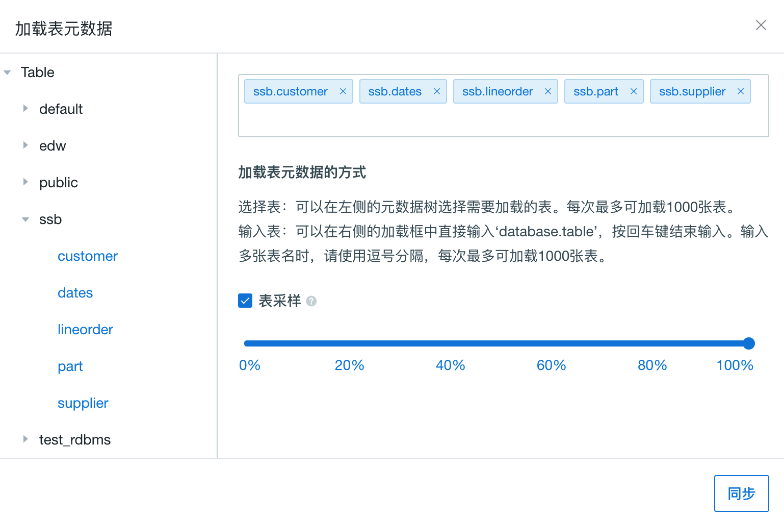

##RDBMS数据源配置

KAP从3.0开始支持RDBMS作为默认的输入数据源。链接RDBMS数据源，首先需要下载JDBC驱动程序jar包，并把jar包放置在`$KYLIN_HOME/ext`目录下。此外，因为Cube构建过程需要使用**sqoop**，还需要把jar包拷贝到sqoop安装目录的lib目录下。

以下参数需要您配置在链接RDBMS数据源的项目配置中：

| 参数名                           | 解释                                             |
| -------------------------------- | ------------------------------------------------ |
| kylin.source.jdbc.driver         | JDBC驱动类名                                     |
| kylin.source.jdbc.connection-url | JDBC连接字符串                                   |
| kylin.source.jdbc.user           | JDBC连接用户名                                   |
| kylin.source.jdbc.pass           | JDBC连接密码                                     |
| kylin.source.jdbc.dialect        | JDBC方言（目前仅支持default、greenplum两种方言） |
| kylin.source.jdbc.sqoop-home     | sqoop命令所在文件                                |

如果需要开启查询下压，还需要配置以下参数：

`kylin.query.pushdown.runner-class-name=io.kyligence.kap.query.pushdown.PushdownRunnerSDKImpl`

> 注：以上配置项均支持在项目级别覆盖配置。您可以在项目配置中，重现定义以上配置。

配置完以上参数之后，启动KAP，即可通过KAP界面连接RDBMS数据源。

### 创建项目

以Greenplum数据源为例，我们使用PostgreSQL JDBC Driver来连接Greenplum数据源，步骤如下：

1. 下载PostgreSQL JDBC Driver的jar包，放置在`$KYLIN_HOME/ext`和sqoop安装目录的lib目录下。
2. 在`kylin.properties`中添加以下设置：

```
kylin.source.jdbc.driver=org.postgresql.Driver
kylin.source.jdbc.connection-url=jdbc:postgresql://<host>:<ip>/<schema>
kylin.source.jdbc.user=<username>
kylin.source.jdbc.pass=<password>
kylin.query.pushdown.runner-class-name=io.kyligence.kap.query.pushdown.PushdownRunnerSDKImpl
kylin.source.jdbc.dialect=greenplum
kylin.source.jdbc.sqoop-home=/usr/hdp/current/sqoop-client/bin
```

配置完成之后，启动KAP，就可以通过KAP界面连接Greenplum数据源了。

打开KAP的Web UI，在主界面的顶端是项目的管理工具栏，点击“＋”即可如下图所示创建一个新的项目（Project），例如命名该项目为KAP_Sample。 



在Web UI的左上角选择刚刚创建的项目，表示我们接下来的全部操作都在这个项目中，在当前项目的操作不会对其他项目产生影响。 




### 同步RDBMS表

选择数据源为RDBMS后，通过点击“Table”来加载我们所需要的表，如下图所示：

在弹出的对话框中展开ssb数据集，并选择需要的表，如图所示：



勾选采样，导入后系统会自动计算各表各列的维数，以掌握数据的基本情况。稍等几分钟后，我们可以通过数据源表的详情页查看这些信息。

