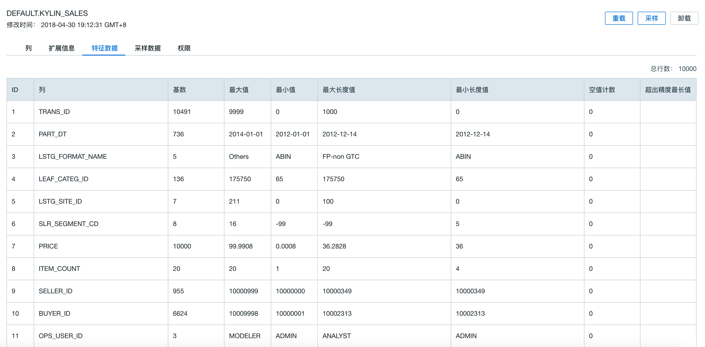
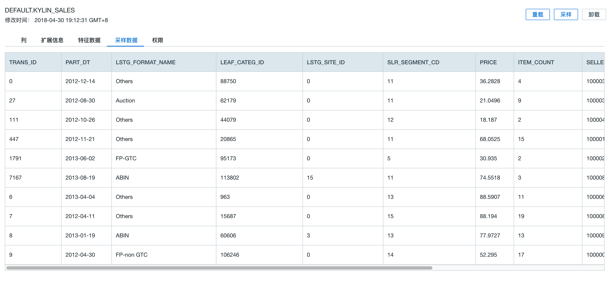

## 数据采样

### 概述

本章将介绍Kyligence Enterprise中的数据采样功能和使用。

### 什么是**采样**?

本产品中采样功能主要支持用户针对数据源中的表，进行抽样统计， 包括分析具体表相关列的基数和样例格式等。 

### 为什么使用**采样**？

采集到的统计信息能够帮助用户设计更好的数据模型和Cube。

### 如何进行数据采样?

用户可以在数据源加载元数据过程中或对已加载元数据的表，使用采样功能。

**步骤一：** 登录本产品Web UI，切换进入需要进行检测的项。

**步骤二：** 点击左侧导航栏的**建模**，再点击右侧**数据源**标签页，查看待采样的数据源表清单。

**步骤三：** 下方左侧选中待采样的具体表后， 点击表详细信息右上角的**采样**按钮。

**步骤四：** 调整**采样比例**。在弹出的对话框， 用户可按需调整该表采样范围比例，默认为100%全表采样。

> 提示：如果项目没有加载表的元数据，可以点击**数据源**按钮，在弹出的**加载元数据**窗口中，选择一个或**多个表**，并统一指定表采样的比例

> 注意：表的采样比例可选范围分别为20%－40%－60%－80%－100%，采样比例越高，则采样结果越准确，但可能耗用较多资源。用户可根据实际资源配置情况进行调整（参见[推荐配置](../config/recommend_settings.cn.md)）

**步骤五：** 点击**提交**按钮， 开始采样任务

**步骤六：** 点击左侧导航栏的 **监控** 模块，观察数据源采样任务进度。

> 提示：采样任务名称格式： SAMPLING TABLE-Database Name.Table Name-Job Start Time。

> 注意：对Kafka数据源进行采样时，不触发采样任务，但是仍会完成采样。

**步骤七：**采样任务完成后，可通过**建模**->**数据源**功能下，选择具体表名， 查看表的详细信息。

采样的详细统计信息包含以下内容， 可通过点击切换相应的标签页查看：

- 列
- 扩展信息
- 特征数据
- 采样数据

