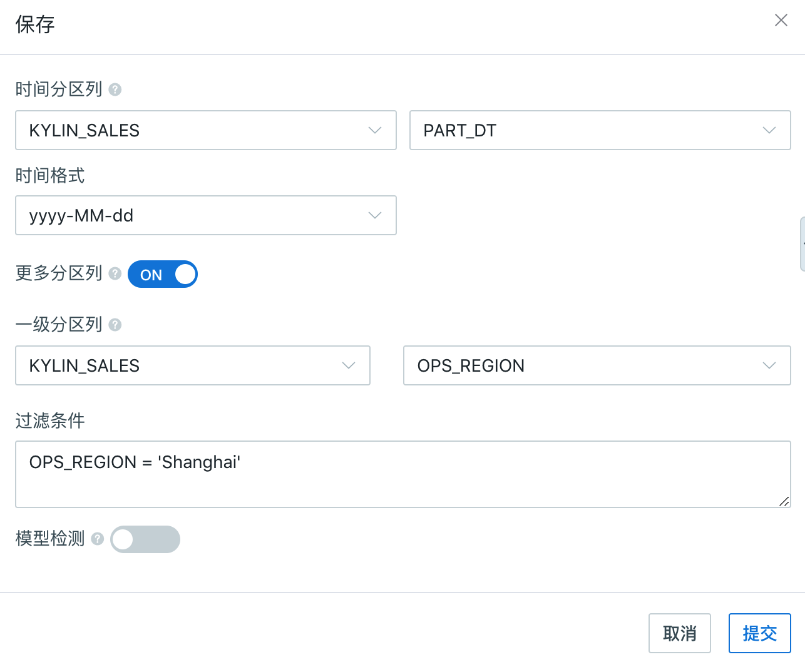
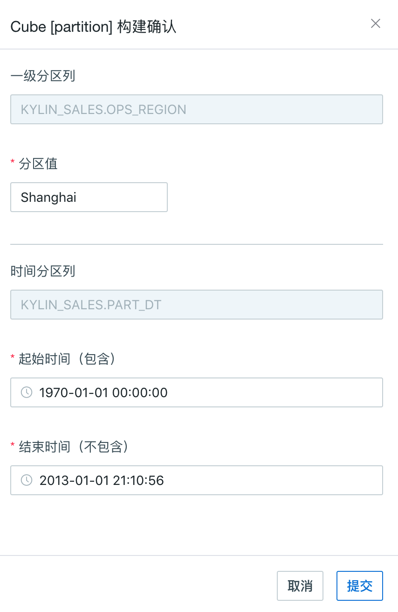

## 多级分区模型

本产品除了默认支持基于时间类型的分区方式外， 还支持其他类型的分区，统称多级分区。

> 提示：多级分区支持从本产品V2.5.2版本开始

增强分区灵活性， 比如多租户的使用场景中，除了时间之外，经常采用机构或地区来进行分区。

### 多级分区的概念

- 基本概念：分区列分为时间分区列与多级分区列。多级分区中目前只支持新增一级分区。
- 常用概念：
  - 时间分区列：可以支持日期或更细粒度的时间分区；支持的数据类型有时间型（time／date／datetime），也支持整数型（integer/tinyint/smallint/bigint/int4/long8）；
  - 多级分区列：时间分区列之外的分区维度，目前新增一级分区列；一级分区列目前支持整数或字符串类型（long/short/int/integer/string/char/varchar）；
  - 分区值：构建时，一级分区列中具体的值，常在该分区值上增量构建segment。

### 基本使用

1. 在创建模型或Cube的最后一步

   > - 创建模型基本流程可以参照[设计模型](data_modeling.cn.md)
   > - 设计 Cube 的一般流程可以参考[设计 Cube](cube/create_cube.cn.md)；

2. 在点击模型**保存**功能按钮的弹出窗口， 点击**更多分区列**的按钮开启

3. 在**一级分区列**中，指定分区列所在的**表名**和指定分区**列名**

   

   ​

4. Cube构建时，已有多级分区列的cube需要选择多级分区列与对应的时间分区列；

   

