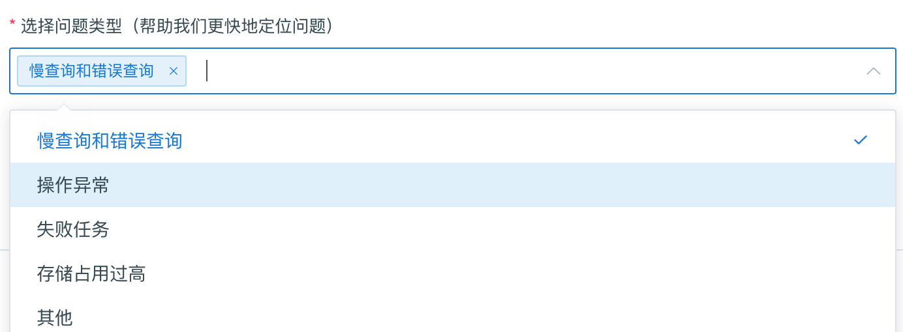
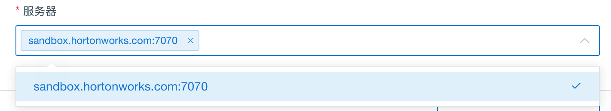
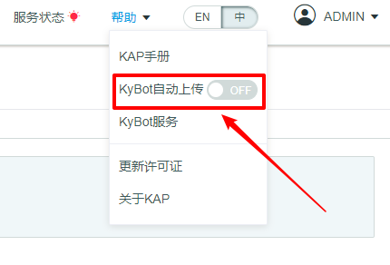
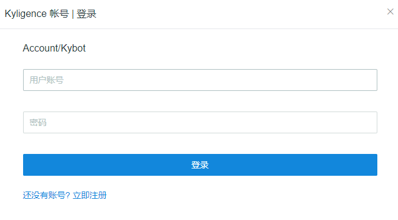
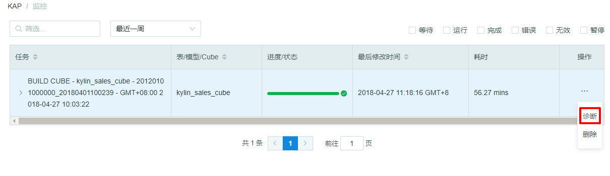

## 系统诊断与任务诊断
用户在使用 KAP 过程中遇到的问题，例如 Cube 创建失败、SQL 查询失败、SQL 查询时间过长等；KAP 的 Web UI 提供了一个“诊断”功能，可以将有关的信息打包成压缩包，供运维人员分析问题原因。
该功能的入口总共有两处：系统诊断和任务诊断。

### 系统诊断
系统诊断包包含整个 KAP 实例的诊断信息，生成系统诊断包需要如下操作：

#### 1.单击`系统`页面下的`诊断`按钮

#### 2.选择时间范围
可以选择`最近一小时`、`最近一天`、`最近三天`、`最近一个月`，或者自定义时间范围

> * 注意：选择的时间范围必须包含 **KAP 发生问题**的时间段。

#### 3.选择问题类型

#### 4.选择服务器

> * 注意： 如果 KAP 部署在多节点上，需要确定发生问题的节点，并在生成系统诊断包时选择正确的服务器名字，否则有可能系统诊断包中不包含问题的有关信息。

#### 5.选择将系统诊断包下载到本地或者上传到 KyBot
KAP 提供了两种选择，可以下载到本地供运维人员分析，也可以上传到 KyBot 网站，进行自助诊断。

点击`下载诊断包`，可以将诊断包下载至本地。

点击`生成诊断包并上传到 KyBot，可以将诊断包上传至 KyBot 网站。
更多关于Kybot的使用，请参考：[自助式诊断与优化服务 KyBot](../kybot/README.md)

同时 KAP 也支持了自动上传系统诊断包的功能。
可以通过打开`帮助`下的 `KyBot 自动上传开关`，登录 KyAccount 账号即可。

### 任务诊断
任务诊断包包含某个任务的诊断信息，生成任务诊断包需要如下操作：
#### 1. 单击`监控`页面中某个任务，点击`操作`，展开后点击`诊断`按钮

#### 2.选择服务器

#### 3.选择将系统诊断包下载到本地或者上传到 KyBot
 点击`下载诊断包`，可以将诊断包下载至本地。

 点击`生成诊断包并上传到 KyBot，可以将诊断包上传至 KyBot 网站。

