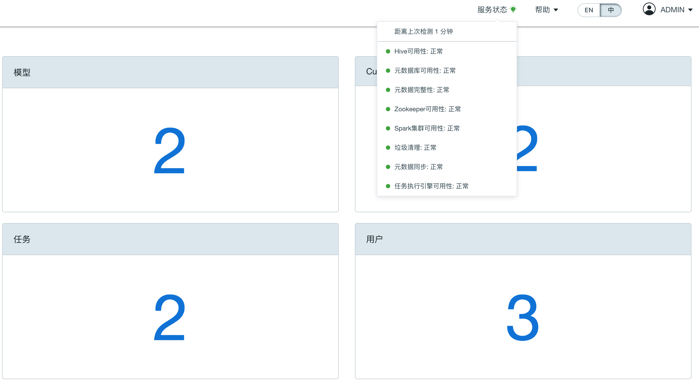

## 服务状态检测

从KAP V2.5.6开始，对于ADMIN权限用户，KAP会每15分钟检测环境依赖并提供分级警示信息，方便用户了解到KAP所依赖服务的状态。

KAP主要从以下几个方面进行检测：

* MetaStore活性检查：检查metastore的可连通性，读写正确性，和响应速度
* Hive连通性检查：检查Hive/Beeline的可连通性，kerberos ticket可用
* Metadata完整性检查：检查metadata一致性、是否损坏
* Metadata同步检查：检查metadata同步异常，并自动重载元数据
* Spark context活性检查：检查pushdown spark cluster活性
* Zookeeper活性检查：检查zookeeper的可连通性，加锁操作，和响应速度
* 任务执行引擎活性检查：检查job engine活性

状态检测使用绿色、黄色和红色分别表示健康，提示和警告三种状态。用户还可以通过移动鼠标到状态栏来查看具体的信息。

