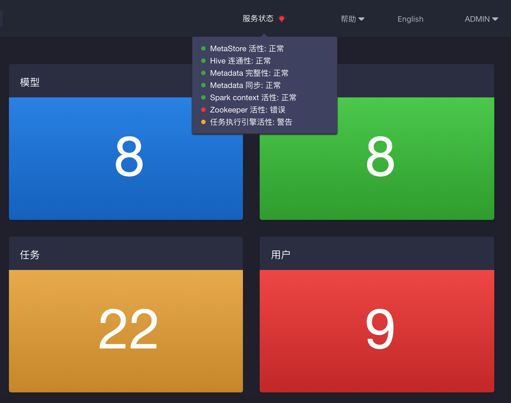

## 环境依赖服务检测
KAP 从 v2.5.6版本开始，增加了环境依赖服务检测的功能，每15分钟进行环境检测。ADMIN 权限用户可以在界面上清晰地看到相关信息与分级的警示提醒，帮助管理员诊断环境问题。

环境依赖的服务状态（以下简称为服务状态）检测使用绿色、黄色和红色分别表示正常、警告和错误三种状态。当出现非正常状态时，您还可以通过移动鼠标到检测项来查看二级信息。

环境依赖检测主要从以下几个方面进行：

* Hive 可用性检查：检查 Hive/Beeline 的可连通性
* 元数据库可用性检查：检查元数据储存的可连通性、读写正确性和响应速度
* 元数据完整性检查：检查元数据的一致性及判断元数据是否损坏
* Zookeeper 可用性检查：检查 Zookeeper 的可连通性、加锁操作和响应速度
* Spark 集群可用性检查：检查 Spark 的可用性
* 垃圾清理检查：检查垃圾文件大小
* 元数据同步检查：检查元数据同步是否异常，异常时尝试重载元数据
* 任务执行引擎活性检查：检查任务执行引擎的活性

### 使用命令行进行单独诊断
KAP还提供了命令行工具来执行对每个服务状态检测，方便进行实时检查和排除错误。同时，检测结果将被保留在单独的日志文件（`$KYLIN_HOME/logs/canary.log`）里。

执行 `$KYLIN_HOME/bin/kylin.sh io.kyligence.kap.canary.CanaryCLI <canaries-to-test>`，其中  <code>canaries-to-test</code> 可替换的对应的检测参数如下：
 
 * Hive 可用性： <code>HiveCanary</code>
 * 元数据库可用性： <code>MetaStoreCanary</code>
 * 元数据完整性： <code>MetadataCanary</code>
 * Zookeeper 可用性： <code>ZookeeperCanary</code>
 * Spark 集群可用性：暂时无法使用命令行来进行单独检测
 * 垃圾清理： <code>GarbageCanary</code>
 * 元数据同步： <code>MetaSyncErrorCanary</code>
 * 任务执行引擎可用性： <code>JobEngineCanary</code>
 

### 服务状态检测说明
#### 服务状态分为以下三种：

+ **绿色**：正常，表示该项服务状态检测正常。
+ **黄色**：警告，表示某项服务状态的检测时间超过警告时限，可能会影响 KAP 性能，但是并不影响使用。
+ **红色**：错误，表示某项服务的检测存在异常或者检测时间超过错误时限。

#### 各项服务状态的检测标准（黄色和红色）主要如下：

| 检测项目              | 服务状态：黄色                                               | 服务状态：红色                                               |
| --------------------- | ------------------------------------------------------------ | ------------------------------------------------------------ |
| HiveCanary            | 在 Hive 中执行列出所有数据库超过20秒                                   | 在 Hive 中执行列出所有数据库超过30秒                                   |
| MetaStoreCanary       | 执行元数据读、写、删操作超过300毫秒                          | 1. 执行元数据读、写、删操作超过1000毫秒  2. 对元数据执行写操作后，未能读取到新写的数据 |
| MetadataCanary        | 验证元数据完整性超过10秒                                     | 1. 验证元数据完整性超过30秒  2. 元数据完整性存在错误     |
| ZookeeperCanary       | 查看 ZooKeeper 活性、加锁、解锁超过3秒                         | 1. 查看 ZooKeeper 活性、加锁、解锁超过10秒 2. ZooKeeper 处于非活跃状态 3. ZooKeeper 加锁／解锁失败 |
| SparkSqlContextCanary | 使用 Spark Context 进行一次整数连加操作超过10秒                | 使用Spark Context进行一次整数连加操作超过30秒                |
| GarbageCanary         | 1. 元数据垃圾文件数超过50个及以上  2. Cube 构建产生的垃圾文件数超过50个及以上 3. 垃圾数据的数据量达到5G及以上 |                                                              |
| MetaSyncErrorCanary   | Metastore 同步失败                                            |                                                              |
| JobEngineCanary       |                                                              | 1. 有 KAP 节点未能返回 Job Engine 状态  2. 没有活跃状态的任务构建引擎节点 |
