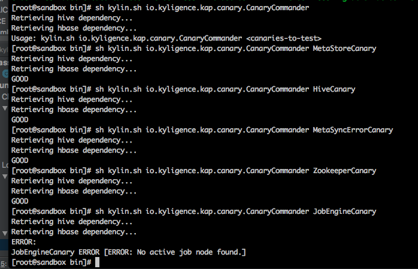

## 环境依赖服务检测

从KAP V2.5.6开始，KAP会每15分钟进行环境依赖服务检测。对于ADMIN权限用户，可以在界面上清晰地看到相关信息与分级的警示提醒，方便用户了解到KAP所依赖服务的状态，具体展示界面如下。

环境依赖的服务状态（以下简称为服务状态）检测使用绿色、黄色和红色分别表示健康、警告和错误三种状态。当出现非正常状态时，您还可以通过移动鼠标到检测项来查看二级信息。

KAP还提供了命令行工具来进行每个环境依赖检测，方便自行检查和排除错误。同时，检测结果将被保留在单独的日志文件里（`$KYLIN_HOME/logs/canary.log`），并包括在KyBot诊断包中。

环境依赖检测主要从以下几个方面进行：

* MetaStore活性检查：检查元数据储存的可连通性，读写正确性，和响应速度
* Hive连通性检查：检查Hive/Beeline的可连通性，kerberos ticket可用
* Metadata完整性检查：检查元数据一致性、是否损坏
* Metadata同步检查：检查元数据同步异常，并自动重载元数据
* Spark context活性检查：检查pushdown spark cluster活性
* Zookeeper活性检查：检查zookeeper的可连通性，加锁操作，和响应速度
* 任务执行引擎活性检查：检查任务执行引擎的活性

### 使用命令行进行单独诊断

运行方法如下：

在`$KYLIN_HOME/bin` 目录下执行`./kylin.sh io.kyligence.kap.canary.CanaryCommander <canaries-to-test>`，检测结果如下图所示：

> <canaries-to-test>可替换为对应的检测命令参数：
>
> •元数据储存活性：MetaStoreCanary 
>
> •Hive连通性：HiveCanary
>
> •元数据完整性：MetadataCanary
>
> •元数据同步一致性：MetaSyncErrorCanary
>
> •Zookeeper活性：ZookeeperCanary
>
> •任务执行引擎活性：JobEngineCanary
>
> Spark相关检测目前暂时无法使用命令行来进行单独检测。

### 服务状态检测说明

服务状态分为以下四种：

+ GOOD：正常
+ WARNING：警告，如检测时间超过警告时限等，例如：
> MetaStoreCanary WARNING [WARNING: Creating metadata (40 bytes) is slow and it may impact KAP performance and availability.]
+ ERROR：错误，如检测时间超过错误时限等，例如：
> ERROR [JobEngineCanary-191152] canary : No active job node found.
+ CRASH：崩溃，如服务运行时抛异常等，例如：
> 2018-03-19 12:07:30,218 INFO  [SparkSqlContextCanary-191207] canary : Completed > SparkSqlContextCanary CRASH [CRASH: Cannot call methods on a stopped SparkContext.
> This stopped SparkContext was created at:
> org.apache.spark.sql.SparderFunc.init(SourceFile)
> io.kyligence.kap.rest.init.KapInitialTaskManager.checkAndInitSpark(SourceFile:69)
> io.kyligence.kap.rest.init.KapInitialTaskManager.afterPropertiesSet(SourceFile:44)
> org.springframework.beans.factory.support.AbstractAutowireCapableBeanFactory.invokeInitMethod
>  s(AbstractAutowireCapableBeanFactory.java:1687)
> org.springframework.beans.factory.support.AbstractAutowireCapableBeanFactory.initializeBean(AbstractAutowireCapableBeanFactory.java:1624)
> (No active SparkContext.)

WARNING和ERROR的检测标准主要如下：
+ MetaStoreCanary
  - 做metadata读写删超过300毫秒，WARNING
  - 做metadata读写删超过1000毫秒，ERROR
  - 写完metadata后，未能读取新写的数据，ERROR(msg: Metadata store failed to read a newly created resource.)

+ HiveCanary
  - 查询hive所有database超过20秒，WARNING
  - 查询hive所有database超过30秒，ERROR

+ MetadataCanary
  - 验证metadata完整性超过10秒，WARNING
  - 验证metadata完整性超过30秒，ERROR
  - Metadata完整性存在错误，ERROR(msg: Metadata {entities} corrupt, with rule --{rule})

+ MetaSyncErrorCanary
  - Metastore同步失败，WARNING(msg: Metadata synchronization error detected (from {node1} to {node2}). Network was unstable or overloaded? Auto recovery attempted.)

+ ZookeeperCanary
  - 查看ZooKeeper活性、加锁、解锁超过3秒，WARNING
  - 查看ZooKeeper活性、加锁、解锁超过10秒，ERROR
  - ZooKeeper非活跃状态，ERROR(msg: Zookeeper with connection {url} is not alive.)
  - 加锁失败，ERROR(msg: Failed to require zookeeper lock.)
  - 解锁失败，ERROR(msg: Failed to release zookeeper lock.)

+ JobEngineCanary
  - 有KAP节点未能返回job engine状态，ERROR(msg: Node {node} failed to report job engine status)
  - 没有活跃状态的任务构建引擎节点，ERROR(msg: No active job node found.)

+ SparkSqlContextCanary
  - 使用spark context进行一次整数连加操作超过10秒，WARNING
  - 使用spark context进行一次整数连加操作超过30秒，ERROR