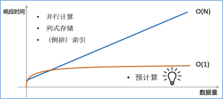

## 常见问题

以下收集了用户在学习使用Kyligence Enterprise过程中经常遇到的一些问题。

### 设计方面

**Q: Kyligence Enterprise 最大能支持的维度数有多少？**

A: 这个问题不是简单一个数字能回答的。首先，本产品的多维立方体“物理”维度最多62个，但用户可以通过使用维表+定义"衍生"（Derived）维度的方式，将一个维度衍生出更多维，从而达到支持上百个维度查询的 Cube。通常建议 Cube 的物理维度（除去衍生维度）在15个以内，当有更多维度的时候，务必分析用户查询模式和数据分布特征，采取维度分组，定义 Mandantory、Hierarchy 和 Joint 等高级手段，避免维度间的肆意组合（“维度的灾难”），从而使得 Cube 的构建时间和所占空间在可控范围。

**Q: 构建 Cube 的过程要多久？有时很慢，如何优化？**

A: 通常 Cube 构建在几十分钟到几小时。具体时间取决于数据量、模型复杂度、维度基数、集群计算能力和配置等多方面。优化需要具体问题具体分析。如果您需要帮助，可以联系我们的[售后支持](https://support.kyligence.io/#/)。

**Q: 构建 Cube 时遇到 Out of Memory (OOM) 问题，如何解决？**

A：OOM 要看具体在构建哪一步发生，会采取不同措施。如果是在 Build Dictionary 发生，需要审视 Cube 定义，看是否有对超高基数维度使用了字典编码，然后改用其它编码方式。如果是在 Build Cube 时候发生，需要检查 MapReduce 的内存分配设置（配置文件`conf/kylin_job_conf.xml`）。如果您在使用 InMem 构建模式，建议改用对内存需求更小的分层构建模式（在`conf/kylin.properties`里设置`kylin.cube.algorithm=layer`）。

**Q：Derived 维度和 Normal 维度有什么区别？**

A：Derived 维度相对于 Normal 来说，它并不直接参与维度的组合计算，而是它的外键参与维度组合，从而降低了总的维度组合数。在查询时，对 Dervied 维度的查询会首先转换为对它的外键的查询，因此会牺牲一些查询性能。

**Q：Hierarchy Dimension有顺序关系吗？**

A：有关系，要从大到小的顺序声明。

**Q: 如果有多张事实表，该如何建模？**

A: 可以为每个事实表定义一个 Cube，然后使用子查询来组合这几张表的查询。或者使用 Hive View 将多张事实表关联成成一张宽表，然后用这张宽表定义模型和 Cube，查询按宽表进行。

**Q: Segment 的数量影响查询的性能吗？大的 Segment 可以拆分成小的吗？**

A：Segment 的数量会影响查询性能，因为本产品需要扫描每个 Segment 文件来完成查询，所以通常建议定期进行 Segment 合并来控制数量。通常来说，更少的 Segment 意味着更好的查询性能，因此建议您合理规划 Segment 的构建粒度。

**Q: 源数据表结构变化了怎么办？**

A：如果是新增字段，那是没有问题的。但是删除或修改字段可能会导致模型或 Cube 定义失效，所以建议尽量避免。如果无法避免，可以考虑通过 Hive View 来屏蔽源表变化，让模型和 Cube 不受影响。

**Q: 如何从传统关系型数据库加载数据？**

A：Kyligence Enterprise 从 v3.0 版本后，支持使用 RDBMS 作为数据源。具体使用方法请参考[导入 RDBMS 数据源](../datasource/rdbms_datasource/README.md)。

**Q: 本产品支持雪花模型吗？**

A: 支持。

**Q：定义多个 Aggregation Group，查询可以跨 Aggregation Group 吗？**

A：Aggreation Group 目的是降维，最好查询的条件只在一个 Aggregation Group 中，如果跨越了 Aggregation Group，则需要从 Base Cuboid 进行后聚合，会影响查询的性能。

**Q：使用 Hive 创建大平表性能会比星型模型更好吗？**

A：构建性能没有区别，但星型模型可以使用 Derived 维度，在存储和查询性能上将更加灵活。

**Q：压缩配置对构建 Cube 有什么作用？**

A:   当需要处理的数据体量变得越来越大时，网络I/O的限制也越来越大。开启压缩可以让每个I/O操作处理更多的数据，压缩也可以改进网络传输的性能。尽管 CPU 压缩和解压缩数据需要花费一些时间，但是通常这些时间是远远小于I/O和网络I/O消耗的时间，从而使得整个 MR 任务更快完成。

如何设置压缩配置，请参考手册[压缩配置](../installation/config/compression_config.cn.md)章节

### 查询引擎

**Q：什么是查询引擎？**

A：Kyligence Enterprise支持三种查询引擎：Cube 引擎，表索引（Table Index）引擎，下压（Pushdown）引擎

Cube 引擎是被广泛使用的，为聚合类查询所设计的查询引擎，用于OLAP分析场景。

表索引引擎是列式存储引擎，为明细查询场景设计。在分析场景中，用户可以通过钻取聚合数据到最底层的明细数据。

下压引擎是其他 SQL on Hadoop 引擎，包括 Hive，SparkSQL，Impala 等。当某个查询不适合预计算引擎时，查询会被下压到其他下游查询引擎。这种情况下，查询延迟通常会延长到分钟级。

**Q：多查询引擎如何一起工作？**

A：有两种类型的查询，聚合查询和明细查询，带有 “group by“ 的是聚合查询，其他查询是明细查询。

对于聚合查询，Kyligence Enterprise按照顺序：Cube引擎 > 表索引引擎 > 下压引擎

对于明细查询，Kyligence Enterprise按照顺序：表索引引擎 > Cube引擎 > 下压引擎

每个引擎都有自己的查询能力（通过维度、指标、列定义），如果查询与当前引擎不匹配，则查询会被路由到下一个引擎。

**Q：如何开启／关闭查询引擎**

A：每个查询引擎都可以独立地启用和关闭。如果在 Cube 设计阶段没有配置表索引，则意味着对相关的查询关闭表索引查询引擎。查询下压引擎需要手工配置才能启用。Cube 引擎也可以通过配置参数`kylin.query.disable-cube-noagg-sql=true`，关闭 Cube 对明细查询的处理。

**Q：如何指定 sparder/calcite 查询引擎**

A：KE默认使用calcite查询引擎，如果需要开启sparder引擎，可以在三个级别进行控制：
    1.系统级别设置：在KYLIN_HOME/conf/kylin.properties中添加`kap.query.engine.sparder-enabled=true`
    2.项目级别设置：在项目级别配置中添加配置`kap.query.engine.sparder-enabled=true`
    3.查询级别设置：在查询中添加配置
    ```
       -- ConfigOverride(kap.query.engine.sparder-enabled=true)
                       select * from kylin_sales
    ```

### 查询方面

**Q：本产品支持 MDX 查询吗？**

A：可以通过 Kyligence Insight 支持。

**Q：怎么查看查询的执行计划？**

A：可以在查询的前面添加``explain plan for``以获得执行计划，例如```explain plan for select count(*) from airline```。但是执行计划的结果的展示并没有被优化，可以通过前端的``导出结果``功能查看。

**Q：本产品支持模糊查询吗？**

A：支持`like`做为过滤条件，同时我们建议您对需要使用模糊查询的列使用 fuzzy 类型的索引，更多详情请参考[明细表索引](../model/cube_design/table_index.cn.md)。

**Q：支持的 SQL 标准是什么？有哪些函数？**

A：本产品支持 SQL 92 标准，使用 Apache Calcite 做为查询解析引擎，因此本产品的 SQL 语法可以参考https://calcite.apache.org/docs/reference.html

**Q:   查询结果会将列名返回为大写，如果需要小写的列名怎么办？**

A:   使用类似 `select column_A as "test" from table` 的语句，将列的假名用双引号转义则可以返回大小写敏感的列名。

**Q：支持 Distinct Count 吗？**

A：支持，本产品提供两种统计去重基数（Count Distinct）指标的方式：基于 HyperLogLog 算法的模糊去重和基于 Bitmap 的精确去重。两种方式进行计算时需要的资源和性能不一样，用户可以根据需要选择使用。

**Q：对于有 Inner Join 的模型，为什么有时查询结果比 Hive 的少？**

A：这符合设计，本产品会首先从数据源读取原始数据，并按照模型的定义生成一张大平表。本产品在从 Hive 中抽取数据的时候，会按照 Model 中定义的方式 Join 所有表来取数据。如果有 Inner Join，一些不能匹配的数据在拉取过程中会被直接过滤。如果查询是跟模型匹配的，带有所有表，那么查询结果就没有问题。如果查询只匹配部分表，有可能出现查询结果比在Hive中只查询部分表时少的情况。

在实际实践中，如果源数据质量不能保证的话，建议用 Left Join。如果要用 Inner Join，就要保证维度表与事实表的同步更新。

**Q：使用本产品还需要 BI 系统吗？**

A：要的。本产品本身的核心在于强大的查询后端，针对数据分析提供亚秒级的响应。同时对外部各个 BI 平台也有很好的集成，也提供了丰富的 API 供进行二次开发。所以针对本产品需要配合其他的 BI 系统一起使用。

推荐本公司的 Kyligence Insight for Superset，是一款功能强大，且与 Kyligence Enterprise 无缝集成的 BI 解决方案。

**Q：遇到查询相关的功能、性能问题，如何解决？**

A：请看如何处理[关于查询的功能和性能问题](../query/query_issue.cn.md)。

**Q：如何配置 cube/raw table 黑名单**

A：如果希望某个cube/raw table不参与查询，可以在两个级别进行控制：
    1.系统级别设置：在KYLIN_HOME/conf/kylin.properties中添加`kap.query.black.realizations=INVERTED_INDEX[name=test_cube],CUBE[name=test_cube]`
    2.项目级别设置：在项目级别配置中添加配置`kap.query.black.realizations=INVERTED_INDEX[name=test_cube],CUBE[name=test_cube]`

### 对比方面

**Q：本产品与 Spark、Impala 有什么区别？**

A：从业内的使用经验来看，目前 Hadoop 平台上可用于查询分析的几种技术主要包括预计算（本产品）、内存计算（以Spark为代表）、倒排索引（以ElasticSearche为代表）和列式存储（以Impala为代表）。

从技术原理来看，预计算技术将数据事先按维度组合聚合，保存结果为物化视图。经过聚合，物化视图的规模将只由维度的基数决定，而不再随数据量的增长而线性增长。以电商为例，如果业务扩张，交易量增长了10倍，但只要交易数据的维度不变（供应商/商品数量不变），聚合后的物化视图将依旧是原先的大小。查询的速度也将保持不变，即计算时间复杂度相对数据量是O(1)的。

而内存计算、倒排索引、列式存储等技术，虽然其技术原理各不相同，但都是在查询执行时（runtime）对明细数据进行在线的汇总统计，因此这些技术在数据记录数较少时（百万~千万），性能还处于可接受范围。但随着数据量快速增长（硬件资源不增加），其查询速度也将随着数据量的增长而线性增长，因此其计算时间复杂度相对数据量为O(N)的。

各种技术的计算时间复杂度对比如下图所示。从大数据背景来看，网络日志、系统日志、物联网等各种数据在飞速而持续的产生着，从而对于大数据查询分析来说，其面对的数据量将是一个爆发式的增长模式，因此，预计算这种能够屏蔽数据量爆发增长带来的计算压力，保持计算时间复杂度O(1)的技术将是最理想也是最合适的技术。




**Q：本产品与 Druid 有什么区别？**

A：Druid 最初的设计是为了实时分析，本产品更关注解决 OLAP 问题。最初 Druid 可以支持实时流 Kafka，现在 Kyligence Enterprise 也支持直接从 Kafka 读取消息，具备实时构建 Cube 的能力，提供近实时的分析处理能力。Druid 使用位图索引作为内部数据结构，本产品也使用位图为 Cube 建立索引；Druid使用自己定义的查询语言，而本产品支持ANSI SQL；Druid 在支持表连接方面有限制；本产品支持星型和雪花模型；Druid与已有的BI工具集成不够友好，本产品可以很好地支持大部分 BI 工具，如 Tableau，Excel。由于本产品支持 MOLAP Cube，在超大规模数据集上的复杂查询具备极高的性能。而 Druid 需要扫描全部索引，如果数据集太大，或者查询范围太大，则性能损失更大。本产品依赖于Hadoop 运行，Druid 需要运维自己的分布式计算和存储集群。对于已经部署了 Hadoop 的用户，本产品的部署非常简单易用，而 Druid 需要重新部署完整的集群。

