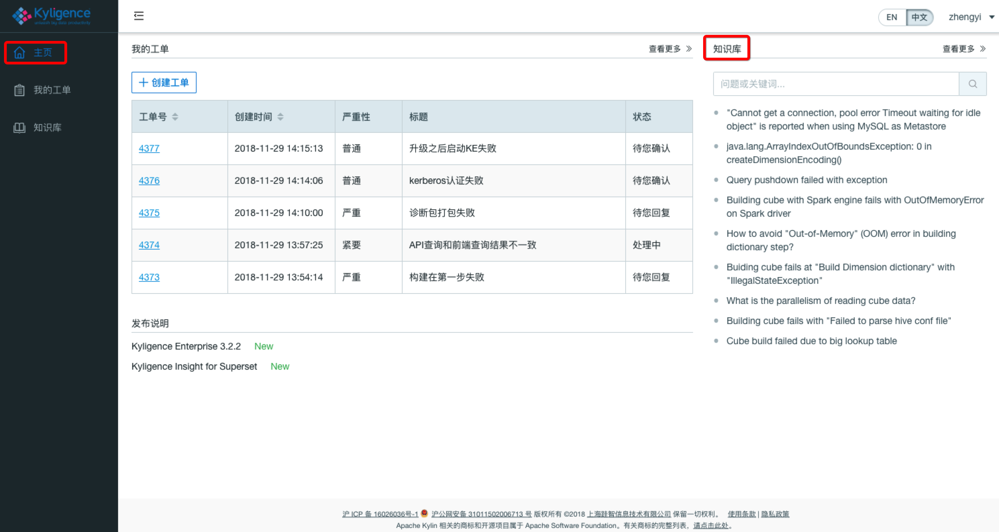

## 获取技术支持

### Kyligence 技术支持

Kyligence 可以帮助客户安装、配置、优化和运行 Kyligence Enterprise，帮助客户解决大规模数据处理和分析问题。Kyligence 既支持客户将 Kyligence Enterprise 安装在客户的数据中心，也支持安装在公有云，如 Amazon Web Services 和 Microsoft Azure 等。

如果您是 Kyligence 产品的使用用户，在使用 Kyligence Enterprise 及相关产品过程中遇到问题，可以在  [Kyligence 支持中心](https://support.kyligence.io)  使用知识库功能自助搜索获得相应的答案，或者创建并提交工单以获取技术支持。以下是 **Kyligence 支持中心** 使用教程：

* [知识库](#知识库)
* [创建工单](#创建工单)
* [查看工单](#查看工单)
* [用户手册与发布声明](#用户手册与发布声明)

### 知识库  

**知识库入口**

在 Kyligence 支持中心的主页右侧，可以看到``知识库``模块。

除了 Kyligence 支持中心主页的知识库入口，也可以通过单击左侧导航栏中的``知识库``标签，进入``知识库``界面。搜索栏的下面，也提供了常见问题的快速入口。

**操作示例**

在搜索框中输入关键字 “Cannot get a connection” 并点击搜索，您会看到30条与关键语句相关的搜索结果。

### 创建工单  

**创建工单入口**

在 Kyligence 支持中心主页的``我的工单``下通过点击``创建工单``按钮进入创建工单界面

同时，也可以通过单击左侧导航栏中的``我的工单``标签，进入工单界面，点击``创建工单``按钮，进入创建工单界面。

**创建工单操作示例**

在创建工单界面，在相应位置填选标题、严重性、问题分类、问题描述后，可通过添加附件按钮上传诊断包，图片等附件从而更详实地描述问题。最后请点击提交按钮，完成工单的创建流程。
> **注意**：附件最大支持上传2GB。

**问题严重性定义**

|严重性|定义|
|-|-|
|紧要|软件无法启动或启动后无法进行任何操作，生产业务系统中断|
|严重|软件使用受限，生产系统的功能减少且没有可用的解决方法，业务可以以有限的方式进行|
|普通|软件中一部分非关键功能无法按预期进行，业务可以继续|
|轻微|软件使用中的疑问或改进建议，对业务操作影响较小|

> **注意**：请尽量遵照上述严重性标准提交工单，Kyligence 有权根据实际情况调整问题严重性。

### 查看工单  

**工单状态**

在主页的``我的工单``模块下可以看到最新的5条（默认显示条数）工单信息，并能通过点击``工单号``，进入工单详情页面。

在``我的工单``界面可以看到所有工单的摘要信息，同样可以通过点击``工单号``进入工单详情页面。

工单状态一般分为处理中、待您回复、待您确认和已关闭四种状态。

|状态| 定义|
|-|-|
|处理中|代表 Kyligence Support 正在查看并处理您的问题|
|待您回复|代表 Kyligence Support 正在等待您的回复|
|待您确认|代表 Kyligence Support 正在等您确认问题是否已经解决|
|已关闭|代表问题已经解决或者该工单服务已经结束|

您可以在工单详情页面点击**关闭工单**按钮，从而关闭工单。

在关闭工单后，将会邀请您进行工单满意度调查，我们期待您的反馈意见以便提高我们的服务质量。

### 用户手册与发布声明  

**用户手册**

在知识库界面的右侧，可以找到用户手册的模块。通过单击用户手册模块下产品版本的连接，能够浏览相应 Kyligence Enterprise 版本最新的用户手册。

**发布声明**

在支持中心主页的中下侧，可以看到发布声明版块，点击模块内的链接，可以看到 Kyligence 旗下产品最新的发布声明

